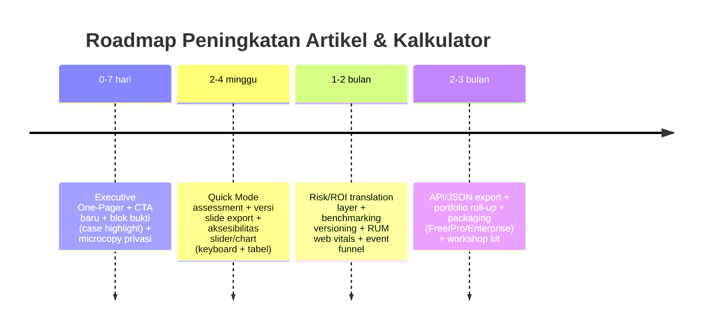

# Penilaian Menyeluruh Artikel 1 dan Kalkulator Operational Maturity di entity["company","Resistance Zero","data center ops advisory"]

## Ringkasan Eksekutif

Artikel “When Nothing Happens, Engineering Is Working” (Operations Journal #1) sudah berada di level yang **kuat secara konsep**: hook naratifnya tajam, struktur babnya rapi dan “serius”, dan Anda sudah melakukan hal yang jarang dilakukan konten engineering: **membawa operasi yang “tak terlihat” menjadi sesuatu yang bisa didefinisikan, diukur, dan dipertanggungjawabkan** lewat kerangka Safety-II, maturity model, dan kalkulator. Ini adalah fondasi yang tepat untuk menarik audiens Mid‑Senior sekaligus C‑level. citeturn34view0turn31view2

Yang membuatnya belum “maksimal mengunci” audiens C‑level bukan kekurangan ide, melainkan **format pengantaran dan bukti yang dipaketkan**:
- Untuk C‑level, artikel 9.000 kata/20 menit terasa “mahal waktu” tanpa **Executive One‑Pager** dan **CTA yang jelas dalam bahasa ROI/risk** (mis. “berapa risiko outage yang turun jika Anda naik 1 level di change management?”). citeturn34view0turn33view1  
- Sebagian claim bisnis sudah kuat (contoh: avoided cost, PUE improvement, ROI 4:1–10:1), tetapi perlu **penguatan “credibility scaffolding”**: tautan langsung ke sumber primer, “assumptions & limitations” yang eksplisit, dan pemisahan tegas antara “contoh kasus” vs “benchmark industri”. citeturn33view1turn33view2turn33view0
- Kalkulator Anda sudah “di atas rata-rata” karena mengandung radar chart, prioritas perbaikan, benchmark, sensitivitas (tornado), what‑if, Monte Carlo, waterfall, dan export PDF—ini level yang biasanya muncul pada tool komersial. Namun, agar dianggap “boardroom‑grade”, perlu 3 penguatan: **(1) transparansi metodologi & data**, **(2) UX yang memandu menuju keputusan**, **(3) jaminan privasi/keamanan yang eksplisit**. citeturn31view2turn33view2

Catatan asumsi: Target industri Anda “unspecified”, tetapi konten dan variabel kalkulator sangat jelas berorientasi **data center/critical infrastructure** (Tier, PUE, BMS/DCIM, CMMS, UPS, dsb.), jadi penilaian ini membaca konteks tersebut sebagai baseline. citeturn34view0turn33view1turn31view2

## Analisis Konten Artikel

Narasi pembuka Anda mengangkat problem yang sangat “real” di operasi: *ketika sukses didefinisikan sebagai tidak adanya kejadian, nilai kerja jadi “tidak terlihat” dan rentan dipotong.* Ini sangat kuat sebagai tesis dan relevan ke C‑level karena langsung menyentuh budgeting dan justifikasi kapabilitas. citeturn34view0

Anda juga menanam CTA awal untuk assessment (“Assess Your Facility’s Operational Maturity”) yang bagus karena memindahkan pembaca dari “ide” ke “aksi.” Ini sudah selaras dengan pola konten B2B yang efektif: *insight → tool → next step.* citeturn34view0turn31view2

### Kejelasan, struktur, dan keterbacaan untuk dua persona

Secara struktur, artikel sudah punya Table of Contents dan pembagian bab yang “whitepaper‑like”, sehingga Mid‑Senior mudah melakukan skimming ke bab yang dibutuhkan. citeturn34view0

Namun untuk C‑level, struktur ini masih berasa “engineer-first.” C‑level umumnya ingin:
1) **keputusan apa yang harus diambil**,  
2) **risiko apa yang turun**,  
3) **berapa besar biaya/ROI**,  
4) **apa yang paling prioritas**,  
dengan pembuktian ringkas.

Artikel sudah punya “bahan mentah” untuk 4 hal itu (cost quantification, case context, maturity, calculator), tetapi belum dipaketkan sebagai *executive route*. Misalnya, case context Anda kuat: 12 prevented incidents, zero unplanned outages, 99.999% availability, avoided costs $1.2M+, PUE improvement 1.65 → 1.48. Ini sebenarnya *satu slide* yang bisa “menang” di rapat. Tapi di artikel, informasi ini masih muncul sebagai bagian dari narasi panjang, bukan “Executive Evidence Block” yang diposisikan sebagai highlight. citeturn33view1turn33view2

### Tone dan messaging

Tone artikel tegas, reflektif, dan “high-agency engineering.” Narasi “hero vs boring competence” juga sangat tepat untuk meng-address bias organisasi yang memuja firefighting. citeturn33view3

Yang perlu dijaga untuk audiens C‑level: beberapa istilah (BMS, DCIM, CMMS, MoC/CAB, RCA/CAPA, RTO/RPO) berpotensi menaikkan “cognitive tax.” Anda sudah memberi deskripsi pada beberapa bagian, tetapi untuk C‑level Anda akan menang besar jika:
- Ada **glossary mini** (hover tooltip) atau **sidebar “Istilah kunci (2 menit)”**, dan  
- Ada “translation layer” dari istilah operasi ke bahasa risiko/keuangan (mis. “MoC maturity tinggi → menurunkan risiko misconfiguration → menurunkan probability incident yang bersifat human error/procedure-related”). citeturn34view0turn31view2turn44view0

### Kesesuaian untuk executive summary, key takeaways, dan CTA

Artikel belum memiliki **Executive Summary** yang bisa berdiri sendiri. Padahal referensi industri menunjukkan bahwa outage cost dan human/procedure factors adalah isu strategis yang mudah dipahami eksekutif:
- Dalam ringkasan temuan Uptime Intelligence, lebih dari separuh responden melaporkan outage signifikan terakhirnya biaya >$100k dan 16% >$1 juta. citeturn42view1  
- Cakupan 2025 report (diringkas pihak ketiga) juga mencatat 54% responden >$100k dan 20% >$1 juta, serta 80% percaya insiden terakhir bisa dicegah dengan manajemen/proses yang lebih baik. citeturn43view0  
- entity["company","Uptime Institute","data center research firm"] menekankan peluang pencegahan melalui training dan review prosedur; bahkan 85% insiden “human error major outage” (3 tahun) terkait kegagalan mengikuti prosedur atau flaw pada proses/prosedur. citeturn44view0  

Saran kunci: jadikan 3 angka ini sebagai “lead bullets” di Executive Summary, lalu hubungkan langsung ke kalkulator Anda sebagai “instrument panel” untuk memprioritaskan investasi. Ini akan membuat artikel terasa “boardroom-relevant” dalam 30–45 detik pertama.

## Analisis Kalkulator

Kalkulator “Operational Maturity Assessment” Anda sudah mencerminkan desain yang matang: ia tidak hanya “menghitung skor”, tetapi juga mendorong *prioritization thinking* lewat bobot, impact multiplier, benchmark, sensitivitas, simulasi, dan ekspor laporan. Komponen seperti tornado, Monte Carlo, dan waterfall biasanya muncul pada tool konsultansi atau produk enterprise. citeturn31view2turn33view2

Berikut penilaian multi‑perspektif sesuai aspek yang Anda minta.

### UX/UI: alur, progressive disclosure, dan “decision guidance”

Yang sudah kuat:
- **Immediate value proposition**: pengguna diminta menilai 8 dimensi 1–5 dan langsung mendapat composite score, radar chart, serta prioritas improvement. citeturn34view0turn31view2  
- **Progressive disclosure**: adanya “Pro Analysis” (tornado, what‑if, Monte Carlo, waterfall, dual radar) memberi jalur dari “asses cepat” → “analisis untuk business case.” citeturn31view2turn33view2  
- **On‑page methodology**: formula normalisasi dan priority score ditampilkan, ini jarang dan sangat membantu kredibilitas. citeturn31view2turn33view2  

Yang menghambat “C‑level wow”:
- “Hasil” masih dominan berupa metrik internal (score, level). C‑level butuh 1 layer tambahan: **implikasi risiko dan uang**.
  - Contoh: “Maturity 50 (Level 3) → estimasi exposure outage/biaya tahunan?”  
  - Anda sudah punya basis naratif cost/outage di artikel; penguatan berikutnya adalah membuat kalkulator dapat memetakan *score delta* ke *risk delta* (dengan asumsi eksplisit). citeturn32view0turn33view1turn43view0  
- Tidak terlihat pernyataan privasi/telemetri di sekitar kalkulator (di teks halaman tidak ditemukan “privacy/cookie”). Untuk enterprise audience, *silence = suspicion*. citeturn31view0turn31view1turn31view2  
  - Praktik yang sangat kuat dicontohkan oleh tool entity["organization","U.S. Department of Energy","us energy department"] pada C2M2: “data tetap di perangkat pengguna.” Ini dapat Anda adopsi sebagai microcopy sederhana namun dampaknya besar. citeturn24view1  

### Input: label, default, unit, dan konsistensi model

Dimensi & skala:
- Anda menggunakan skala 1–5 (Ad‑hoc → Optimized) dengan deskripsi detail setiap level per dimensi—ini bagus untuk mengurangi ambiguity dan membantu “self‑calibration.” citeturn31view2  
- Bobot dimensi (dengan total 100%) dan opsi custom weights menambah fleksibilitas untuk berbagai konteks (AI/HPC vs tradisional). citeturn31view2  

Facility context:
- Variabel konteks (Capacity MW, Facility type, Redundancy tier, Operating model, Region) tampak digunakan untuk “contextualize benchmark,” tetapi penjelasan “bagaimana memodifikasi benchmark” belum terlihat; saat ini baru menyatakan fungsi/tujuan dan bahwa data muncul di PDF report. citeturn31view2  
  - Untuk meningkatkan kredibilitas, jelaskan apakah konteks:
    1) hanya ditampilkan di report,  
    2) mengubah benchmark referensi, atau  
    3) mengubah interpretasi skor (mis. “Tier IV butuh score >X agar aman”).  

Default values:
- Anda memberi anchor yang bagus: “Score 50 = semua dimensi level 3 (Defined).” Ini *default narrative* yang kuat untuk memulai dari baseline netral. citeturn31view2  
- Namun untuk audiens eksekutif, lebih baik lagi jika ada tombol “Set baseline” per persona (mis. “Enterprise DC Tier III”, “Colo Tier III/IV”, “Edge unmanned”) sehingga pengguna merasa tool “paham konteks saya” sejak awal.

### Validasi, error handling, dan guardrails

Yang sudah ada secara konsep:
- “Total weights must equal 100%.” bagus sebagai constraint. citeturn31view2  
- Monte Carlo menambahkan “confidence interval”—ini sangat jarang dan merupakan diferensiasi. citeturn31view2turn33view2  

Yang perlu dipastikan (dan disarankan ditampilkan jelas di UI):
- Jika total bobot ≠ 100%, apa yang terjadi? Idealnya:
  - skor tidak dihitung sampai valid,  
  - tampil pesan error non-menghakimi, dan  
  - sistem menawarkan “auto-normalize weights” (tombol sekali klik).  
- Untuk input skala 1–5, perlu guardrail untuk mencegah “gaming” atau bias:
  - tampilkan “confidence prompt”: “Seberapa yakin Anda?” (Low/Med/High) yang kemudian mempengaruhi lebar confidence interval (bukan hanya noise ±0.5 yang seragam). Saat ini noise terlihat uniform ±0.5, yang rapi secara matematis tetapi belum “semantik.” citeturn31view2turn33view2  

### Asumsi, metodologi, dan formulae

Kekuatan utama kalkulator Anda adalah transparansi formula:
- Composite score: \(\;((WeightedSum - 1)/4)\times 100\;\) dengan WeightedSum = rata-rata berbobot skala 1–5. citeturn31view2turn33view2  
- Priority score: \((5 - Score)\times Weight \times Impact\ Multiplier\). Ini logis untuk “leverage-first” prioritization. citeturn31view2turn33view2  
- Sensitivity analysis: perubahan ±1 poin per dimensi (tornado). citeturn31view2turn33view2  
- Monte Carlo: 10.000 simulasi dengan noise ±0.5 per dimensi untuk estimasi uncertainty. citeturn31view2turn33view2  

Agar “boardroom-grade,” saran penguatan metodologi:
1) **Versioning**: tampilkan “Model version” & “Last updated” untuk benchmark dan formula. Tanpa versioning, eksekutif sulit mempercayai skor untuk keputusan investasi.  
2) **Benchmarks**: Anda sudah memberi “Directional benchmarks from Uptime Institute & industry assessments” dan angka Tier I/II/III/IV. Tambahkan:
   - apakah ini median, mean, atau rule-of-thumb?  
   - tahun rujukan?  
   - cakupan sample (enterprise vs colo vs hyperscale)? citeturn31view2turn33view2turn42view1  
3) **Traceability**: pada PDF, beri footnote otomatis yang mengarah ke rujukan primer (mis. ringkasan data outage cost, procedure failures). Ini akan meningkatkan trust tanpa memperpanjang UI. citeturn44view0turn42view1turn43view0  

### Output: penyajian angka, chart, dan export

Output yang sudah terlihat:
- Radar chart 8 dimensi, top 3 priorities, benchmark comparison, export PDF. citeturn31view2turn33view2  
- Pro analysis: tornado, what-if, CI Monte Carlo, waterfall, dual radar. citeturn31view2turn33view2  

Penguatan output untuk C‑level:
- Tambahkan **“Executive Summary Panel”** di atas chart:
  - “Current maturity: Predictive (Score 50)”  
  - “Top 3 risk drivers” (bukan hanya improvement priorities)  
  - “Next 90-day focus”  
  - “Potential avoided-cost range” (dengan asumsi transparan; bisa menggunakan data publik seperti proporsi outage >$100k dan >$1M sebagai konteks urgensi, bukan sebagai angka prediksi langsung). citeturn31view2turn43view0turn44view0  
- Export:
  - Selain PDF, tambahkan “Export to Slides (PPTX)” template 5–7 slide. Ini sangat “C‑suite friendly” karena mereka hidup di deck.  
  - Tambahkan “Download CSV/JSON” untuk Mid‑Senior (mudah dibawa ke dashboard internal), dan “Shareable link” yang menyimpan konfigurasi (opsional; enterprise biasanya butuh).  
- Jelaskan apakah PDF dibuat di client atau server. Jika client‑side, tulis jelas “Data tidak dikirim ke server” (lihat contoh DOE C2M2). citeturn24view1turn31view2  

image_group{"layout":"carousel","aspect_ratio":"16:9","query":["radar chart maturity model example","tornado chart sensitivity analysis example","data center operations control room dashboard"],"num_per_query":1}

## Tinjauan Teknis, Aksesibilitas, dan SEO

Bagian ini menilai “apa yang perlu ada” agar halaman dan kalkulator tampil sekelas produk enterprise. Karena audit performa/headers tidak dijalankan secara instrumented di sini, rekomendasi difokuskan pada best practice yang dapat diverifikasi dan diimplementasikan.

### Performa dan mobile responsiveness

Menggabungkan artikel panjang + visualisasi interaktif + simulasi (10.000 run) berpotensi memukul pengalaman mobile/low-power device. Proyeksi risikonya: scroll jank, input lag, dan layout shift terutama di bagian chart.

Standar yang lazim untuk mengukur pengalaman:
- Core Web Vitals: LCP ≤ 2,5s, INP ≤ 200ms, CLS ≤ 0,1 (diukur pada 75th percentile). citeturn37search0  
- Instrumentasi RUM dapat memakai library `web-vitals` dari entity["company","Google Cloud","cloud provider"]/Chrome yang memang dirancang agar pengukuran sesuai definisi Chrome dan tooling Google. citeturn45view0  

Rekomendasi teknis yang langsung terkait kalkulator:
- Jalankan Monte Carlo di **Web Worker** agar UI tidak freeze saat 10.000 simulasi. (Model Anda sudah “kaya”; memastikan interaksi tetap halus akan menaikkan persepsi kualitas.) citeturn31view2turn33view2  
- Lazy‑load chart: radar/tornado/waterfall hanya dirender ketika panel dibuka (accordion). Ini selaras dengan “Pro Analysis” yang tampaknya memang panel tambahan. citeturn31view2turn33view2  

### Aksesibilitas (WCAG) untuk artikel + kalkulator

WCAG 2.2 sudah menjadi W3C Recommendation dan menambah kriteria baru terkait navigasi/fokus dan input (mis. target size, focus not obscured). Ini relevan karena kalkulator Anda tampak memakai banyak kontrol slider/accordion. citeturn37search1turn37search2  

Checklist aksesibilitas prioritas tinggi untuk tool seperti ini:
- **Keyboard operability & focus visibility**: setiap slider, tombol export, tab “Pro Analysis” harus bisa dioperasikan keyboard dan fokusnya terlihat. WCAG juga menekankan aspek focus visibility. citeturn37search2turn37search5  
- **Pola slider yang benar**: WAI-ARIA Authoring Practices memberi pola keyboard untuk slider (arrow keys, home/end, page up/down) dan atribut `aria-valuenow/min/max/text`. Ini sangat relevan untuk custom weights dan skala 1–5. citeturn38search2  
- **Chart accessibility**: radar/tornado/waterfall harus punya alternatif:
  - “View as table” (data tabel),  
  - ringkasan teks otomatis (“Top leverage: Monitoring ±X poin”),  
  - jangan bergantung pada warna merah/hijau saja (tornado Anda mengindikasikan red/green). citeturn31view2turn33view2turn37search2  

### Security & privacy (data handling)

Kalkulator maturity Anda mengumpulkan konteks fasilitas (capacity, tier, operating model, region) dan menyatakan data muncul di PDF report. Itu normal, tetapi untuk enterprise perlu kepastian “data tidak bocor.” citeturn31view2  

Praktik yang sangat meyakinkan dari C2M2: data user “remains only on user devices.” Sebuah kalimat ini bisa menjadi *trust accelerator* besar bila Anda memang memproses di client. citeturn24view1  

Dari sisi kerangka risiko aplikasi web, OWASP Top 10:2021 adalah referensi awareness paling umum. Tool Anda tidak perlu “menjadi security product”, tetapi perlu menunjukkan Anda paham baseline: input validation, auth/session bila ada akun, logging, dsb. citeturn38search1  

### SEO dan analytics instrumentation

Untuk SEO, artikel Anda sudah punya struktur bab dan TOC (bagus untuk UX). citeturn34view0  
Namun untuk performa discovery dan shareability (LinkedIn/Slack), biasanya butuh:
- meta description & Open Graph (judul, gambar, ringkasan),  
- Schema.org “Article” untuk artikel dan “WebApplication/SoftwareApplication” untuk kalkulator (agar mesin pencari memahami fungsi),  
- internal linking antar “Operations Journal series” dan “tools hub”.

Untuk analytics, idealnya event taxonomy memisahkan persona:
- “Start assessment”, “Completed assessment”, “Export PDF”, “Viewed Pro Analysis panel”, “Adjusted weights”, serta “Contact/Book workshop”. Ini penting untuk melihat *drop-off* dan *feature adoption* yang membedakan Mid‑Senior vs C‑level.

## Benchmarking terhadap Praktik Terbaik

Pembandingan berikut berfokus pada pola “assessment/calculator → insight → action”, bukan hanya domain data center. Karena target industri Anda tidak dispesifikkan, saya memilih pembanding yang menunjukkan praktik terbaik pada: **benchmarking, laporan grafis, mode quick vs deep, dan privasi/data handling**.

### Tabel perbandingan fitur dan pelajaran yang bisa diambil

| Produk/Artefak | Tipe & domain | Cara input | Output & deliverable | Benchmark & transparansi | Kekuatan yang bisa ditiru | Gap/catatan |
|---|---|---|---|---|---|
| Kalkulator maturity Anda (di Artikel 1) | Self-assessment operational maturity (data center ops) citeturn31view2turn34view0 | Skala 1–5 per dimensi + bobot + konteks fasilitas citeturn31view2 | Score 0–100, radar, priorities, benchmark, PDF; plus tornado/what‑if/Monte Carlo/waterfall (Pro) citeturn31view2turn33view2 | Formula ditampilkan; benchmark “directional” disebutkan citeturn31view2turn33view2 | “Enterprise feel” karena analisis lanjutan + export; formula transparency | Perlu privacy statement eksplisit; perlu mapping skor → risiko/ROI untuk C‑level |
| entity["organization","DORA","devops research program"] Quick Check | Quick diagnostic (software delivery) citeturn28view0 | Input ringkas; metode berbasis metrik kunci | Score 0–10 + perbandingan benchmark; basis metodologi jelas citeturn28view0 | Menyebut normalisasi skor dan benchmark dari riset tahunan citeturn28view0turn42view1 | “Fast path” untuk eksekutif: hasil cepat, benchmark jelas | Tidak sedalam tool Anda; tapi unggul di “executive speed” |
| Program M&O entity["company","Uptime Institute","data center research firm"] | Assessment profesional (data center operations) citeturn23view1 | Observasi menyeluruh (100+ area) dan area fokus 7 domain citeturn23view1 | Risk profile + roadmap aksi; CCAM untuk kompetensi staf citeturn23view1 | Mengaitkan dengan risk reduction/downtime; menekankan human error sebagai penyebab utama/kontributor citeturn23view1turn44view0 | Bahasa bisnis sangat kuat (risk, insurance, downtime) | “Productized” tapi berbayar/consulting; pelajaran utamanya: output berupa roadmap & risk profile |
| DCMM Assessment Tool (Berkeley Lab + Green Grid) | Maturity model (data center efficiency/sustainability) citeturn23view0turn30view0 | Tool spreadsheet (Green Grid) + evaluasi portofolio | “Equalizer” personal + benchmarking results (disebutkan) citeturn23view0 | Model formal; akses download butuh sign-in citeturn30view0 | Konsep “equalizer” bagus untuk visual prioritas | Gating/sign-in bisa jadi friction; Anda lebih unggul karena web-based & richer analytics |
| C2M2 (DOE) | Cybersecurity maturity (IT/OT, lintas industri) citeturn24view1 | Self-eval tool, help text, bisa selesai ~1 hari citeturn24view1 | Report grafis otomatis; result bisa disimpan/di-load; ada panduan workshop citeturn24view1 | Pernyataan privasi sangat eksplisit: data tetap di device user citeturn24view1 | “Trust signal” terbaik: data handling clear + workshop kit | Anda bisa meniru cara mereka mengemas workshop enablement |
| MESA MOM/CMM (NIST) | Maturity assessment (manufacturing ops management) citeturn29view0 | Questionnaire; target maturity 0–5 per aktivitas; quick vs comprehensive mode citeturn29view0 | Detail result lebih kaya di mode comprehensive; tool self-guided citeturn29view0 | Transparansi mode & tradeoff sangat jelas citeturn29view0 | Pola “Quick scan → deep dive” sebagai UX pattern | Tool berbasis Excel; Anda bisa meniru cara menjelaskan tradeoff waktu vs detail |

### Pelajaran benchmarking yang paling relevan untuk Anda

Pertama, tool yang paling disukai eksekutif biasanya punya “fast lane” (DORA) dan “deep lane” (M&O/NIST). Tool Anda sudah punya “deep lane” lewat Pro Analysis, tetapi fast lane untuk C‑level belum terasa sebagai “one look decision.” citeturn28view0turn23view1turn31view2turn29view0

Kedua, trust dibangun dengan dua hal sederhana: **(a) statement privasi yang eksplisit**, dan **(b) benchmark/methodology yang bisa dilacak**. C2M2 adalah contoh paling jelas untuk (a). citeturn24view1turn31view2

Ketiga, konteks industri saat ini mendukung narasi Anda: outage sering dianggap bisa dicegah lewat manajemen/proses; biaya outage signifikan sering >$100k dan tidak jarang >$1M; dan isu prosedur/training meningkat. Ini sangat cocok dijadikan “opening executive block” sebelum masuk ke teori Safety‑II. citeturn43view0turn44view0turn42view1

## Rekomendasi Prioritas dan Contoh Copy

Bagian ini menyatukan: prioritas (impact/effort/persona), ide kreatif, contoh microcopy, wireframe/flow (mermaid), serta contoh executive summary dan email outreach.

### Prioritas rekomendasi berdasar impact, effort, dan persona

Tabel di bawah mengklasifikasikan rekomendasi ke dampak (tinggi/sedang/rendah), usaha (rendah/sedang/tinggi), dan persona utama.

| Rekomendasi | Dampak | Usaha | Persona utama | Alasan “mengapa ini penting” |
|---|---|---|---|---|
| Tambahkan **Executive One‑Pager** tepat di bawah judul + tombol “Download 1‑Page PDF” | Tinggi | Rendah–Sedang | C‑level | Mengubah artikel 20 menit jadi 60 detik; meningkatkan shareability internal citeturn34view0turn33view1 |
| “Data handling promise”: microcopy **“Data Anda tidak dikirim ke server (client‑side)”** + link “Privacy & Methodology” | Tinggi | Rendah | C‑level + Procurement/Security | Mengurangi friction trust; praktik DOE C2M2 menunjukkan kekuatan pernyataan eksplisit citeturn24view1turn31view2 |
| Tambahkan panel hasil “CEO view”: **Risk & Cost Translation** (mis. exposure level, top risk drivers, 90‑day plan) | Tinggi | Sedang | C‑level | Score tanpa konteks uang/risk sulit jadi keputusan investasi; industri menegaskan biaya dan pencegahan via proses/training citeturn42view1turn43view0turn44view0 |
| Buat “Quick Mode” assessment (4–6 pertanyaan) + “Deep Mode” (existing) | Tinggi | Sedang | C‑level → Mid‑Senior | Meniru pola DORA & NIST: quick scan untuk entry, deep dive untuk action plan citeturn28view0turn29view0 |
| Tambahkan export **PPTX deck template** (5–7 slide) dari hasil kalkulator | Tinggi | Sedang | C‑level | Deck adalah alat internal selling; mempercepat keputusan & budgeting |
| Aksesibilitas slider & chart: keyboard interaction + “View as table” + contrast-safe | Sedang | Sedang | Semua | Selaras WCAG 2.2 dan WAI‑ARIA slider practices citeturn37search1turn37search2turn38search2 |
| Implementasi RUM: ukur LCP/INP/CLS + event funnel completion | Sedang | Sedang | Mid‑Senior + Product | Memastikan tool tetap cepat; metrik Core Web Vitals memiliki threshold jelas citeturn37search0turn45view0 |
| “Evidence lockers”: blok ringkas yang menampilkan 12 prevented incidents + avoided cost + PUE delta sebagai highlight | Sedang | Rendah | C‑level | Mengubah narasi menjadi bukti konkret; Anda sudah punya data (sebagai contoh kasus) citeturn33view1turn33view2 |
| Paket pricing: Free (score+radar), Pro (what‑if+tornado+PDF), Enterprise (API+custom benchmarks+workshop) | Sedang | Rendah–Sedang | C‑level + RevOps | Anda sudah punya natural feature split “Pro Analysis”; tinggal dipaketkan citeturn31view2turn33view2 |
| Bangun “benchmark library” (tier/region/facility type) dan tampilkan versi & sumber | Sedang | Tinggi | C‑level | Benchmark tanpa provenance menurunkan trust; Uptime dan Green Grid menunjukkan nilai benchmark formal citeturn31view2turn42view1turn30view0turn23view0 |

### Creative enhancements yang “impressive” untuk Mid‑Senior dan C‑level

#### Visual interaktif yang menguatkan storytelling (tanpa menambah 2.000 kata)

1) **Swiss Cheese / Defense Layers interactive**: pengguna bisa toggle “holes” per dimensi (Docs, Training, Change, Monitoring, Maintenance, Emergency, CI, Leadership) dan melihat bagaimana “alignment risk” berubah saat maturity naik. Ini memanfaatkan metafora yang Anda sebut, tapi dibuat “tangible.” citeturn34view0  
2) **Waterfall “where the score comes from” default** di hasil (bahkan untuk Free). Waterfall Anda sudah ada di Pro; jadikan versi ringkasnya sebagai pemahaman cepat. citeturn31view2turn33view2  
3) **What‑if business case wizard**: “Jika Anda punya budget X, pilih 2 dimensi untuk naik 1 level; tool memberi dampak score + narasi yang bisa dipaste ke email.” Ini mengubah kalkulator menjadi *decision aid*, bukan sekadar assessment. citeturn31view2turn33view2turn44view0  

#### Executive One‑Page dan slide export (template isi)

- One‑pager (PDF 1 halaman):  
  - “Current maturity category” + definisi singkat  
  - Radar ringkas  
  - Top 3 priorities + alasan (priority score)  
  - “Operational risk narrative” (1 paragraf: apa yang paling berbahaya jika tidak diperbaiki)  
  - “90‑day plan” (3 langkah)  
  - “Assumptions & data handling” (footer kecil, tetapi tegas). citeturn31view2turn24view1  

- Slide export (5–7 slide):
  1) Why now (cost/procedure trend) citeturn43view0turn44view0turn42view1  
  2) Current score/maturity category citeturn31view2  
  3) Radar + top 3 priorities citeturn31view2turn33view2  
  4) What‑if scenario (target) citeturn31view2turn33view2  
  5) Risk & ROI narrative (assumption-based)  
  6) 90‑day plan + owners  
  7) Appendix methodology & sources

#### API, personalization, dan packaging

- API/JSON export: “GET results” untuk integrasi ke dashboard CMMS/DCIM/BI; ini menarik untuk Mid‑Senior (operational reporting) dan untuk Enterprise buyer (scale across portfolio).  
- Personalization:
  - Pilih persona (COO/CFO/CTO vs Ops Manager).  
  - Pilih “Operating model” (in-house/managed/hybrid) sudah ada; jadikan ini memodifikasi rekomendasi “next actions.” citeturn31view2  
- Packaging ide (contoh sederhana):
  - **Free**: score + radar + top 3 priorities + basic PDF (1 page).  
  - **Pro**: tornado + what‑if + dual radar + Monte Carlo + full PDF (multi-page, includes appendix). citeturn31view2turn33view2  
  - **Enterprise**: API + custom benchmarks + workshop facilitation kit ala C2M2 + portfolio roll-up dashboard. citeturn24view1turn23view1turn23view0  

### Suggested copy edits: headline, CTA, dan microcopy

#### Headline alternatif (pilih sesuai channel)

Headline Anda sekarang sangat kuat secara filosofi. Untuk membuatnya lebih “eksekutif”, Anda bisa menambahkan sub-headline yang langsung bicara dampak.

- **Versi C‑level / LinkedIn**  
  - Headline: “Operasi Tanpa Insiden Itu Bukan ‘Tidak Ada Kerja’—Itu Disiplin yang Menghemat Biaya Outage” citeturn34view0turn43view0  
  - Subheadline: “Nilai maturity Anda, benchmark, dan dapatkan 3 prioritas investasi dalam 10 menit.” citeturn34view0turn31view2  

- **Versi Mid‑Senior / engineering audience**  
  - Headline: “From Safety-II to Operations Journal: Cara Membuat Kerja Proaktif Jadi Terukur” citeturn34view0  
  - Subheadline: “Framework 8 tahap + maturity calculator + template evidence.” citeturn34view0turn31view2  

#### CTA utama (copy yang lebih “hasil-oriented”)

Saat ini CTA: “Try the Calculator.” Anda bisa A/B test (bahasa Indonesia):
- “Mulai Assessment 10 Menit (Skor + Prioritas + PDF)” citeturn31view2  
- “Dapatkan 3 Prioritas Investasi Operasional Anda” citeturn31view2turn33view2  
- “Lihat ‘Risk Profile’ Operasi Anda (tanpa data sensitif)” (disandingkan dengan statement privasi). citeturn24view1turn31view2  

#### Microcopy untuk membangun trust dan mengurangi friksi

- Di dekat tombol export: “PDF dibuat di browser Anda; data tidak dikirim ke server.” (Jika benar—dan jika tidak benar, jelaskan mekanismenya.) citeturn24view1turn31view2  
- Di benchmark panel: “Benchmark bersifat directional; tampilkan versi & sumber di lampiran PDF.” citeturn31view2turn33view2  
- Di custom weights: “Total harus 100%. Klik ‘Auto-normalize’ untuk menyeimbangkan bobot.” citeturn31view2  

### Mockup/wireframe & flow (Mermaid)

#### Flow pengalaman pengguna yang memisahkan “fast lane” C‑level dan “deep lane” Mid‑Senior

```mermaid
flowchart TD
A[Landing: Artikel + Value Proposition] --> B{Pilih Mode Pembaca}
B -->|C-level| C[Executive One-Pager\n(60 detik)]
B -->|Mid-Senior| D[Deep Dive\n(Framework + Case)]
C --> E[Mulai Assessment]
D --> E
E --> F[Input\n8 dimensi 1-5\n+ profil fasilitas\n+ bobot]
F --> G[Hasil Inti\nScore + kategori\nRadar + Top 3 Prioritas]
G --> H{Next Step}
H --> I[Download PDF\n(1 page / full)]
H --> J[Export PPTX\n(5-7 slide)]
H --> K[Share Link\n(opsional)]
H --> L[Book Workshop / Contact]
```

#### Roadmap delivery 90 hari (praktis untuk eksekusi tim)



### Contoh bahasa Executive Summary (siap tempel)

Berikut contoh (bahasa Indonesia, gaya ringkas dan “boardroom-ready”). Anda dapat menaruh ini di bagian atas artikel dan juga sebagai halaman pertama PDF export.

**Executive Summary**  
Operasi data center berkinerja tinggi sering terlihat “seperti tidak terjadi apa-apa”—padahal stabilitas tersebut adalah hasil kerja harian yang terukur: monitoring, maintenance, change control, training, documentation, dan kesiapsiagaan darurat. Tantangan utamanya bukan “apakah tim operasi bekerja”, melainkan **bagaimana organisasi membuktikan nilai kerja proaktif** agar investasi pada proses, people, dan tooling tidak dipangkas saat tidak ada incident.

Data industri menunjukkan konsekuensi outage tetap signifikan: lebih dari separuh responden melaporkan biaya outage signifikan terakhirnya di atas $100.000, dan sebagian melaporkan di atas $1.000.000. Selain itu, mayoritas operator percaya outage terakhir mereka bisa dicegah melalui manajemen/proses yang lebih baik—yang berarti ruang perbaikan terbesar ada pada *operational maturity*, bukan sekadar membeli perangkat baru. citeturn42view1turn43view0turn44view0  

Assessment ini mengukur 8 dimensi maturity pada skala 1–5 dan memetakan skor komposit 0–100 untuk membantu prioritisasi investasi. Output utama: skor maturity, radar 8 dimensi, top 3 prioritas perbaikan (leverage tertinggi), dan skenario what‑if untuk membangun business case lintas stakeholder. citeturn31view2turn33view2  

### Contoh email outreach ke C‑level (template)

Subjek (pilih salah satu):
- “Mengubah ‘tidak ada insiden’ menjadi metrik: maturity score & 3 prioritas investasi”
- “Outage cost makin tinggi—ini cara memprioritaskan pencegahan dalam 10 menit” citeturn43view0turn44view0  

Isi email:
> Pak/Bu [Nama],  
>  
> Banyak organisasi menganggap operasi data center “baik-baik saja” saat tidak ada insiden—padahal justru di situ nilai engineering paling besar tersembunyi. Sementara itu, data industri terbaru menunjukkan lebih dari separuh outage signifikan biayanya >$100.000, dan banyak yang bisa dicegah lewat perbaikan proses, pelatihan, dan kontrol perubahan. citeturn42view1turn43view0turn44view0  
>  
> Saya ingin berbagi assessment 10 menit yang memetakan operational maturity (0–100) di 8 dimensi utama dan langsung menghasilkan 3 prioritas investasi dengan leverage terbesar, plus opsi laporan PDF/slide untuk diskusi internal. citeturn31view2turn33view2  
>  
> Jika Bapak/Ibu berkenan, saya bisa kirim 1‑page ringkasan hasil (tanpa data sensitif) atau kita jadwalkan 25 menit untuk membahas: (1) posisi maturity saat ini, (2) risiko terbesar, (3) 90‑day plan yang realistis.  
>  
> Hormat,  
> [Nama]  
> [Jabatan] | [Kontak]  

### Daftar sumber yang diprioritaskan

Sumber pada halaman Anda:
- Artikel & kalkulator Operational Maturity Assessment di entity["company","Resistance Zero","data center ops advisory"] (Operations Journal #1). citeturn34view0turn31view2turn33view1  

Sumber primer/industri (outage, biaya, faktor manusia/prosedur):
- Ringkasan temuan Annual outage analysis 2024 (Uptime Intelligence): proporsi biaya outage >$100k dan >$1M serta peluang pencegahan via proses. citeturn42view1  
- Press release Annual Outage Analysis 2025 dari entity["company","Uptime Institute","data center research firm"]: tren prosedur/training dan proporsi insiden terkait prosedur. citeturn44view0  
- Ringkasan pihak ketiga (entity["organization","Data Center Knowledge","industry publication"]) untuk angka outage cost band dan pencegahan via proses. citeturn43view0  
- Halaman M&O (Uptime) untuk framing “ops risk profile” dan peta area operasi. citeturn23view1  

Pembanding (assessment/maturity tools):
- DORA Quick Check metodologi skor 0–10 dan benchmark. citeturn28view0  
- DCMM via Berkeley Lab + The Green Grid (benchmark maturity). citeturn23view0turn30view0  
- MESA MOM/CMM tool oleh entity["organization","NIST","us standards agency"] (quick vs comprehensive). citeturn29view0  
- C2M2 oleh entity["organization","U.S. Department of Energy","us energy department"] (privacy statement, report grafis, save/load). citeturn24view1  

Aksesibilitas/UX/performa & security baseline:
- WCAG 2.2 sebagai W3C Recommendation dan daftar perubahan utama (entity["organization","W3C","web standards body"] / WAI). citeturn37search1turn37search2  
- WAI‑ARIA Authoring Practices: pola keyboard untuk slider (relevan untuk kalkulator). citeturn38search2  
- Core Web Vitals thresholds (web.dev). citeturn37search0  
- Library `web-vitals` untuk pengukuran RUM. citeturn45view0  
- Nielsen heuristics (rujukan link resmi + ringkasan PDF) untuk prinsip UX seperti error prevention dan visibility of system status. citeturn40view0turn39search40  
- OWASP Top 10:2021 untuk baseline risiko keamanan aplikasi web (konsep). citeturn38search1