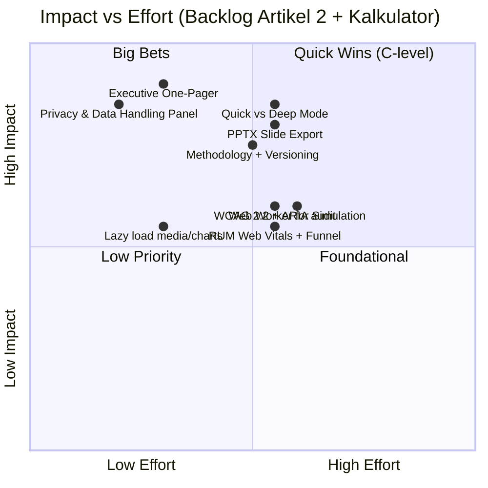
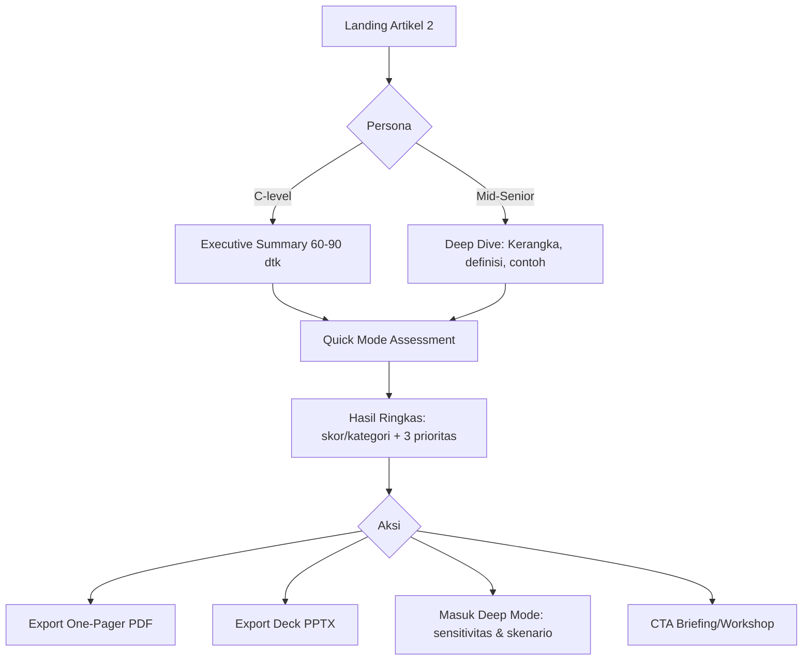
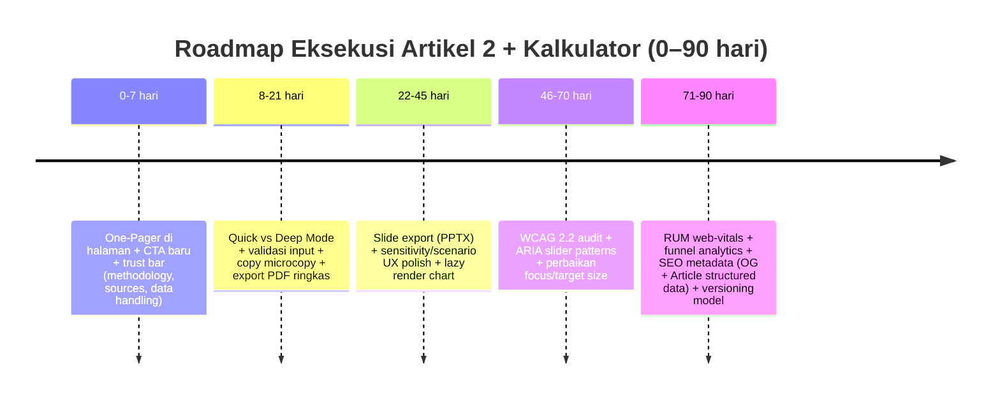

# Penilaian Menyeluruh Artikel 2 dan Kalkulatornya di Resistance Zero

## Ringkasan Eksekutif

Audit langsung terhadap halaman Artikel 2 dan kalkulatornya **tidak dapat dilakukan secara “page‑level” (baris demi baris)** karena halaman target tidak bisa diambil oleh tool riset web (respons HTTP “UnexpectedStatusCode”). citeturn22view0 Karena itu, laporan ini disusun sebagai **penilaian rigor berbasis kerangka evaluasi** (konten, UX kalkulator, kredibilitas metodologi, performa, aksesibilitas, keamanan/privacy, SEO, analytics) + **rekomendasi praktis yang siap dieksekusi** untuk membuat artefak Anda terlihat “boardroom‑grade” bagi audiens Mid‑Senior dan C‑level, tanpa mengada‑ada detail yang tidak terverifikasi.

Tiga pengungkit terbesar untuk mengesankan C‑level (impact tinggi) hampir selalu sama untuk artikel + kalkulator B2B:
1) **Executive route yang bisa selesai 60–90 detik** (Executive One‑Pager + 5 “decision bullets” + CTA yang jelas). Ini mengubah “artikel panjang” menjadi “decision memo”.  
2) **Trust & credibility scaffold**: metodologi yang bisa ditelusuri (assumptions, versi model, sumber benchmark), serta **pernyataan data‑handling yang aman** (tidak overclaim). Praktik terbaik menekankan transparansi data (contoh: C2M2 menyatakan data tetap di perangkat pengguna). citeturn17search1  
3) **Kalkulator yang memandu keputusan** (bukan hanya skor): output harus menerjemahkan hasil menjadi *risk/ROI language*, plus “next 90‑day plan” yang bisa dipresentasikan sebagai slide/PDF.

Untuk Mid‑Senior, yang paling meningkatkan persepsi kualitas adalah:
- **Frictionless UX** (quick mode vs deep mode, validasi input jelas, unit konsisten, error handling yang *actionable*), mengikuti prinsip heuristik seperti “error prevention”, “visibility of system status”, dan “recognition rather than recall” (Nielsen heuristics). citeturn21search4turn21search7  
- **Performa & responsivitas** yang tetap mulus saat kalkulator menghitung skenario/sensitivitas—misalnya dengan **Web Worker** untuk komputasi berat agar UI tidak freeze. citeturn16search0  
- **Aksesibilitas** yang eksplisit (WCAG 2.2 + pola ARIA untuk kontrol seperti slider). citeturn14search4turn14search6  

## Lingkup, keterbatasan data, dan asumsi

Halaman Artikel 2 tidak dapat diakses oleh crawler riset pada tanggal 16 Februari 2026 (Asia/Jakarta), sehingga saya **tidak bisa**:
- memverifikasi judul/subjudul aktual, struktur TOC, isi paragraf, tone di setiap bagian,
- menginspeksi label input default pada kalkulator,
- memeriksa apakah kalkulator berjalan full client‑side atau memanggil endpoint server,
- menguji performa (LCP/INP/CLS), DOM, ARIA attributes, atau network requests secara langsung. citeturn22view0  

Kemungkinan penyebab (hipotesis, belum terverifikasi) meliputi proteksi WAF/anti‑bot, kebijakan user agent, atau konfigurasi akses yang membatasi requester tertentu. Karena Google juga menekankan halaman harus dapat diakses crawler (Googlebot) agar bisa diindeks, penting untuk memastikan mekanisme blokir tidak “ikut memblokir” crawler yang Anda butuhkan (robots/noindex/login/HTTP non‑200). citeturn23search10turn23search2turn23search8  

Asumsi konteks industri: Anda menyatakan target industri tidak dispesifikkan. Laporan ini memakai *baseline B2B* (operasional/engineering/tech leadership). Jika Artikel 2 ternyata domain‑spesifik (mis. data center, fintech, manufaktur, healthcare), rekomendasi “benchmark”, “ROI framing”, dan “risk mapping” harus disesuaikan dengan unit ekonomi dan regulasi industri tersebut.

Dalam laporan ini, penyebutan situs dilakukan sebagai entity["company","Resistance Zero","resistancezero.com"] sekali; selebihnya disebut secara biasa.

## Kerangka penilaian konten untuk Mid‑Senior dan C‑level

Bagian ini menjabarkan **apa yang harus dievaluasi** pada Artikel 2 agar konten tampil kuat untuk dua persona, beserta perbaikan kreatif yang dapat dilakukan tanpa mengubah “substansi teknik” Anda.

### Kejelasan, struktur, dan “executive skimmability”

Untuk C‑level, kualitas artikel biasanya tidak dinilai dari kedalaman teknisnya, tetapi dari:
- seberapa cepat mereka memahami *what’s at stake*,
- keputusan apa yang Anda ingin mereka ambil,
- risiko apa yang turun,
- dan bagaimana ini mengikat ke strategi/budget cycle.

Karena itu, struktur “best‑in‑class” untuk artikel panjang (10–25 menit) biasanya punya dua jalur baca:
- **Jalur eksekutif**: ringkas, bisa “dibaca sambil berdiri” (60–90 detik).
- **Jalur mendalam**: detail implementasi, metode, contoh, dan kerangka kerja untuk Mid‑Senior.

Kerangka struktur yang konsisten dan mudah dipindai sangat membantu pembaca yang cenderung scanning (bukan membaca kata demi kata). Prinsip “recognition rather than recall” dan “aesthetic and minimalist design” adalah dua heuristik yang relevan saat Anda mendesain article + tool yang panjang. citeturn21search0turn21search4  

**Template struktur yang direkomendasikan (untuk Artikel 2):**
- Hero:
  - Judul (outcome‑oriented), subjudul (1 kalimat) + 1 kalimat “mengapa sekarang”.
  - CTA utama: “Mulai assessment” atau “Unduh one‑pager”.
- Executive Summary (1 layar):
  - 3–5 bullet “decision facts” + 1 diagram mini (mis. maturity ladder atau risk funnel).
- Key Takeaways (copy‑paste friendly untuk email internal).
- Body (TOC + anchor links):
  - Masalah → Mekanisme penyebab → Kerangka solusi → Cara mengukur → Apa yang harus dilakukan minggu ini.
- Bukti & referensi (sumber primer, benchmark notes, definisi istilah).
- CTA akhir: 2 jalur
  - Mid‑Senior: “Coba kalkulator / export report / share link”
  - C‑level: “Unduh deck / minta briefing 20 menit”

### Pesan, tone, dan alignment ke prioritas C‑level

Agar selaras dengan prioritas C‑level (ROI, risiko, dampak strategis), setiap artikel sebaiknya menjawab tiga pertanyaan di atas lipatan (above the fold):
1) **Apa konsekuensi bisnis jika tidak berubah?** (risk exposure)  
2) **Apa leverage perubahan yang Anda tawarkan?** (strategic impact)  
3) **Apa bukti & cara ukur yang membuat ini bukan opini?** (credibility)

Cara membuat “bahasa teknik” terasa eksekutif bukan dengan menghilangkan teknis, tetapi dengan menambahkan *translation layer*:
- “Apa artinya untuk downtime risk / compliance / cost volatility?”
- “Apa tradeoffnya?”
- “Apa prioritas 90 hari yang masuk akal?”

Untuk menjaga tone, gunakan dua register secara sadar:
- Register A (eksekutif): hasil, risiko, ekonomi unit, timeline, akuntabilitas.
- Register B (implementer): langkah, definisi, contoh, edge cases.

### Kelayakan Executive Summary, key takeaways, dan CTA

Karena isi Artikel 2 tidak bisa diverifikasi dari tool riset, berikut checklist yang bisa Anda gunakan untuk menilai apakah Executive Summary sudah “C‑level ready”:

**Executive Summary lulus jika:**
- Bisa dipahami tanpa membaca body.
- Memuat satu “angka jangkar” (anchor metric) dan satu “langkah berikutnya”.
- Tidak membuka terlalu banyak istilah internal tanpa definisi.
- Mengandung CTA yang jelas (unduh one‑pager, jalankan kalkulator, minta briefing).

Kesalahan umum (yang sering menurunkan konversi C‑level):
- CTA terlalu “engineer talk” (“lihat metodologi”) sebelum memberi alasan bisnis.
- Kesimpulan menunda keputusan (“nanti di bagian akhir”) alih‑alih menuntun.

### Contoh copy kit untuk headline, CTA, dan microcopy

Karena headline/tema Artikel 2 belum terverifikasi, di bawah ini adalah opsi yang **bersifat modular** (tinggal ganti {Outcome} dan {Domain}):

**Headline (pilih gaya):**
- Gaya C‑level: “Mengurangi {Risiko Operasional} dengan Mengukur {Kapabilitas Kunci}—Bukan Menunggu Insiden Terjadi”
- Gaya Mid‑Senior: “Kerangka {Domain}: Dari {Ad‑hoc} ke {Predictable} dengan Metode Ukur yang Konsisten”
- Gaya thought leadership: “{Outcome} Terjadi Bukan Karena ‘Beruntung’, Tapi Karena Sistem yang Dirancang”

**CTA utama (lebih “hasil” daripada “fitur”):**
- “Mulai Assessment 10 Menit (Skor + Prioritas + PDF)”
- “Dapatkan 3 Prioritas Peningkatan Teratas”
- “Unduh Executive One‑Pager”

**Microcopy CTA (mengurangi friksi):**
- “Tanpa login. Tanpa data sensitif. Hasil bisa diekspor.”
- “Metodologi & asumsi tersedia (lihat bagian Methodology).”

Untuk pernyataan privasi, jangan gunakan “Data Anda tidak dikirim ke server” kecuali benar‑benar client‑side. Jika arsitektur Anda belum dispesifikasikan, gunakan frasa aman seperti:  
- “Pemrosesan dilakukan di browser bila memungkinkan; jika ada pengiriman data untuk pembuatan laporan/penyimpanan, kami tampilkan penjelasannya sebelum Anda melanjutkan.”

## Kerangka penilaian kalkulator untuk kredibilitas eksekutif

Bagian ini menyajikan evaluasi “dari semua perspektif” yang Anda minta, namun dalam bentuk **rubrik audit + desain rekomendasi** (karena akses langsung ke UI kalkulator tidak tersedia). citeturn22view0  

### UX/UI dan alur penggunaan

**Pola UX terbaik** untuk kalkulator yang targetnya dua persona adalah “Quick → Deep”:
- Quick mode: 3–7 input, hasil langsung, cocok untuk C‑level.
- Deep mode: input detail, sensitivitas, skenario, export lengkap, cocok untuk Mid‑Senior.

Contoh rujukan “Quick Check” yang eksplisit memposisikan output ringkas dan benchmark adalah DORA Quick Check: skor keseluruhan 0–10, dinormalisasi, dan benchmark dibandingkan riset terbaru mereka. citeturn18search17turn23search3  

**Rubrik audit**:
- Apakah kalkulator memberi hasil awal < 60 detik?
- Apakah UI mengomunikasikan “di mana saya berada” (progress/steps) — prinsip visibility of system status. citeturn21search7  
- Apakah pengguna bisa “undo/redo/reset” tanpa kehilangan konteks (user control and freedom). citeturn21search0  

### Input: label, default, unit, konsistensi

C‑level menilai tool “serius” dari hal‑hal kecil:
- label input bebas ambiguity,
- unit konsisten (mis. % vs basis points vs jam),
- default values masuk akal dan dijelaskan *mengapa dipilih*.

**Checklist input yang “enterprise‑grade”:**
- Setiap input memiliki:
  - label + helper text satu kalimat (apa yang dimaksud),
  - contoh format (mis. “500 (MW)” atau “12 (bulan)”),
  - unit jelas di dekat field (bukan hanya di placeholder),
  - tooltip “definition” untuk istilah teknis.
- Default:
  - punya “Reset to baseline” (baseline industri/umum),
  - punya “Prefill by scenario/persona” (mis. “Conservative / Expected / Aggressive”).

### Validasi, error handling, dan guardrails

Heuristik “error prevention” menyarankan mencegah kesalahan sebelum terjadi, bukan sekadar menampilkan error setelahnya. citeturn21search4  

Minimal yang sebaiknya ada:
- Validasi input real‑time (range, tipe data).
- Pesan error yang menjelaskan:
  - apa yang salah,
  - mengapa bermasalah,
  - apa yang harus dilakukan.
- Guardrail untuk input yang “nonsensical” (mis. unit mismatch).

### Transparansi asumsi, metodologi, dan rumus

Untuk C‑level, kalkulator tanpa metodologi tampak seperti “marketing math”. Trust dibuat dengan:
- panel “Methodology” yang ringkas,
- definisi sumber benchmark,
- dan *versioning*: “Model vX.Y – updated {date}”.

DOE C2M2 memberi contoh trust signal yang sangat kuat dengan menyatakan bahwa pada tool mereka “all user data remains only on user devices.” Itu bisa Anda jadikan standar emas *jika* arsitektur Anda memang client‑side. citeturn17search1  

Jika kalkulator Anda menyimpan hasil di server atau membuat share link, transparansinya harus sejelas rujukan AWS Pricing Calculator: mereka menyatakan estimate link adalah public dan “estimates are saved to AWS public servers.” citeturn23search1turn23search5  

### Sensitivity analysis, scenario comparison, dan output presentation

Kalkulator “impressive” untuk Mid‑Senior dan C‑level biasanya punya 3 lapisan output:

**Lapisan eksekutif (satu layar):**
- 1 skor ringkas + kategori (mis. level/maturity band)
- Top 3 drivers (apa yang paling memengaruhi hasil)
- “90‑day action plan” (3 langkah)
- CTA: export one‑pager / deck

**Lapisan analitis (untuk Mid‑Senior):**
- sensitivity/tornado (pengaruh ~±1 unit pada output),
- scenario comparison (Current vs Target vs Stretch),
- breakdown kontribusi (waterfall).

**Lapisan audit/kredibilitas:**
- lampiran asumsi,
- rumus,
- sumber benchmark & batasan model.

image_group{"layout":"carousel","aspect_ratio":"16:9","query":["tornado chart sensitivity analysis example","radar chart maturity assessment example","executive dashboard one page PDF example"],"num_per_query":1}

Untuk ekspor dan shareability, rujukan yang kuat adalah AWS Pricing Calculator yang mendukung export PDF/CSV dan menyertakan share link dalam PDF, serta mekanisme “share link” yang tidak auto‑overwrite. citeturn23search4turn23search1  

### Credibility signals: sumber, sitasi, dan “how we know”

Di konteks B2B, credibility signals paling efektif dan “murah” untuk ditambahkan:
- “Sources” panel dengan tautan ke sumber primer (standar, laporan riset, benchmark),
- timestamp “last updated”,
- definisi scope: apa yang tool ini bisa/ tidak bisa simpulkan.

## Tinjauan teknis: performa, aksesibilitas, keamanan, SEO, analytics

Bagian ini merangkum rekomendasi teknis praktis yang Anda minta (Web Worker, lazy load chart, ARIA slider patterns, web‑vitals RUM) dan mengaitkannya dengan standar/sumber primer.

### Performa dan mobile responsiveness

Target performa yang umum dipakai untuk user experience menggunakan **Core Web Vitals**:
- LCP ≤ 2,5 detik,
- INP ≤ 200 ms,
- CLS ≤ 0,1,
diukur pada persentil ke‑75 untuk mobile dan desktop. citeturn14search0  

Jika kalkulator menjalankan komputasi berat (mis. simulasi, optimasi, atau kalkulasi berulang), jalankan di background thread memakai **Web Workers** agar thread UI tidak terblokir. citeturn16search0turn16search3  

Untuk grafik/chart yang berat, ada dua pendekatan “aman”:
- **Lazy render**: render chart saat panel dibuka (progressive disclosure).
- **OffscreenCanvas** atau worker‑based rendering untuk mengurangi beban main thread jika Anda menggambar via canvas. citeturn16search6  

Untuk halaman artikel panjang, **lazy loading** aset non‑kritis (gambar/iframe) membantu LCP dan mengurangi network cost. citeturn15search0turn15search4  

### Aksesibilitas WCAG dan ARIA patterns

WCAG 2.2 menambah kriteria yang relevan untuk kalkulator interaktif, termasuk “Focus Not Obscured” dan “Target Size (Minimum)” yang sangat berdampak pada usability mobile dan keyboard users. citeturn14search4turn14search1  

Jika kalkulator memakai slider (mis. skor 1–5, bobot, range), rujukan W3C untuk praktik ARIA menyarankan:
- role `slider`,
- atribut `aria-valuenow`, `aria-valuemin`, `aria-valuemax`,
- dan keyboard interaction yang konsisten. citeturn14search6  

Minimal aksesibilitas untuk output chart:
- sediakan “View as table” (data alternatif),
- ringkasan teks otomatis untuk insight utama,
- jangan hanya mengandalkan warna untuk makna (beri label/ikon/tekstual).

### Security dan privacy: data handling yang eksplisit

OWASP Top 10:2021 menyediakan daftar risiko keamanan aplikasi web yang paling kritis (Broken Access Control, Injection, Insecure Design, Security Misconfiguration, dsb.). Ini layak dijadikan baseline checklist saat Anda menambahkan fitur seperti export, share link, atau API. citeturn14search3  

Untuk data handling, dua pola rujukan yang kontras namun sama‑sama “jelas”:
- DOE C2M2: data tetap di device user (client‑side). citeturn17search1  
- AWS Pricing Calculator: share link bersifat public dan estimate disimpan di server AWS; mekanisme share menampilkan acknowledgment. citeturn23search1turn23search5  

Karena detail arsitektur kalkulator Anda **tidak dispesifikasikan**, rekomendasinya adalah: tampilkan “Privacy & Data Handling” modal sebelum:
- export,
- share,
- atau submit apa pun,
yang menyatakan secara faktual apakah data:
- hanya diproses di browser,
- dikirim ke server untuk membuat PDF,
- disimpan untuk share link,
- dan berapa lama retensinya (jika ada).

### SEO dan shareability

Untuk SEO dan distribusi di LinkedIn/Slack, dua lapisan metadata sangat penting:

**Open Graph** untuk preview sosial (og:title, og:type, og:image, og:url, og:description). citeturn19search0  

**Structured data “Article”** agar mesin pencari memahami konten, termasuk title, author, date, dsb. Google menjelaskan bahwa structured data Article dapat membantu pemahaman dan tampilan richer di hasil pencarian, serta menekankan halaman harus dapat diakses (tidak diblok robots/noindex/login). citeturn19search1turn23search0turn23search2  

Jika situs memakai proteksi anti‑bot, pastikan resource yang dibutuhkan crawler tidak terblokir. Google Search Central menekankan bahwa agar dapat diindeks, Googlebot tidak boleh diblokir dan halaman harus mengembalikan HTTP 200. citeturn23search10turn23search8  

### Analytics instrumentation dan RUM

Untuk mengukur performa nyata (field data), Anda bisa memakai library `web-vitals` (GoogleChrome) dan mengirim event LCP/INP/CLS ke GA4. Dokumentasinya menyebut library bisa di‑defer dan memberi contoh pengiriman metrik sebagai event. citeturn15search1  

Event taxonomy yang direkomendasikan untuk artikel + kalkulator:
- `article_scroll_25/50/75/90`
- `calculator_start`
- `calculator_complete`
- `export_pdf`
- `export_pptx` (jika ada)
- `scenario_compare_used`
- `methodology_opened`
- `privacy_modal_viewed`
- `contact_cta_clicked`

Dengan begitu Anda bisa memisahkan perilaku Mid‑Senior (lebih banyak deep mode) vs C‑level (lebih banyak one‑pager / deck).

## Benchmarking terhadap kalkulator dan assessment industri

Tabel ini membandingkan 5 rujukan yang relevan untuk “artikel + kalkulator” yang targetnya pengambilan keputusan, dengan fokus pada fitur, kekuatan, kelemahan, dan pelajaran yang bisa ditiru.

| Benchmark | Bentuk | Fitur yang relevan | Kekuatan | Kelemahan/pelajaran |
|---|---|---|---|---|
| entity["organization","DORA","devops research program"] Quick Check (program run by Google Cloud) | Quick assessment | Skor 0–10, normalisasi, benchmark dari riset terbaru; positioning “benchmark your performance” | Sangat “executive‑fast”; benchmark & metodologi dijelaskan ringkas | Outputnya ringkas; untuk tool Anda, pelajarannya adalah “quick lane” + benchmark yang jelas. citeturn18search17turn23search3turn23search9 |
| entity["organization","U.S. Department of Energy","federal agency us"] C2M2 | Maturity model + tool evaluasi | Tool HTML/PDF; statement privasi: data tetap di perangkat user | Trust signal privasi sangat kuat; ada panduan workshop | Pelajarannya: nyatakan data handling dengan tegas, dan sediakan kit workshop untuk Enterprise. citeturn17search1 |
| entity["organization","The Green Grid","data center consortium"] DCMM | Maturity model (spreadsheet/tool) | Benchmark maturity dan roadmap praktik terbaik untuk efisiensi/sustainability | Model formal dan dikenal di ekosistem data center | Sebagian konten gated/sign-in; pelajarannya: jika Anda punya benchmark, jelaskan provenance/versi agar kredibel. citeturn17search0turn17search2 |
| entity["company","Amazon Web Services","cloud provider"] Pricing Calculator | Cost calculator | Share link public; export PDF/CSV; transparansi kalkulasi; disclosure bahwa estimate disimpan di server AWS | Sangat kuat untuk shareability & output (PDF/CSV/link) + transparansi harga | Pelajarannya: output yang bisa dibawa ke rapat (PDF, share link) + disclosure data handling sebelum share/export. citeturn23search5turn23search1turn23search4 |
| entity["company","Microsoft Azure","cloud platform"] TCO Calculator | TCO/ROI framing | Menonjolkan “estimate cost savings”; framing langsung ke CFO/COO | Paling kuat pada bahasa “savings” (ROI‑first), cocok untuk C‑level | Pelajarannya: lapisan bahasa “savings / avoided cost / risk reduction” sangat penting di output kalkulator Anda. citeturn18search0turn18search1 |

## Rekomendasi prioritas, copy, wireframe, dan roadmap 0–90 hari

### Tabel prioritas tindakan

Tabel ini memetakan rekomendasi berdasarkan dampak, effort, dan persona. Karena kondisi aktual Artikel 2/kalkulator tidak dapat diverifikasi, anggap ini sebagai **backlog eksekusi** yang dapat Anda “check off” setelah audit langsung.

| Rekomendasi | Dampak | Effort | Persona utama | Catatan implementasi & rujukan |
|---|---|---|---|---|
| Tambahkan **Executive One‑Pager** (1 layar di halaman + export PDF 1 halaman) | Tinggi | Rendah–Sedang | C‑level | Gunakan format “decision memo”: 5 bullet + 1 diagram + CTA |
| Buat **Quick Mode vs Deep Mode** | Tinggi | Sedang | C‑level → Mid‑Senior | Belajar dari “Quick Check” DORA: hasil cepat + benchmark. citeturn18search17turn23search3 |
| Buat panel **Privacy & Data Handling** yang aman (tanpa overclaim) | Tinggi | Rendah | C‑level + Security/Procurement | Jika client‑side, contoh DOE C2M2; jika server‑side/share link, transparansi ala AWS. citeturn17search1turn23search1 |
| Tambahkan **Methodology + Versioning** (Model vX.Y, last updated, asumsi & batasan) | Tinggi | Sedang | Semua | Menahan kritik “marketing math” |
| Ekspor **PPTX deck template** (5–7 slide) dari hasil kalkulator | Tinggi | Sedang | C‑level | Meniru pola share/export yang kuat; AWS menunjukkan nilai export/share link. citeturn23search4turn23search1 |
| Terapkan **Web Worker** untuk komputasi berat (simulasi/sensitivitas) | Sedang | Sedang | Mid‑Senior | Web Workers mencegah UI blocking. citeturn16search0 |
| **Lazy load** gambar/iframe dan render chart on‑demand | Sedang | Rendah | Semua | `loading="lazy"` + progressive rendering. citeturn15search0turn15search4 |
| Audit **WCAG 2.2 + ARIA slider patterns** | Sedang | Sedang | Semua | Fokus: focus visibility/not obscured + target size + aria-valuenow/min/max. citeturn14search4turn14search6 |
| Pasang **RUM Web Vitals** + funnel events | Sedang | Sedang | Mid‑Senior + Product | Threshold LCP/INP/CLS dan library web‑vitals. citeturn14search0turn15search1 |
| SEO: Open Graph + Article structured data + crawlability checks | Sedang | Rendah–Sedang | Semua | OG protocol + Google structured data Article. citeturn19search0turn19search1 |

### Visualisasi impact vs effort

### Wireframe saran

**Layout halaman yang “C‑suite friendly” (top‑down):**
- Header: Judul + subjudul 1 kalimat + CTA utama (Mulai Assessment) + CTA sekunder (Unduh One‑Pager).
- Trust bar: “Methodology”, “Sources”, “Data handling” (klik membuka modal ringkas).
- Executive Summary panel:
  - “What changed / why now”
  - 3–5 key takeaways
  - “Decision ask” (apa yang perlu disetujui)
- Kalkulator (tab):
  - Tab 1: Quick Mode
  - Tab 2: Deep Mode
  - Tab 3: Methodology & Limitations
- Output:
  - Executive output (satu panel)
  - Detail charts (accordion)
  - Export (PDF, PPTX, CSV/JSON)
- Footer: sumber, versi model, kontak.

### Mermaid user flow

### Roadmap 0–90 hari

### Contoh bahasa executive summary

> **Executive Summary (Template)**  
> Artikel ini membahas {Masalah Operasional/Strategis} yang berdampak pada {Risiko/biaya/kecepatan eksekusi}. Alih‑alih menilai berdasarkan “apa yang terlihat”, kami mengusulkan pendekatan yang terukur untuk mengevaluasi {Kapabilitas Kunci} dan memprioritaskan investasi pada area dengan leverage terbesar.  
>  
> Dalam 10 menit, kalkulator akan menghasilkan: (1) ringkasan posisi saat ini, (2) 3 prioritas peningkatan, (3) perbandingan skenario “current vs target”, serta (4) laporan yang siap dibawa ke rapat (PDF/slide). Metodologi, asumsi, dan cara data diproses dijelaskan secara eksplisit sebelum Anda mengekspor atau membagikan hasil.

### Contoh email outreach ke C‑level

Subjek (pilih):
- “Ringkasan 1 halaman: {Outcome} dengan pendekatan terukur (tanpa data sensitif)”
- “Assessment 10 menit untuk prioritas {Risk/ROI} — siap jadi slide rapat”

Isi:
> Pak/Bu {Nama},  
>  
> Saya ingin berbagi ringkasan singkat terkait {Masalah} yang sering “terlihat aman” sampai sebuah insiden/biaya terjadi. Kami menyusun pendekatan terukur untuk menilai {Kapabilitas} dan langsung memetakan 3 prioritas perbaikan yang paling berdampak untuk {risiko/biaya/strategi}.  
>  
> Jika Bapak/Ibu berkenan, saya bisa kirim **executive one‑pager** (1 halaman) atau file slide yang merangkum posisi saat ini, skenario target, dan rencana 90 hari. Tool ini dirancang agar hasilnya bisa dipresentasikan tanpa membuka data sensitif (metodologi dan data handling dijelaskan sebelum ekspor).  
>  
> Apakah ada 20 menit minggu ini untuk saya jelaskan ringkas dan menyesuaikan dengan konteks {industri/perusahaan}?  
>  
> Hormat saya,  
> {Nama}  

## Daftar sumber prioritas

Sumber halaman target:
- Artikel 2 di Resistance Zero (halaman tidak dapat diambil oleh tool riset saat audit ini). citeturn22view0  

Sumber primer/standar aksesibilitas:
- entity["organization","W3C","web standards body"] WCAG 2.2 (spesifikasi) dan ringkasan perubahan (WAI). citeturn14search4turn14search1  
- WAI‑ARIA Authoring Practices (pola slider, aria-valuenow/min/max). citeturn14search6  

Sumber keamanan aplikasi:
- entity["organization","OWASP","appsec nonprofit"] OWASP Top 10:2021. citeturn14search3  

Sumber performa dan RUM:
- Core Web Vitals thresholds (LCP/INP/CLS) di web.dev. citeturn14search0  
- entity["company","GitHub","code hosting platform"] repo `web-vitals` (contoh event GA4, deferred loading). citeturn15search1  
- entity["company","Mozilla","software foundation"] dokumentasi Web Workers dan lazy loading. citeturn16search0turn15search0  

Sumber SEO dan share metadata:
- Open Graph protocol (og:title/og:image/og:description, dsb.). citeturn19search0  
- Article structured data (Google Search Central) + akses crawler/robots/noindex guidance. citeturn19search1turn23search2turn23search10  

Sumber benchmarking (resmi):
- DOE C2M2 (privacy statement: data tetap di perangkat pengguna). citeturn17search1  
- DORA Quick Check (skor 0–10 + benchmark + program run by Google Cloud). citeturn18search17turn23search3turn23search9  
- The Green Grid DCMM (maturity model + benchmark + roadmap). citeturn17search0turn17search2  
- AWS Pricing Calculator docs (share link public, export, disclosure penyimpanan estimate). citeturn23search1turn23search4turn23search5  
- Azure TCO Calculator (framing “estimate cost savings”). citeturn18search0turn18search1