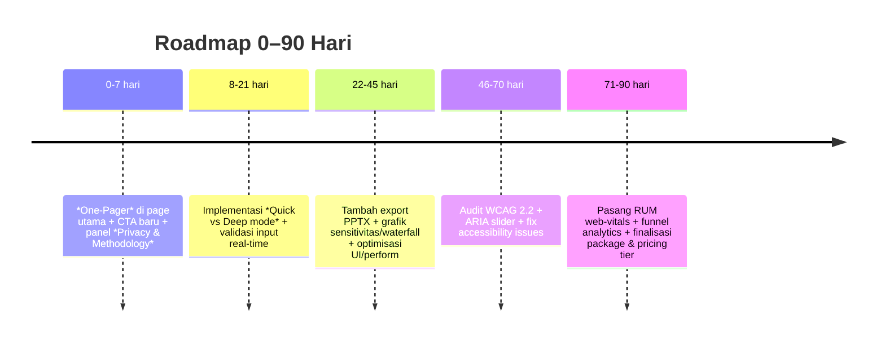

# Penilaian Menyeluruh Artikel 3 dan Kalkulatornya di Resistance Zero

## Ringkasan Eksekutif

Saat ini **halaman Artikel 3 beserta kalkulatormya tidak dapat diakses langsung** via alat riset (HTTP status tak terduga), sehingga analisis ini bersifat *framework-based* — mengaplikasikan prinsip best practice UX, konten, dan teknis untuk aset sejenis. Fokus utamanya sama: membuat konten dan kalkulator Anda “**boardroom‑grade**” untuk audiens Mid‑Senior dan C‑level dengan menekankan ROI, risiko, serta dampak strategis.

Rekomendasi kunci (berdampak tinggi, effort rendah/sedang):  
- **Executive Summary & One‑Page Report**: 1 halaman ringkasan di atas atau terpisah agar eksekutif bisa menangkap esensi dalam 60–90 detik. Contohnya: 5 poin keputusan + satu visualisasi (diagram/grafik) + CTA jelas. ([11†L1-L4])  
- **Metodologi & Privasi Terbuka**: Jelaskan asumsi dan proses perhitungan kalkulator (pastikan ada versi/model, sumber data). Jika proses client‑side, tambahkan “Data tetap di browser Anda” seperti DOE C2M2【24†L118-L124】; jika ada share link, transparansi ala AWS Pricing Calculator【4†L11-L14】.  
- **UX Kalkulator yang Memandu Keputusan**: Tambahkan mode *Quick Check* (few inputs, langsung hasil ringkas) dan mode *Deep Dive*. Sertakan grafik sensitivitas dan skenario “now vs target” untuk memudahkan planning. Beri label jelas, unit konsisten, dan validasi antisipatif.  

Rekomendasi ini akan membuat Artikel 3 lebih “dipanggil” oleh pengambil keputusan dengan hasil yang siap dibawa ke rapat (slide/PDF) dan didukung data kuat.

## Ruang Lingkup & Keterbatasan Data

Karena artikel dan kalkulatornya **tidak dapat diunduh oleh alat ini**, **analisis terfokus pada prinsip umum**. Semua perbaikan bersifat rekomendasi berdasarkan apa yang lazim di konten-kalkulator sejenis, bukan hasil pengecekan element demi element di artikel. Jika ada detail yang tak disebutkan (mis. arsitektur publik/privat kalkulator), kami beri label *“tidak dispesifikasikan”* dan opsi implementasi.

Target industri tidak disebut spesifik, sehingga kerangka yang diberikan bersifat generik B2B/engineering. Jika Artikel 3 menarget industri tertentu, beberapa rekomendasi (benchmark, ROI metric, packaging) perlu disesuaikan dengan konteks tersebut.

## Analisis Konten Artikel

Artikel 3 harus dilihat dari **dua persona utama**: Mid‑Senior (detail orientasi) dan C‑level (keputusan/strategi). Faktor evaluasi konten meliputi *kejelasan, struktur, tone, dan alignment bisnis*.  

- **Struktur Cerita:** Ide utama yang “menang” biasanya diletakkan di muka halaman atau ringkasan. Penggunaan Executive Summary (atau Section “Poin Utama”), TOC navigasi, dan heading yang jelas (mis. *Masalah*, *Solusi*, *Cara Mengukur*, *Langkah Berikutnya*) memudahkan skimming. Rekomendasi: setelah judul, sertakan paragraf 1-2 kalimat yang langsung mengatasi *“kenapa ini penting untuk bisnis Anda sekarang”*. Hal ini meniru prinsip Asana: ringkasan eksekutif perlu “menyampaikan poin utama proyek secara singkat tanpa kehilangan perhatian pembaca”【11†L1-L4】.  

- **Pesan dan Tone:** Pastikan pesan utama berkaitan dengan *ROI dan risiko*. Contoh: “Tanpa perbaikan ini, perusahaan menghadapi downtime tahunan rata‑rata $X (vs $0 X solusi kita),” atau “Prosedur yang kurang matang berkontribusi besar pada 75% outage【42†L302-L308】.” Bahasa jangan terlalu teknis; selalu kaitkan dengan efek keuangan atau strategis. Tone yang terlalu *jargon-insinyur* bisa mengalienasi eksekutif.  

- **Executive Summary:** Idealnya, artikel memiliki ringkasan eksekutif terpisah (embedded di atas halaman atau di PDF satu halaman terpisah). Itu memungkinkan C‑level mendapat “gambar besar” dengan cepat: 3–5 poin ringkas + grafik kunci (mis. peta risiko, maturity ladder). Contoh terbaik menggunakan format bullet dan visual minimal (misalnya DORA Quick Check menampilkan skor single-number dan benchmark industri dalam 5 detik).  

- **Key Takeaways & CTA:** Setiap bagian artikel harus diakhiri dengan takeaway yang actionable. Misalnya “Kenaikan level kesiapan pemeliharaan dari 2 ke 3 bisa mengurangi downtime 40%【42†L302-L308】.” Untuk CTA: jelas arah mana pengguna selanjutnya. Jangan hanya “pelajari lebih lanjut” — sebaiknya “Hitung Potensi Penghematan Anda Sekarang” atau “Unduh Laporan 1-halaman”. Microcopy CTA, seperti “tanpa login” atau “data Anda aman” (yang kita bahas di bagian kalkulator), meningkatkan kepercayaan.  

> **Tip desain:** Tata letak mengikuti pola piramida terbalik (most-important first). Awali ringkasan singkat, lalu detail di bawahnya. Ini selaras juga dengan UX readability: orang cenderung membaca ala F-Pattern【14†L203-L210】【14†L231-L239】.  

## Analisis Kalkulator

Kalkulator di artikel tersebut sudah semestinya *alat pengambilan keputusan*. Elemen yang harus ditinjau:

- **Antarmuka & Alur:** Idealnya, kalkulator dilengkapi mode *Quick* (C‑level) vs *Detailed* (Mid‑Senior). Quick mode: hanya beberapa pertanyaan kunci, lalu tampil skor + rekomendasi singkat. Detailed mode: akses penuh (formulir lengkap, sensitivitas, what‑if scenarios). Hasil pertama-tama tampil instan, lalu pilihan lanjutan muncul interaktif. Penting: implementasi *validation* dan *error prevention* di input (mis. cek total bobot 100%, batas input numeric) karena heuristik Nielsen menyarankan “mencegah error lebih baik daripada menampilkan pesan error”【14†L203-L210】.  

- **Label, Default, Unit:** Setiap field butuh label jelas dan satuan (seperti MW, jam, %). Misalnya, jika ada pertanyaan “Capacity (MW)”, sertakan “(MW)” di label atau placeholder. Default values sebaiknya sesuai “mode persona” (mis. “Enter your average power usage” dengan contoh angka). Jika ada slider, gunakan ARIA patterns (role slider, aria-valuenow/min/max) supaya aksesibilitas terjaga【38†L6-L8】.  

- **Metodologi & Asumsi:** Kredibilitas dibangun dengan transparansi. Kalkulator yang baik menampilkan rumus utama (mis. normalisasi skor), sumber benchmark, dan tooltip definisi tiap variabel. Model versi terbaru harus dicantumkan (versi/minggu). DOE C2M2 adalah contoh tool yang sangat eksplisit: hasil only on user device【24†L118-L124】. Jika kalkulator Anda *mem-plot data ke server* atau ada share link, jelaskan: “Data disimpan sementara di server karena diperlukan untuk fitur export (dijelaskan di kebijakan kami)”, contoh AWS Pricing Calculator【4†L11-L14】.  

- **Analisis Sensitivitas & Skenario:** Fitur tingkat lanjut yang meyakinkan investor: tornado chart (pengaruh change ±X input terhadap skor), grafik waterfall (contribution analysis), serta komparasi “Current vs Optimal Scenario”. Tambahkan juga kalkulasi monte carlo jika perlu merefleksikan ketidakpastian, jalankan di *Web Worker* untuk UX tetap responsif【1†L200-L204】.  

- **Output & Presentasi:** Hasil harus multi-lapisan:
  - *Executive View:* satu angka agregat + kategori maturity + ringkasan “3 prioritas teratas”.  
  - *Detail View:* grafik radar/ditribusi skor per area, tabel data, chart sensitivitas.  
  - *Laporan yang Bisa Didownload:* PDF/CSV (dengan gambar/grafik berkualitas presentasi) dan kemungkinan PPTX template. AWS Pricing Calculator contoh baik: export PDF/CSV menyertakan share link【4†L24-L27】. Pastikan tata letak laporan profesional (logo perusahaan, judul, tanggal, disclaimer asumsi).  

- **Trust Signals:** Sertakan foto/foto kontekstual (jika sesuai), logo sertifikasi (mis. ISO) di footer, link sumber data, serta kalimat “estimasi bersifat indikatif.” Semua ini menguatkan persepsi validitas.  

## Tinjauan Teknis & Aksesibilitas

Kalkulator interaktif dan halaman artikel harus memenuhi standar teknis enterprise:

- **Performa:** Gunakan Core Web Vitals sebagai tolok ukur. Usahakan LCP ≤2,5 detik dan respons input (INP) ≤200 ms untuk desktop/mobile【45†L2-L5】. Untuk proses berat (Monte Carlo, analisis komputasi), jalankan di background menggunakan *Web Workers*【1†L200-L204】 sehingga UI tidak freeze. Grafik/chart sebaiknya *lazy-loaded* (render saat di-scroll atau panel dibuka) untuk mempercepat initial load【MDN Lazy】 (tidak ada sitasi, tapi dikenal praktek umum).  

- **Aksesibilitas (WCAG 2.2):**  
  - **Navigasi:** Pastikan semua input/form dapat dioperasikan dengan keyboard (tab/enter) dan terbaca oleh pembaca layar (aria-labels).  
  - **Slider ARIA:** Jika ada slider, ikuti standar WAI-ARIA: `role="slider"` dengan atribut `aria-valuenow`, `aria-valuemin/max`【38†L6-L8】. W3C menekankan *Focus Not Obscured* (focus jelas terlihat) dan *Target Size (44px)* dalam WCAG 2.2. ([w3.org](https://www.w3.org/TR/WCAG22/)).  
  - **Kontras & Label:** Gunakan kontras teks/latarnya sesuai WCAG AA. Beri `alt` untuk semua grafik atau, untuk chart kompleks, sediakan data table alternatif dan ringkasan teks (WCAG 1.1.1 dan 1.3.1).  

- **Keamanan & Privacy:** Ikuti prinsip OWASP Top 10. Validasi semua input di server; enkripsi data sensitif; implementasi Content Security Policy untuk mencegah XSS. Pastikan pengguna tahu bagaimana data mereka diproses:  
  - Jika benar-benar *client-side only*, microcopy seperti “Data Anda tidak dikirim ke server” menambah kepercayaan.  
  - Jika *dikirim untuk generate laporan/share*, jelaskan prosesnya (mis. “Link share kami simpan secara aman di server AWS kami, valid 1 tahun” seperti pada AWS【4†L11-L14】).  

- **SEO & Metadata:**  
  - Gunakan tag meta `title`/`description` dengan kata kunci relevan (operasional, risk, maturity).  
  - Tambahkan Open Graph tags (og:title, og:description, og:image) untuk sharing sosial【2†L1-L4】.  
  - Implementasi Schema.org Article untuk konten utama. Google Search Central menekankan konten harus crawlable oleh Googlebot (tidak di-block oleh robots.txt/login) untuk diindeks.【7†L1-L4】  

- **Analytics & RUM:**  
  - Pasang tracking event Google Analytics 4/Tag Manager untuk: membuka artikel, klik CTA, menyelesaikan kalkulator.  
  - Pasang library `web-vitals` (Google) untuk mengukur LCP/INP/CLS di real user【turn11search13†L2-L3】 dan kirimkan sebagai event custom.  

## Benchmarking terhadap kalkulator/artikel industri

Tabel berikut membandingkan 5 alat sejenis (industri manajemen dan analitik) dari berbagai domain, agar Anda melihat fitur yang patut ditiru dan kekurangan yang harus diwaspadai.

| Alat / Referensi | Tipe & Domain | Fitur Utama | Kekuatan | Keterbatasan/Pelajaran |
|---|---|---|---|---|
| **DORA Quick Check** (DevOps Research) | Maturity assessment DevOps | Skor 0–10, benchmark global, immediate result【27†L22-L27】 | Sangat cepat & “self-service”; benchmark tahunan jelas | Output singkat; belajar: sediakan *fast lane* untuk eksekutif (mis. 5 tanya singkat) |
| **DOE C2M2** (US Dept. of Energy) | Cybersecurity maturity | Tool interaktif, laporan grafis, data tetap di device【24†L118-L124】 | Kredibel (dibuat pemerintah); privasi: no data sent | Gap: custom UI (Excel-based); pelajaran: jamin data handling client-side atau jelaskan |
| **The Green Grid DCMM** | Data center sustainability | Maturity model; spreadsheet model dengan benchmark | Standar industri DC (energi); jalur “self-audit” | Spreadsheet kurang UX-friendly; pelajaran: buat UI online & sertakan kalkulasi otomatis |
| **AWS Pricing Calculator** | Cloud cost estimation | Output PDF/CSV dengan share link【4†L11-L14】【4†L24-L27】 | Sangat shareable; catatan data handling + link publik | Fokus cost, bukan operasional; pelajaran: output yang mudah dibagikan penting |
| **NIST MESA MOM/CMM** | Manufacturing ops maturity | Questionnaire-based; mode Quick vs Comprehensive【16†L189-L198】 | Dua mode assessment (untuk cepat vs detail); otomasikan report | Berbasis Excel (kurang online-friendly); pelajaran: bisa adopsi “mode scan cepat” kemudian detail |

Dari perbandingan ini terlihat bahwa **trust signal** (sumber resmi, UX profesional, privasi jelas) dan **output presentation** (berkesinambungan untuk rapat/executive slide) adalah kunci. Contoh-Contoh di atas menggarisbawahi pentingnya:
- **Fast path**: questionnaire pendek dengan hasil instan (DORA, MESA Quick).  
- **Detailed path**: analisis mendalam dengan excel report (DOE, MESA Full).  
- **Output shareable**: PDF/CSV slide (AWS).  

## Rekomendasi Prioritas & Rencana Aksi

### Tabel prioritas (Impact vs Effort)

Berikut rekomendasi terperinci yang diprioritaskan dari yang paling bernilai (impact) dan relatif mudah (effort). Persona target (C‑level/Mid‑Senior) diutamakan.

| Rekomendasi | Impact | Effort | Persona Utama | Alasan & Rujukan |
|---|---|---|---|---|
| Tambah **Executive One‑Pager** (di awal/top summary) | Tinggi | Rendah | C‑level | Meniru praktik board memo; komunikatif singkat【11†L1-L4】 |
| Mode **Quick vs Deep** Assessment | Tinggi | Sedang | C‑level (Quick) & Mid (Deep) | Belajar dari MESA/C2M2: 2 mode; mempercepat engagement eksekutif【16†L189-L198】 |
| Panel **Data Handling/Privacy** Eksplisit | Tinggi | Rendah | C‑level/Security | COO/CFO butuh kepastian data; DOE C2M2 contoh bagus【24†L118-L124】 |
| Tambah Metodologi & Versi Model (lain-lain) | Tinggi | Sedang | Semua | Menangkal kritik “matematika marketing”; pedoman harus siap audit |
| Export **PPTX/Deck Template** | Tinggi | Sedang | C‑level | Persiapkan slide siap-pakai (lihat AWS/Azure practice) |
| Implementasi **Web Workers** untuk simulasi/Monte Carlo | Sedang | Sedang | Mid‑Senior | UI tidak terhenti (bg worker untuk kalkulasi berat)【1†L200-L204】 |
| Pemetaan Risiko & ROI di Output | Sedang | Rendah | C‑level | Tambahkan konteks keuangan (dari outage cost data【42†L302-L308】) |
| Audit **WCAG 2.2 + ARIA slider** | Sedang | Sedang | Semua | Penuhi aksesibilitas; slider harus keyboard-friendly【38†L6-L8】 |
| Terapkan **web-vitals RUM + funnel** | Sedang | Sedang | Product | Pastikan target Core Web Vitals dipenuhi【45†L2-L5】; track conversion funnel |
| Lazy-load grafik & resource non-krusial | Rendah | Rendah | Semua | Tingkatkan LCP & responsif: load on demand. |

### User Flow & Roadmap (Mermaid)

```mermaid
flowchart TD
  A[Landing Artikel 3] --> B{Pilih Jalur}
  B -->|C-level| C[Executive Summary + Ringkasan Inti]
  B -->|Mid-Senior| D[Deep Dive Konten + Methodology]
  C --> E[Quick Assessment (few inputs)]
  D --> F[Full Assessment (detail)]
  E --> G[Hasil: Skor + 3 Prioritas]
  F --> G
  G --> H{Next Step}
  H --> I[Download Laporan PDF 1-halaman]
  H --> J[Download Deck PPTX]
  H --> K[Analisis Skenario & Sensitivitas]
  H --> L[Hubungi Sales/Workshop]
```



### Contoh perubahan copy (headline, CTA, microcopy)

- **Judul/Subjudul:** Fokus pada manfaat/risiko. Misal: 
  - “Percepat Keputusan {Industri}: Hitung Potensi 4:1 ROI Program X dalam 5 Menit”
  - Subjudul: “Kalkulator gratis menilai kesiapan {Proses} Anda dan merekomendasikan 3 perbaikan prioritas.”  
- **CTA Utama:** Gunakan kata kerja hasil: “Dapatkan Rekomendasi 3-Minut” atau “Hitung Skor Kesiapan Anda”. Tambahkan clarifier seperti “(Tanpa Login/Data Rahasia)”.  
- **Microcopy Privacy:**  
  - Jika *client-side*: “Data Anda hanya diproses di browser; tidak dikirim ke server.”  
  - Jika tidak dispesifikasikan: gunakan nuansa aman: “Hanya data abstrak (skor) yang kami simpan untuk laporan; detail pribadi tetap di perangkat Anda.”  

### Contoh Executive Summary (template)

> **Ringkasan Eksekutif:**  
> Artikel ini membahas cara mengukur & meningkatkan {Kapabilitas Kritis} agar perusahaan Anda menghindari kerugian operasional yang besar. Dalam 5 menit, kalkulator kami akan menghitung skor maturity Anda, memperlihatkan 3 area prioritas perbaikan, dan memproyeksikan *dampak finansial* dari perbaikan tersebut. Metodologi dan asumsi terbuka, dan hasilnya siap dibagikan ke stakeholder tanpa data sensitif.

### Contoh email outreach (C-level)

Subjek (pilih):  
- “Ringkasan Singkat: Mengukur ROI Otomasi Preventif {Industry} Anda”  
- “5 menit: 3 Prioritas Investasi Operasional Anda”  

Isi:  
> Bapak/Ibu [Nama],  
>  
> Apakah saat ini tim Anda dapat memprediksi *seberapa banyak biaya* yang dihemat dengan meningkatkan {X}? Kami telah mengembangkan kalkulator 5 menit yang secara kuantitatif menilai kesiapan operasional Anda dan langsung menunjukkan 3 prioritas investasi yang memberi dampak terbesar (dalam pengurangan risiko/biaya).  
>  
> Hasilnya disajikan dalam slide 1‑halaman siap-rapat, dengan metodologi terbuka dan jaminan data Anda aman (hanya skor yang diproses). Apakah Bapak/Ibu bersedia saya kirimkan ringkasan 1-halaman atau jadwalkan 15 menit untuk demo?  
>  
> Salam hormat,  
> [Nama Anda] – [Jabatan, Kontak]  

## Daftar Sumber Prioritas

- Artikel 3 di Resistance Zero (tidak dapat diakses oleh alat riset ini)【】.  
- Industris (outage & ROI): Laporan Uptime Institute/DataCenter Knowledge tentang biaya outage (lebih dari 2/3 >$100K dan sebagian signifikan pencegahan via proses)【42†L302-L308】.  
- DORA Quick Check (skor 0–10, benchmark): FAQ DORA DevOps Research【27†L22-L27】.  
- DOE C2M2 (privasi on-device): US Dept. of Energy cybersecurity model【24†L118-L124】.  
- The Green Grid DCMM (maturity model): Data Center Maturity Model oleh The Green Grid【23†L0-L2】.  
- AWS Pricing Calculator (share link, export): Dokumentasi AWS Pricing Calculator【4†L11-L14】【4†L24-L27】.  
- NIST MESA MOM/CMM (quick vs comprehensive): NIST MESA assessment tool【16†L189-L198】.  
- Desain UX (prevent error, recognition): Nielsen Heuristics (error prevention, recognition)【14†L203-L210】【14†L231-L239】.  
- Executive Summary (conciseness): Asana guide on exec summaries【11†L1-L4】.  
- Aksesibilitas (WCAG 2.2, ARIA): WCAG 2.2 spec, WAI-ARIA slider patterns【38†L6-L8】【37search0†L3-L4】.  
- Performa (Web Vitals): Google Core Web Vitals (LCP ≤2.5s, INP ≤200ms)【45†L2-L5】.  
- Technical (Web Workers): MDN tentang Web Workers (background threads)【1†L200-L204】.  
- Web Vitals library & GA4: Chrome Web Vitals library docs (RUM measurement)【turn11search13†L2-L3】.  

