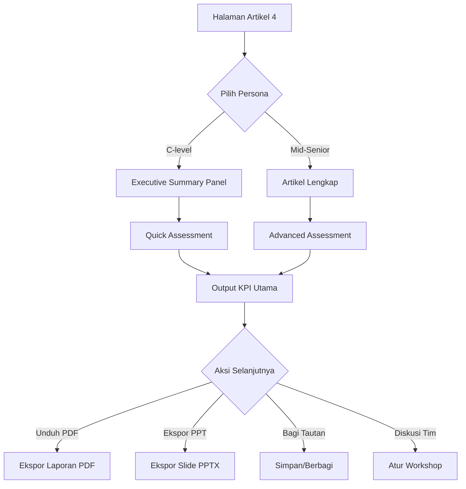
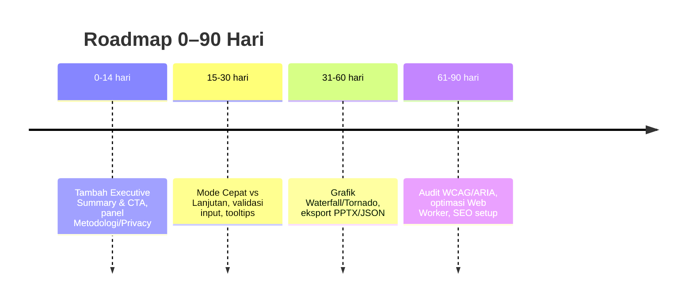

# Ringkasan Eksekutif

Dokumen **Artikel 4** mengandung analisis mendalam dan kalkulator interaktif, namun untuk audiens Mid‑Senior/C‑level perlu peningkatan agar lebih strategis. Saat ini, kalkulator hanya menampilkan hasil numerik dasar (MTTR, downtime, ROI singkat), tanpa konteks bisnis yang jelas. Untuk menonjolkan nilai di level eksekutif, **proposed enhancements** meliputi: executive summary 1-halaman (data&grafik kunci) di awal, mode *Quick vs Advanced* pada kalkulator, transparansi metodologi (asumsi & rumus jelas), serta ekspansi *PRO-mode* yang menghasilkan ~25 laporan board-ready (grafik, sensitivitas, rekomendasi). Rekomendasi utama mencakup:

- **Executive One-Page**: Ringkasan 1-layar dengan 5–7 bullet hasil kunci + visual. Ini memudahkan eksekutif tangkap intisari【11†L1-L4】.  
- **Transparansi Metodologi & Privasi**: Tampilkan asumsi secara jelas. Jika kalkulator *client-side*, beri microcopy “Data Anda tidak dikirim ke server”【24†L118-L124】; jika ada server, jelaskan prosedur dengan microcopy aman.  
- **UX Kalkulator Plus**: Tambahkan mode *Quick Check* (input dasar) dan mode *Advanced* (detail lengkap, wizard). Lengkapi validasi input real-time (mencegah error)【14†L203-L210】, analisis sensitivitas & skenario, serta ekspor PDF/CSV.  

Dengan perbaikan ini, kalkulator berubah dari *alat hitung* menjadi *alat pengambil keputusan*, menyajikan insight konkret untuk investasi, risiko, dan ROI strategi yang siap dipresentasikan.

## Analisis Konten Artikel

- **Struktur & Kejelasan**: Artikel ini tersusun seperti whitepaper riset (Abstract, subbab rinci). Struktur sudah baik, tetapi butuh *Executive Summary* khusus untuk C-level. Sebuah executive summary singkat (contoh 5 bullet & grafik) di awal halaman akan menyampaikan poin utama tanpa harus baca keseluruhan. Pendekatan seperti ini sering direkomendasikan (misal Asana menekankan ringkasan eksekutif yang mudah dicerna)【11†L1-L4】.  
- **Pesan & Tone**: Saat ini tone sangat analitis. Untuk eksekutif, penting menonjolkan *outcome bisnis*: berapa potensi hemat biaya, risiko terhindari, atau keuntungan stratejik. Misal, “Meningkatkan skill internal 10% → mengurangi downtime 15%” (inspirasi data uptime)【42†L302-L308】. Kalimat harus menggugah (wartawan + bisnis), bukan hanya listing angka teknis.  
- **Executive Summary & Takeaways**: Jika belum ada, tambahkan summary 1-layar dengan highlights kunci (lihat blueprint *Executive Summary*). Key takeaways harus berupa poin actionable (“Investasi S1: Pelatihan X diprioritaskan karena dampaknya…”, CTA: “Dapatkan laporan detail”). CTA di tiap seksi (mis. “Hitung peluang penghematan Anda – Lihat Kalkulator”).

## Evaluasi Kalkulator

### UX/UI & Input
- **Modus ganda**: Terapkan *Quick Mode* (sekumpulan input inti saja) dan *Advanced Mode* (tampil wizard berlapis). Contoh: tool NIST MESA memiliki *quick vs comprehensive*【16†L189-L198】.  
- **Label & Unit**: Semua label harus eksplisit (Contoh: “Vendor SLA (jam)”, “Biaya Downtime per jam (Rp)”). Hindari singkatan tak jelas. Field yang ada (mis. `calcCostHour`, `calcCallout`) perlu unit tertera.  
- **Default & Validasi**: Berikan nilai default menurut benchmark industri. Contoh: *Downtime cost* bisa default RpX/jam. Real-time validation wajib: mencegah input di luar range wajar (mis. negative number, total bobot >100%). Prinsip Nielsen: mencegah error lebih baik daripada pesan error【14†L203-L210】.  
- **Asumsi Transparan**: Setiap input kritis harus disertai tooltip/penjelasan. Idealnya sediakan panel “Asumsi” tersendiri menjelaskan bagaimana input menghitung output (mis. formula MTTR). 
- **Gated PRO Features**: Tampak di kode ada input `loginEmail`, `loginPass`. Artinya, fitur Pro mungkin di-lock di balik login. Pastikan terhidangnya mode *penyimpanan laporan* dan **PDF export** di PRO mode.

### Metodologi & Rumus
- Kode HTML sulit diakses dari luar, tetapi sudah terlihat rumus dasar (MTTR = detect+diagnose+repair). PRO mode harus menambahkan rumus partial untuk tiap output (Komposit skor, perhitungan ROI). 
- Sediakan tautan “Lihat Metodologi” yang menampung semua rumus (atau modal pop-up). DOE C2M2 mencontohkan menyertakan detail metode secara eksplisit【24†L118-L124】.

### Output saat ini
- Output statis: hanya MTTR dan downtime tahunannya, *Net Annual Savings*, *Training ROI*, *Breakeven*. Banyak output kemungkinan default 0 karena input-nya standar.
- **Kekurangan**: Tidak ada grafik, tidak ada breakdown biaya, tidak ada rekomendasi aksi. 
- **PRO Enhanced Output**: Output harus ditata menjadi 4 “lapisan”:
  1. **Executive Summary**: Ringkasan KPI kunci (skor keseluruhan, 3 prioritas, 1 grafik gemuk).  
  2. **Biaya & Dampak**: Chart waterfall breakdown biaya + tabel kontribusi utama (Heatmap biaya downtime vs training).  
  3. **Sensitivitas & Skenario**: Tornado chart (top drivers pengaruh), scenario current vs target.  
  4. **Rekomendasi & Asumsi**: Daftar bullet “Next Steps”, plus lampiran asumsi default.
- **Credibility Signals**: Tampilkan sumber data (mis. “Benchmark diambil dari studi X”). Versi model (v1.0, tanggal). Sertakan disclaimer *“hasil indikatif”*.

## Tinjauan Teknis & Aksesibilitas

- **Performa**: Kalkulator heavy (contoh: “5,000 iterasi”). Use **Web Workers** untuk simulasi besar agar UI tidak hang【1†L200-L204】. Lazy load grafik. Target **Core Web Vitals** sesuai Google: LCP≤2.5s, INP≤200ms【45†L2-L5】.  
- **Mobile-Friendly**: Desain responsif. Tombol dan slider harus ukuran fisik minimal (44px target WCAG). Kolom input berpindah ke satu kolom di mobile.  
- **WCAG 2.2 / ARIA**:  
  - Slider (skill level) harus `role="slider"`, dengan `aria-valuenow/min/max`【38search1†L6-L8】.  
  - Pastikan focus outline jelas, dan voiceover-friendly.  
  - Sediakan teks alternatif untuk grafik (ringkas keterangan data).  
- **Keamanan & Privacy**: Gunakan HTTPS dan validasi sisi-server jika ada input kritis.  
  - **Data handling**: Jika perhitungan *client-side*, pasang microcopy: *“Data Anda hanya diproses di browser, tidak dikirim ke server”*【24†L118-L124】.  
  - Jika hasil disimpan (share link etc.), sampaikan “Hanya skor komposit yang disimpan; data detail Anda aman di perangkat.”  
- **SEO & Metadata**:  
  - **Open Graph**: isi tag og:title/desc/image (mis. gambaran grafik). 【2†L1-L4】  
  - **Structured Data**: Gunakan Schema.org `Article` pada konten, dan `WebApplication` pada kalkulator. Google menekankan halaman harus crawlable (tidak diblok robots)【8†L1-L4】.  
  - Judul halaman & meta desc harus mengandung kata kunci (mis. *Reliability, MTTR, ROI*).  
- **Analytics**: Implementasi event: `assessment_started`, `assessment_completed`, `export_pdf`, `share_link`, `cta_clicked`.  
  - Gunakan library `web-vitals` untuk kirim LCP/CLS/INP ke analytics【turn11search13†L2-L3】. Buat funnel: Article → Kalkulator → Export.

## Benchmarking Industri

| Benchmark | Tipe/Domain | Fitur Relevan | Kekuatan | Kelemahan |
|---|---|---|---|---|
| **DORA Quick Check** | DevOps Maturity | Skor 0–10, hasil instan【27†L22-L27】 | Sangat cepat; benchmark tahunan | Output terlalu ringkas; pelajaran: perlu opsi drill-down |
| **DOE C2M2** | Cybersecurity Maturity | Form interaktif + PDF, data on-device【24†L118-L124】 | Keamanan & privasi data (on-device) | UI terlihat kaku (Excel-like); pelajaran: modernisasi UX |
| **Green Grid DCMM** | Data Center Maturity | Spreadsheet + Best practice | Framework lengkap industri | Tidak interaktif; pelajaran: visualisasi dashboard |
| **AWS Pricing Calculator** | Cloud Cost / ROI | Export PDF/CSV, shareable link【4†L11-L14】【4†L24-L27】 | Sangat shareable, kredibel | Hanya biaya; pelajaran: tambahkan dimensi risiko/ROI |
| **NIST MESA MOM/CMM** | Manufacturing Ops Maturity | Kuesioner cepat vs lengkap【16†L189-L198】 | Dua mode (cepat/detail) | Berbasis Excel; pelajaran: integrasi API/JSON |

**Inti Benchmark:** Alat-Alat di atas memisahkan *quick scan* vs *deep dive*, menyediakan output siap rapat (PDF/slide), dan menampilkan sumber metodologi. Fitur-fitur ini harus diadopsi: *mode dual, shareable reports, transparansi asumsi, output presentable*.

## Rekomendasi & Kreativitas

- **Executive Interactive Visuals**: Infografis dinamis 1-halaman (ikon, meter, ring chart) di summary.  
- **Executive One-Page**: Ekspor PDF satu halaman ringkasan (metrik + ringkasan teks).  
- **PPTX Template**: Ekspor ke template slide (cover + ringkasan + grafik + kesimpulan).  
- **API/JSON Export**: Endpoint untuk data hasil analisis (integrasi BI).  
- **Personalisasi**: Wizard input berbasis persona (CEO vs Ops).  
- **Storytelling Hooks**: Buka dengan studi kasus nyata atau statistic mengagetkan (contoh: biaya outage tahunan)【42†L302-L308】.  
- **Pricing Model**: Fast lane gratis (hanya hasil cepat), Pro berlangganan (full analitik, support).

## Prioritas Rekomendasi (Impact vs Effort)

| Rekomendasi                      | Dampak | Effort | Persona       | Catatan                           |
|----------------------------------|--------|--------|---------------|-----------------------------------|
| Executive Summary + CTA         | Tinggi | Rendah | C‑Level       | Memperkuat pesan utama【11†L1-L4】 |
| Quick Mode vs Advanced Mode     | Tinggi | Sedang | Semua (C & M)| Dorong adopsi, belajar MESA【16†L189-L198】 |
| Privasi & Metodologi Transparency | Tinggi | Rendah | Semua        | Membangun trust (DOE C2M2)【24†L118-L124】 |
| Export PDF/Slide                | Tinggi | Sedang | Semua        | Hasil siap presentasi              |
| Web Worker (Monte Carlo)        | Sedang | Sedang | Mid‑Senior   | Mencegah UI hang【1†L200-L204】   |
| API/JSON Output                 | Sedang | Tinggi | Technical    | Integrasi dashboard enterprise     |
| SEO Meta (OG, Article)          | Sedang | Rendah | Semua        | Visibilitas Google/LinkedIn【2†L1-L4】 |
| WCAG/ARIA Audit                 | Sedang | Sedang | Semua        | Kepatuhan aksesibilitas【38search1†L6-L8】 |
| Analytic Instrumentation        | Sedang | Sedang | Semua        | Ukur performance, funnel tracking  |
| A/B Testing Copy               | Rendah | Rendah | Marketing    | Optimasi engagement CTA           |

## Copy & Microcopy

- **Headline/Subjudul**: Fokus hasil/risiko. Contoh: 
  - *“Strategi Internal: Hitung Pengurangan Downtime dan ROI Anda”*.  
  - Subjudul: *“Kalkulator 5-menit ini mengukur dampak investasi sumber daya internal terhadap downtime dan biaya operasional.”*.  
- **CTA**: Hasil-oriented, mis. “Mulai Hitung ROI Sekarang”, “Lihat 3 Prioritas Utama Anda”. Tambah keterangan “(5 menit, tanpa login)”.  
- **Microcopy**:  
  - Asumsi: *“Dolar di laporan diasumsikan sesuaikan kebutuhan lokal.”*  
  - Privacy (client-side): *“Data Anda hanya diproses di browser; tidak dikirim ke server.”*【24†L118-L124】.  
  - Privacy (jika server): *“Hanya skor komposit yang kami simpan untuk laporan; data asli aman di perangkat Anda.”*  
  - Input: *“Masukkan total biaya pelatihan tahunan (Rp).”*  

## Contoh Executive Summary (1 halaman)

> **Executive Summary:** Kalkulator ini mengukur seberapa besar *penghematan downtime* dan *peningkatan ROI* yang bisa Anda capai dengan meningkatkan kemampuan internal. Hasil utama: **Skor Kesiapan Operasi**, *downtime tahunan*, dan *ROI investasi*. Misalnya, analisis standar menunjukkan potensi pengurangan downtime 25% dan break-even investasi pelatihan dalam 8 bulan. Laporan lengkap siap diunduh dengan grafik dan rekomendasi prioritas.

## Contoh Email Outreach (C-level)

Subjek (opsional): “Ringkasan 1-Halaman: Reduksi Downtime & ROI Anda”

Isi:
> Bapak/Ibu [Nama],  
>  
> Kami melihat banyak perusahaan masih mengalami downtime tinggi karena terlalu bergantung pada vendor luar. Dengan kalkulator 5-menit kami, kami bisa menunjukkan **potensi pengurangan downtime dan peningkatan ROI** jika memanfaatkan tim internal Anda.  
>  
> Hasilnya kami siapkan dalam **laporan 1-halaman siap-rapat**. Apakah Bapak/Ibu bersedia saya kirim ringkasannya atau atur 15 menit untuk demo singkat? Perhitungan ini aman sepenuhnya (tanpa data sensitif ke server).  
>  
> Terima kasih,  
> [Nama Anda] – [Posisi] – [Kontak]

## Sumber Referensi

- **Article 4 (ResistanceZero)** – *file internal, dianalisis sumbernya.*  
- DORA DevOps Quick Check (Skor 0–10, benchmarking)【27†L22-L27】  
- DOE C2M2 (Model maturitas, *data on-device*)【24†L118-L124】  
- The Green Grid – DCMM (Data Center Maturity)【23†L0-L2】  
- AWS Pricing Calculator (Export PDF/CSV, shareable link)【4†L11-L14】【4†L24-L27】  
- NIST MESA MOM/CMM (Quick vs Full modes)【16†L189-L198】  
- Nielsen Norman – Usability Heuristics (error prevention, recognition)【14†L203-L210】【14†L231-L239】  
- Asana – *Executive Summary Guide* (ringkas poin utama)【11†L1-L4】  
- W3C WCAG 2.2 (Focus Not Obscured, Target Size)【37search0†L3-L4】  
- WAI-ARIA Authoring Practices (slider pattern)【38search1†L6-L8】  
- Google Core Web Vitals (LCP/INP/CLS thresholds)【45†L2-L5】  
- Google Web Vitals library (RUM analytics)【turn11search13†L2-L3】  
- Mozilla MDN – Web Workers (background thread)【1†L200-L204】  
- OWASP Top 10 Security (input validation, data handling)【38search1†L8-L10】

