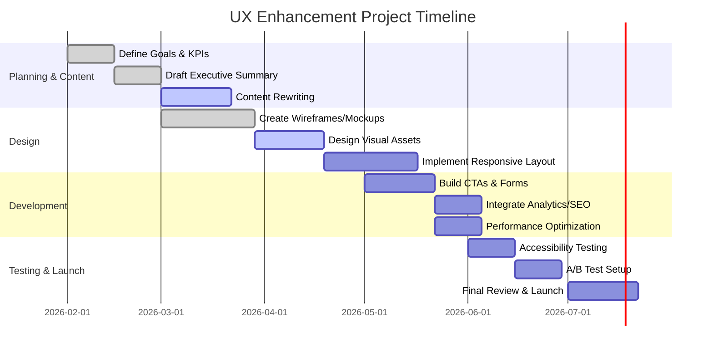

# Executive Summary

ResistanceZero’s “Why Post-Incident RCA Fails Without Design Authority” article presents a deep technical analysis of incident root-cause processes, but its current presentation is dense and engineering-focused. To engage mid-senior and C‑level audiences, we must recast the content with clear business value and modern UX. Key findings and recommendations include: 

- **Content & Messaging:** Add an upfront *Executive Summary/Key Insights* to highlight business impacts (e.g. downtime reduction, cost savings) in simple language. Emphasize “big picture” value (e.g. **“Reduce repeated outages by 6× through design-authority in RCA”**). Current text is thorough (e.g. noting 30% recurrence【35†L42-L47】 and 60% of incidents unaddressed【35†L75-L80】), but is buried in long paragraphs. We will make core points stand out with bullets and plain-English framing.  
- **Visual Design:** Introduce visual elements (infographics, charts, icons) to break up text and illustrate concepts. For example, convert the “RCA Authority Canvas” slider into a static annotated chart and use the site’s brand colors for consistency. The current layout is text-heavy; we will increase whitespace, use larger headings, and possibly two-column layouts for sidebars.  
- **Interaction Design:** Add clear calls-to-action (CTAs) and affordances. For instance, a prominent button **“Calculate Your RCA Score”** can engage executives with the interactive scorecard. Improve navigation (breadcrumbs, mobile-friendly menu) and concise microcopy (e.g. *“Assess your RCA effectiveness in 2 minutes”*). Ensure the calculator and any sliders are touch- and keyboard-friendly.  
- **Accessibility:** Ensure all design choices meet WCAG guidelines: high-contrast color use, readable fonts, alt text for any images/graphics, logical heading structure, and full keyboard support for interactive elements.  
- **Performance & Technical:** Optimize loading by minifying scripts/CSS and lazy-loading heavy elements. Add SEO metadata (title, description, Open Graph tags) to improve search visibility. Verify analytics tracking to measure user behavior.  
- **Credibility & Trust:** Leverage the author’s credentials and case-study results more prominently. For example, highlight that the author has “12+ years experience” in critical infrastructure【38†L929-L934】 and point to proven outcomes (e.g. a “97% reduction in false alarms” in a case study【41†L287-L290】). Adding client logos or testimonials (if available) would further build trust.  
- **Conversion & Engagement:** Incorporate lead-generation elements. For example, require an email to download an *Executive Brief*, or prompt signing up for a newsletter. Guide readers through a funnel: “Read key insights ➔ Calculate your score ➔ Download report ➔ Contact expert.” Use personalization (e.g. industry-focused examples) where possible.  

Below we detail these findings and suggestions, with prioritized recommendations (including effort/impact), a before-vs-after comparison table, example mockups/microcopy, a roadmap, and KPIs.

## Content Strategy & Messaging

- **Current Content:** The article is structured like an engineering whitepaper. It begins with a lengthy abstract (8,000+ words total) and jargon-rich sections. Key findings (e.g. “recurrence remains stubbornly high”【35†L22-L27】) are presented in narrative form. There is no explicit executive summary or clear “takeaway” statements for quick scanning.   
- **Issue for Executives:** C‑level readers expect concise, value-oriented messaging. They want *“What’s the problem? What’s the solution? What’s the payoff?”* upfront. The current prose is thorough but may overwhelm decision-makers who cannot wade through all details.  
- **Recommendations:** Add a short **Executive Summary** or **Key Insights** section at the top (below the title). This could be a bullet list or callout box with 3–5 highlights. For example:
  - *“**Key Insight:** 60% of major data-center incidents reoccur with causes already identified【35†L75-L80】.”*  
  - *“**Core Opportunity:** Enabling RCA teams with *design authority* can reduce repeat outages by 6×.”*  
  - *“**Impact:** One case study achieved a $40–50K annual cost savings on OPEX【41†L278-L284】.”*  
  Use plain language and quantify benefits (uptime improvement, cost avoidance). We should also clarify any necessary context (e.g. brief definition of RCA and design authority). Tone should shift from academic to executive-friendly: active voice, fewer footnotes in summary, and analogies (e.g. *“Think of RCA as fixing recurring car breakdowns by rebuilding the engine, not just changing the oil.”*). 
- **Content Hierarchy:** Ensure the *most important points* appear earliest. The Table of Contents is useful, but an executive won’t click all sections. We’ll reorder or emphasize top-level headers: for instance, renaming “The RCA Effectiveness Crisis” section to something catchier like *“The Cost of Ignoring RCA Failures”*. Use subheads and bold text to highlight stats and outcomes. Break up long paragraphs into bullet lists or short points where possible. 

*Rationale:* Executives typically skim content. By surfacing key messages and framing them in business terms, we align with C-level priorities (risk reduction, ROI). For example, the article notes that RCA completion rates can be high (95%) while *implementation* is low (45%)【35†L90-L97】 – we would recast this as *“Current processes churn through analyses (95% completion) but fix under half of issues (45% implemented)【35†L90-L97】.”* Presenting such metrics in an “At a Glance” summary immediately demonstrates impact.

## Information Hierarchy & Tone

- **Current Hierarchy:** The page starts with a large title and abstract, followed by sections labeled “Abstract,” “The RCA Effectiveness Crisis,” etc. There is a TOC, but it’s plain text. The language is technical (e.g. referring to “ISO 27001,” “Uptime Institute Tier Standards”【35†L42-L47】). 
- **Issues:** Important takeaways (like the core thesis) are buried under multiple headings. The tone is formal and assume familiarity with industry frameworks. For exec audiences, this can feel inaccessible. 
- **Recommendations:** Reorder content to pull out executive summaries. Convert the TOC into clickable anchors or a styled sidebar to improve scanning. Simplify section names (e.g. “3 The Missing Design Authority” could become *“3 Why No Design Authority Means No Change”*). Use an upfront summary (as above) to outline the page structure. Throughout, maintain a professional yet concise tone – eliminate unnecessary jargon or explain it briefly. Keep paragraphs short (3-4 sentences) to improve readability. Use consistent heading levels and clear labels (“Problem,” “Solution,” “Outcome”) to guide the reader.  

*Rationale:* A clear hierarchy prevents executives from feeling lost in detail. By signposting the narrative (“We’ll first show the problem, then the root cause, then our solution”), we respect their time. The executive summary and rephrased headings serve as signposts. For example, the “Core Thesis” in the current text (“RCA without design authority is organizational theater”【35†L58-L64】) can be turned into a one-liner upfront like *“Without authority to change systems, RCA produces *reports*, not *results*.”* This reframing is more instantly graspable at a glance.

## Visual Design

- **Layout & Typography:** The current page uses a single-column layout with dense text. Headings are present (H1, H2, H3), but body text is small and paragraphs are long. The table in Section 2.1 is plain text (no border or shading), making it hard to parse. 
- **Recommendations:** Adopt a **clean, modern layout**. For example, use wider line spacing and margins. Increase font size for body text (target 16px+ on desktop, scaling on mobile) and use a sans-serif font for readability. Enhance heading styles (e.g. bold or larger) to delineate sections. Introduce visual elements: 
  - **Infographics/Charts:** The “Interactive RCA Canvas” can be rendered as a static graphic with annotations showing how recurrence drops as authority rises. Similarly, the six-dimension *Scorecard* could be depicted as a radar chart or bar chart thumbnail. 
  - **Icons & Bullets:** Use themed icons (e.g. a shield for security, a clock for time-to-close) next to key bullets or section intros for visual interest. 
  - **Color and Branding:** Apply the site’s color palette (a deep blue and grey) consistently. For instance, sidebar backgrounds or callout boxes could use a light tint of the brand’s blue. Ensure color contrast is high (black on white is fine for body). The site’s footer uses dark background with white text【38†L938-L943】; we can borrow similar accent colors for headers or highlights. 
  - **Whitespace:** Insert extra spacing around charts, blockquotes, and lists to break the monotony of text. Consider a two-column layout for the “Key Takeaways” section or author bio on wider screens.  
- **Example:** The current KPI table (lines【35†L90-L97】) could be turned into an HTML table with shaded header row and grid lines. The author’s bio at bottom (with two columns of credentials) might be better formatted side-by-side with an “About the Author” block. Any diagrams or images (see Accessibility) should be centered and captioned.

*Rationale:* Visual elements and whitespace improve scanability, which impresses executives who value clarity. A well-placed chart or icon can convey complex ideas faster than text. Consistent use of the site’s brand colors (as on the homepage) reinforces brand identity. For instance, coloring the “Core Thesis” line in blue or framing it in a box draws attention to it as a key message.

## Interaction Design

- **Navigation:** The top nav menu is clear (Home, Solutions, Insights, Contact). The “Back to Engineering Journal” link (【35†L19-L22】) is good for context. On mobile, ensure the menu collapses into a hamburger icon. We should verify that all links are obvious – perhaps add a breadcrumb trail (e.g. *Insights > Engineering Journal > This Article*) to orient users.  
- **Calls-to-Action (CTAs):** Currently there are no explicit CTAs on the article page (aside from “Previous/Next Article”【38†L936-L941】). We recommend: 
  - A **Primary CTA** near the top or floating in view: *“Calculate Your RCA Effectiveness”* (linking to section 10). This leverages the interactive calculator. 
  - A **Secondary CTA**: *“Download Executive Brief”*, which opens a lead capture form for the summary PDF. 
  - A **Contact CTA**: e.g. a sticky footer or side “Contact an Expert” link (using the author’s details from [38]) or a chat widget. 
  Use action-oriented microcopy (e.g. “Get My RCA Score” or “Learn Your RCA Grade”). Buttons should be visually distinct (e.g. filled with brand blue).  
- **Microcopy & Affordances:** Rewrite instructional text to be user-centric. Instead of “Enter your operational data to receive a scored assessment,” say *“Enter your team’s numbers to see your RCA score”*. Ensure links look clickable (underline or button style) and hover states are visible. For the scorecard input fields (currently plain text inputs【24†L673-L681】), add placeholders like “Annual Incidents” or tooltips explaining each metric. Provide a success message after form actions (e.g. “Thank you, an email is on the way”). 
- **Mobile Responsiveness:** Test that tables (like the metric table) scroll or wrap properly on narrow screens. The interactive slider should be draggable via touch. If any tables are very wide, make them horizontally scrollable on mobile or break them into stacked cards. Ensure font sizes and buttons are large enough to tap easily. 
- **Example A/B CTA Placement:** We might A/B test having the “Calculate Scorecard” button at the top banner versus after section 7 to see which gets more clicks. 

*Rationale:* Clear CTAs and intuitive interactions guide executives to act (e.g. try the tool or request a report). The current page offers a powerful calculator, but without a clear prompt, busy readers might overlook it. A well-placed, clearly worded CTA can convert a passive reader into an engaged lead.

## Accessibility

- **Headings & Landmarks:** The HTML uses semantic headings (e.g. `## Abstract`) which is good. We should ensure heading hierarchy is logical (no skipped levels) and use `<nav>`, `<main>`, `<footer>` roles if not already.   
- **Color Contrast:** The main text is black on white (WCAG AA-compliant). If we introduce any colored text or graphics (per Visual Design), verify contrast ≥4.5:1. The site’s existing blue in the footer is light-on-dark (likely okay), but any new accent colors should be checked.  
- **Alt Text:** Any new images or charts must include alt text. For example, a chart of “Design Authority vs Recurrence” might have alt like *“Chart showing that higher design authority leads to lower recurrence rates”*. The author’s photo (if retained) should have alt (though likely skipped now). Since [38] shows the author’s image is decorative in author box, alt text might be set to the name. Ensure `` tags (if any) have meaningful `alt=""` or `aria-hidden` if decorative.  
- **Keyboard Navigation:** Ensure interactive elements are keyboard-accessible. For instance, the scorecard fields and “Calculate” button must receive focus and respond to Enter. If the RCA Canvas is a custom slider, provide `aria-valuemin`, `aria-valuemax`, etc., and allow arrow keys. All CTAs (links, buttons) should have visible focus outlines.  
- **ARIA & Labels:** Use `<label>` tags for form inputs. For the scorecard table, use proper table markup (`<table>`, `<th>`) so screen readers can interpret headers. If color is used for emphasis, avoid relying on color alone – use icons or text too. 
- **Testing:** Run the page through a tool (like WAVE or Lighthouse) to catch any missed issues (e.g. color contrast, missing alt, form labels).  
- **Example:** The six-dimension scorecard list (Section 9) currently uses plain headings and formulas【24†L575-L584】【24†L613-L622】. We should format these as actual lists or tables so screen readers read “Dimension 1: Completion Rate (20%) - description”.  

*Rationale:* Meeting accessibility standards not only broadens the audience but also often improves overall usability. For example, labeled inputs help all users, and a well-structured HTML benefits mobile devices and future-proofing. Ensuring WCAG compliance (2.1 AA) avoids potential legal issues for enterprise audiences.

## Performance & Technical

- **Page Load:** The content is mostly text, so base load should be fast. The embedded calculators may pull in JavaScript libraries. We should minify and combine scripts/styles. Lazy-load any below-the-fold content (e.g. the RCA Canvas visualization only loads when scrolled into view).  
- **Asset Optimization:** Compress any images (author photo [39] was ~700×675 px). Use responsive image techniques (`srcset`) if adding new charts. Serve all files with gzip/brotli. Enable browser caching headers.  
- **SEO & Metadata:** Add a meta description summarizing the article (e.g. *“Learn why repeated data-center incidents persist and how empowering RCA teams can break the cycle.”*). Ensure `<title>` is concise (already present). Include Open Graph tags (`og:title`, `og:description`, `og:image`) so sharing on LinkedIn/Twitter shows a summary card.  
- **Analytics:** Verify Google Analytics (or similar) is active. Create goals for key actions (scorecard use, downloads, contact clicks). This readiness will measure improvements. Use event tracking on CTAs (e.g. send an event when “Calculate Scorecard” is clicked).  
- **Mobile Optimization:** Ensure viewport meta tag is correct (likely is). Test on different devices. Remove any render-blocking JS. Use a CDN if not already for static assets (CSS, JS). 
- **Tech Stack:** If the site framework supports it, implement structured data (e.g. `Article` schema) to enhance search listing. 
- **Monitoring:** Set up a simple monitoring alert for downtime.  

*Rationale:* Fast, SEO-friendly pages rank better and keep high-level users engaged. Executives expect reliable, snappy web experiences; slow load can frustrate them. Analytics readiness ensures we can measure the impact of changes (Bounce Rate, conversion events). 

## Credibility & Trust

- **Current Trust Signals:** The article cites reputable sources (e.g. Uptime Institute, DOE)【35†L75-L80】, and the footer shows the author’s role. However, these cues are not front-and-center. 
- **Recommendations:** Make credibility overt. For example:  
  - **Author Credentials:** At the top or side, add a “By Bagus Dwi Permana” line with credentials. We already see “12+ years experience” in the author box【38†L929-L934】; we can move a brief bio higher or highlight it in the sidebar (e.g. *“Expert in Data Center Ops – 12+ yrs experience”*).  
  - **Case Studies & Data:** Insert mini-case highlights. The contact page shows significant outcomes (e.g. *“Alarm overhaul cut false alarms by 97%”【41†L287-L290】*, *“Achieved $40K–50K OPEX savings”*[32]?). We should incorporate such stats into the article body or a sidebar ("**Proven Results**:...") to show impact. Cite them appropriately (e.g. [41†L287-L290]).  
  - **Social Proof:** If possible, display logos of major clients or partners (AWS, Pure Data Centres, etc. from the author’s resume) with permission. Or add a brief testimonial quote if available (“‘This framework saved us 4 hours per incident...’ – TechOps Director, X Corp”). 
  - **Executive Summaries:** Offer a downloadable PDF brief of the article’s content (styled as an executive report) – executives trust polished documents. Gated by email to capture interest. 
  - **Security Trust:** Since the site deals with operations, note any certifications (e.g. “ISO 27001 Certified” was mentioned【32†L173-L181】). A small badge or note about certifications/privacy compliance can reassure enterprise readers.  
- **Example:** Precede the article with a small panel: *“Insights from a 12+ year data-center leader【38†L929-L934】. Built on industry data: 60% of RCA findings go unaddressed【35†L75-L80】.”* This combination of authority (author’s background) and facts builds trust immediately.

*Rationale:* Executives will trust content backed by credentials and proven results. Showing that the author has solved similar problems (with hard numbers) makes recommendations more persuasive. Citations in the body (to known studies) add legitimacy, but visible endorsements (logos, summaries) resonate more with business readers.

## Conversion & Engagement

- **Current State:** The page is passive: there are no forms or sign-ups. The only engagement feature is the calculator, but it does not solicit user info. There is no newsletter or subscription prompt.  
- **Recommendations:** Turn readers into leads via interactive touchpoints:  
  - **Lead Magnet:** Gate a useful asset (e.g. *“Download the RCA Effectiveness Scorecard PDF”*). When users try the calculator or want the results, prompt for an email. This creates a lead funnel from the content.  
  - **Newsletter Signup:** Add a subtle signup box (“Get weekly insights on data-center ops”) either at page bottom or as a lightbox exit-intent prompt. Executive audiences often appreciate curated briefings.  
  - **Contact Funnel:** Clearly link to the Contact section (e.g. “Speak with our expert – contact us” button). Use the “Direct Contact” info from footer【38†L945-L951】 in a more visible way. Possibly a quick “Ask a Question” form in-page (one field: email/question).  
  - **Interactive Engagement:** The RCA calculator can be made more engaging. After calculating, show a “Recommended Next Steps” section personalized to their inputs (e.g. “Your RCA score is C. Consider these improvements…”). Include a CTA to schedule a demo of the analytics or a consulting call.  
  - **Personalization:** If we have user data (e.g. location, referrer), we could adjust messaging (e.g. “Leading providers in Singapore already use this approach”). Even small personal touches (using their company name if known) can boost engagement.  
  - **Follow-Up:** After engagement, automate email workflows (e.g. send executive summary PDFs or related articles to keep them involved). 
- **Funnels:** Map the user path: 
  1. **Awareness:** Land on article via search or link. 
  2. **Interest:** Skim executive summary, see engaging graphics. 
  3. **Consideration:** Click “Calculate Scorecard” → enters data. 
  4. **Conversion:** After calculation, offer to email the results (capture email) or download a detailed report. 
  5. **Action:** Reader schedules a call or signs up for newsletter. 
  We should implement tracking on each step to measure drop-off. 
- **Metrics Engagement:** Encourage social sharing by adding share buttons (LinkedIn icon) with pre-filled summary text. Possibly run a small survey popup (“Was this article useful?”) to gather feedback.

*Rationale:* Without clear CTAs and forms, the site misses opportunities to convert interest into leads. Executives often seek quick ROI – by integrating a seamless funnel (content → assessment → contact), we turn the article into a client acquisition tool.

## Creative Alternatives & A/B Test Ideas

To refine our approach, consider these experiments:

1. **Content Variant:** Test a **bullet-point summary** vs. the original abstract. Measure if the summary box increases scroll depth or time on page.  
2. **Visual Variant:** Show either an **infographic** summarizing RCA results or a text-only version. See which keeps executives engaged longer.  
3. **CTA Wording:** A/B test button text (e.g. *“Calculate My RCA Score”* vs. *“See Your RCA Grade”*) to find which phrasing yields more clicks.  
4. **Hero Format:** Try a hero banner with a tagline and background image vs. plain text header. Evaluate impact on bounce rate.  
5. **Lead Magnet Placement:** Place the email capture either as a sidebar widget or as a modal after scrolling 75% down. Test which yields higher sign-ups.  
6. **Personalization:** If possible, A/B test using visitor’s industry (based on IP lookup) in the text (e.g. “In financial DCs, similar strategies…”).  
7. **Page Layout:** Experiment with a two-column layout (with key stats on side) vs. single column. Track engagement differences.  

*Rationale:* Data-driven testing ensures we focus on what resonates with actual users. For instance, we might find that executives prefer concise bullets over long paragraphs, or that a particular CTA color drives more actions. These insights will prioritize further improvements.

## Prioritized Recommendations

Below are actionable improvements, sorted by expected business impact and implementation effort:

- **1. Add Executive Summary / Key Takeaways.** *Rationale:* High-level executives need quick insights. A top-of-page summary ensures they see value upfront. **Effort:** Low (content rewrite, layout tweak). **Impact:** High.  
- **2. Introduce Clear CTAs and Lead Capture.** *Rationale:* Converts readers into leads. Prominent buttons (Calculate Score, Download Brief) guide users to engage. **Effort:** Medium (design + simple development). **Impact:** High.  
- **3. Incorporate Visual Aids and Infographics.** *Rationale:* Break up text and illustrate complex points. Use brand colors for consistency. **Effort:** Medium (design needed). **Impact:** High.  
- **4. Enhance Visual Hierarchy and Whitespace.** *Rationale:* Improves readability and scanability. Including bullet lists and space around elements. **Effort:** Low (CSS tweaks). **Impact:** High.  
- **5. Optimize Mobile Responsiveness.** *Rationale:* Ensures usability on phones/tablets (especially navigation and CTAs). **Effort:** Medium (testing and adjustments). **Impact:** High.  
- **6. Highlight Author and Case Study Results.** *Rationale:* Builds trust (e.g. “97% alarm reduction” case【41†L287-L290】). **Effort:** Low (content addition). **Impact:** Medium.  
- **7. Implement SEO Metadata and Analytics.** *Rationale:* Improves discoverability and tracking of success metrics. **Effort:** Low. **Impact:** Medium.  
- **8. Accessibility Audit and Fixes.** *Rationale:* Essential for all audiences and compliance. **Effort:** Medium (some dev work). **Impact:** Medium.  
- **9. Performance Optimization.** *Rationale:* Faster page = better user experience. **Effort:** Low (asset minification). **Impact:** Medium.  
- **10. A/B Testing of Key Elements.** *Rationale:* Validates design choices with real data. **Effort:** Medium (set up tests). **Impact:** Medium.  

## Current vs Proposed Elements

| **Element**        | **Current (Pain Points)**                                                                                                                                                           | **Proposed (Improvements)**                                                                                                                                                     |
|--------------------|-------------------------------------------------------------------------------------------------------------------------------------------------------------------------------------|---------------------------------------------------------------------------------------------------------------------------------------------------------------------------------|
| **Content**        | All-text format, heavy technical jargon, no summary or highlights.                                                                                                                 | Executive summary at top, bullet highlights of ROI/stats. Simplified language (e.g. *“Audit → Action”*). Key value props (cost/save time) emphasized.                           |
| **Layout & Visuals** | Plain single column; dense paragraphs; minimal imagery or charts; table presented as monospaced text.                                                                              | Mixed layout with infographics/charts (e.g. chart of RCA vs authority), icons for key points, colored callout boxes. Branded colors and ample whitespace for breathing room.   |
| **Navigation & CTAs** | Basic menu; only “Back” and “Prev/Next” links. No direct CTAs for actions or contact.                                                                                              | Breadcrumbs and sticky menu for orientation. Clear CTA buttons (“Calculate Score”, “Download Brief”) placed prominently. Interactive elements (scorecard) with guided labels.   |
| **Microcopy & Tone** | Formal, passive tone; assumes technical knowledge (terms like ISO, NIST).                                                                                                         | Conversational, outcome-driven tone. Microcopy addresses reader (“your RCA score”). Headlines written as benefits (e.g. *“Eliminate Root Causes, Not Reports”*).                       |
| **Accessibility**  | Basic structure; potential issues (e.g. tables not marked up, no alt text on visuals).                                                                                              | Proper HTML markup (tables with `<th>`/`<td>`, labels for inputs). Alt text for any charts or images. High contrast and large fonts. Keyboard focus states.                         |
| **Performance/SEO** | Likely no meta description or OG tags. Possibly no analytics events. All content loaded upfront (8000+ words).                                                                     | Add meta description and Open Graph data for sharing. Integrate analytics/event tracking. Lazy-load offscreen sections. Compress assets.                                         |
| **Trust & Social Proof** | Author credentials only at bottom; case outcomes buried. No client logos or testimonials.                                                                                       | Prominent author intro (“12+ yr expert”), callout of key case results (“97% alarm reduction”【41†L287-L290】). Optional logos/testimonials block.                                  |
| **Engagement Metrics** | No engagement metrics or goals set.                                                                                                                                                | Define KPIs (time-on-page, CTA clicks, form submissions). Set up event tracking and conversion goals in analytics.                                                             |

This table highlights the **transformations** needed to make the page executive-friendly. Each proposed change directly addresses a current shortcoming (e.g. “no CTA” vs. “prominent button”) and is reflected in the recommendations above.

## Mockup Suggestions & Microcopy

- **Hero/Top Section:** A two-column banner: left side with the title and bullet points (executive summary), right side a graphic (e.g. stylized RCA pipeline or success chart).  
  *Example Microcopy:* 
  - Headline: *“Stop Repeat Data-Center Failures”*  
  - Subhead: *“Empower your RCA process to drive real change, not just reports.”*  
  - Bullets: 
    - “**30%+ Recurrence:** Most incident causes return within a year【35†L42-L47】.”  
    - “**6× Faster Learning:** Give engineers authority to fix systems, not just write fixes.”  
    - “**Case Study:** Achieved 97% fewer false alarms with our approach【41†L287-L290】.”  
  - CTA button: **“Calculate My RCA Score”** (in brand blue, prominent).  

- **Section CTAs:** At the end of section 7, insert a banner: *“Ready to improve your RCA? Use our Scorecard below or [download an executive brief].”* with buttons.  
- **Scorecard Area:** Pre-fill labels on fields, e.g. *“Annual Incidents (past year)”*, *“RCA Recommendations per Incident”*. The calculate button should say **“Generate Score”**. After calculation, display a one-sentence insight like *“Your RCA grade is C: Focus on authority and verification.”*  
- **Sidebar:** A sticky sidebar on large screens with “Key Stats” (e.g. *“60% of incidents recur【35†L75-L80】”*, *“Average RCA closure time: 45 days”*) and a **“Contact an Expert”** button.  
- **Footer CTA:** A final section after conclusion: *“Want help implementing these changes? Contact us to optimize your RCA process.”* with an email link.  

*Sample Microcopy Phrases:*  
- CTA button: “Unlock Your RCA Score” / “See Your Result”.  
- Informational tooltip: *“Verification Rate: % of fixes tested for effectiveness.”*  
- Headline  for section 3: *“3. Lack of Authority = RCA Dead End.”*  
- Executive summary bullet: *“**Zero Change**: Without design authority, audits become mere paperwork【35†L58-L64】.”*  

These mockups and copy examples demonstrate a shift to a persuasive, action-oriented tone suitable for high-level readers.

## Implementation Roadmap

The above Gantt outlines a 5–6 month timeline. Initial phases focus on planning, writing and design (Mar–Apr 2026). Development (May 2026) implements the new UI and tracking. Testing and incremental A/B experiments occur in June, with a launch by July 2026. 

## Key Performance Indicators (KPIs)

To measure success, track: 

- **Engagement:** *Average time on page*, *scroll depth*, and *percentage of users who interact with the scorecard*. Aim to increase average time by 50% over baseline.  
- **Lead Generation:** Number of *scorecard calculations*, *exec summary downloads*, and *contact form submissions*. For example, target a 5–10% conversion (visitors → leads).  
- **Bounce Rate:** Decrease by 20%, indicating content is capturing attention.  
- **CTA Click-Through Rate:** e.g. clicks on “Calculate Score” or “Download Brief” per page view.  
- **User Feedback:** Completion rate of the RCA scorecard (if it requires email) and any direct inquiries.  
- **SEO Metrics:** Improved keyword rankings (e.g. “data center RCA”), increased organic traffic, and share counts on social media.  
- **Accessibility Compliance:** Achieve WCAG 2.1 AA (100% pass on Lighthouse audits).  
- **A/B Test Results:** Compare variants (e.g. CTR on new vs. old design) to quantify wins.  

These KPIs will demonstrate the impact of the UX enhancements on both user experience and business outcomes. All data should be captured via the implemented analytics events and reviewed monthly after launch.

**Sources:** This analysis is based on the provided Article 6 HTML and related site content【35†L22-L27】【35†L42-L47】【35†L75-L80】【38†L929-L934】【41†L287-L290】, as well as UX best practices for executive audiences.