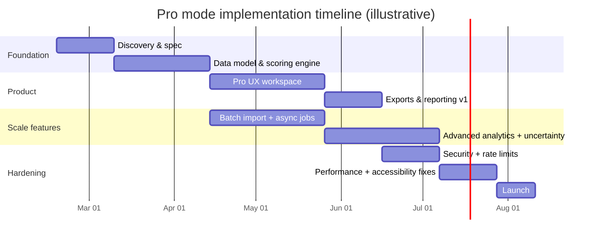
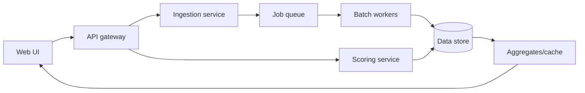

# Pro/Advanced Mode Design for the Article 1 Operational Maturity Assessment Tool

## Executive summary

The current interactive tool embedded in Article 1 is a lightweight **self-assessment maturity calculator**: users rate eight operational dimensions on a **1–5** scale and the tool summarizes results as a **composite score (0–100)**, a **maturity level** and **category**, plus visual summaries such as a radar chart and “top improvement priorities.” citeturn24view0turn5view1

The calculator’s conceptual backbone is explicitly defined in the article: (a) a **five-level model** with labeled score bands (Reactive → Generative), and (b) **dimension weights** (Documentation 10%, Training 15%, etc.), plus **benchmark reference points** (Tier I ≈ 25 … Tier IV ≈ 82) described as directional approximations. citeturn5view1turn5view0turn24view0 The “data source” is therefore not a live dataset; it is an **embedded heuristic model** with static weights and benchmark anchors. citeturn5view1turn24view0

This approach is excellent for an article context (fast, low-friction, concept reinforcement), but it has predictable limitations: **subjectivity**, **coarse granularity**, no uncertainty bounds, minimal contextualization (facility type, geography, redundancy), no evidence capture, no portfolio/time comparisons, and no interoperability with operational systems (CMMS/DCIM/BMS/ITSM). citeturn24view0turn5view1

The Pro/Advanced mode should therefore aim to transform the tool from “single-shot self-rating” into an **evidence-backed operational analytics product** that can:  
- ingest real metrics and artifacts (tickets, alarms, work orders, training logs),  
- produce **massive/portfolio-level results** and time-series insights,  
- quantify uncertainty and validation confidence, and  
- generate richer, decision-oriented outputs (prioritized initiatives with modeled impact and ROI).  

This direction aligns with industry evidence that procedures, training, and operational rigor remain major levers for reducing outages (e.g., procedure non-adherence is repeatedly highlighted as a major driver of human-error-related outages). citeturn12search0turn12search4turn9search0

## Existing calculator inventory

### Inputs

The current calculator accepts **eight categorical inputs**, each scored **1 (Ad-hoc) → 5 (Optimized)**: Documentation, Training, Change Management, Monitoring, Maintenance, Emergency Readiness, Continuous Improvement, Leadership. citeturn24view0turn5view1

The article defines **fixed weights** for these dimensions:  
- Documentation **10%**  
- Training **15%**  
- Change Management **15%**  
- Monitoring **15%**  
- Maintenance **15%**  
- Emergency Readiness **10%**  
- Continuous Improvement **10%**  
- Leadership **10%** citeturn5view1

### Outputs

On the rendered page, the tool displays at least four headline outputs:  
- **Composite Score (0–100)**  
- **Maturity Level** (an integer 1–5)  
- **Maturity Category** (text label; example shown: “Predictive”)  
- **Weighted Average (1–5)** citeturn24view0turn5view1

It also advertises four distinct result modules:  
- **Eight-Dimension Radar Chart**  
- **Dimension Scores**  
- **Top 3 Improvement Priorities**  
- **Benchmark Comparison** citeturn24view0turn5view1

### Algorithms

What is specified explicitly in the article:  
- **Weighted aggregation** across eight dimensions using the stated weights. citeturn5view1  
- **Maturity categories** tied to composite score ranges: Level 1 (0–20), Level 2 (21–40), Level 3 (41–60), Level 4 (61–80), Level 5 (81–100), with names Reactive, Preventive, Predictive, Proactive, Generative. citeturn5view1turn4view1  
- **Directional benchmarks** by (Tier I–IV) with average composite scores: 25, 45, 65, 82. citeturn5view1turn4view2

What is strongly implied by the displayed values (inference from the page’s “example state,” where Weighted Average = 3.00 corresponds to Composite Score = 50):  
- The composite score likely uses a **linear normalization from the 1–5 scale onto 0–100** such that 1→0 and 5→100 (e.g., `(weighted_avg − 1) / 4 × 100`). This exact formula is not shown in the extracted rendered text, so it should be treated as **inferred** rather than confirmed. citeturn24view0

How “Top 3 Improvement Priorities” is computed is **not specified** in the visible text. A typical approach would be ranking by “gap to 5,” optionally weighted (e.g., `weight × (5 − score)`), but this is **unspecified** in the article extract. citeturn24view0

### UX flows

The interaction model, as described, is straightforward:  
1) User selects scores (1–5) for each of eight dimensions. citeturn24view0turn5view1  
2) Tool computes and displays summary outputs, plus visual breakdowns and benchmark comparison. citeturn24view0  

No account/login, persistence, collaboration, or exports are described in the page content; these capabilities are therefore **unspecified** in the visible specification. citeturn24view0

### Data sources used today

The article states the benchmarks are based on “industry data from the Uptime Institute and operational assessments,” but the calculator appears to use **static embedded values** rather than a dynamically-updated database. citeturn5view1turn24view0

### Practical limitations

The current tool design has several important limitations (some inherent to self-assessment, some addressable in Pro mode):

- **Subjectivity and calibration drift:** A 1–5 rating without evidence capture can vary widely between raters, sites, and cultures. citeturn24view0  
- **No uncertainty quantification:** The tool returns point estimates (e.g., score 50) without confidence/intervals. citeturn24view0  
- **Benchmark ambiguity:** Tier benchmarks are explicitly “directional,” not prescriptive—useful for narrative context, but weak for decision-grade benchmarking unless backed by a defined dataset and methodology. citeturn5view1  
- **Limited decision support:** “Top priorities” can be persuasive, but without linking to operational metrics, risk models, or ROI, they may not be actionable for budgeting.  
- **Accessibility risk for visualization:** If visualizations rely on canvas-based charts, additional accessibility work is required because canvas content is not readable by screen readers by default. citeturn15search0turn15search1  
- **No integration with operational systems:** The current model does not appear to ingest CMMS/BMS/DCIM/ITSM data, which is essential for larger/massive result sets.

## Pro/Advanced mode feature specification

A high-value Pro mode should keep the existing “8-dimension score” concept, but add **configurable inputs**, **evidence capture**, **data ingestion**, and **portfolio/time analytics**. Below is a detailed specification, written as if it were a product requirements baseline.

### Inputs in Pro mode

Pro mode inputs should be configurable at three layers: **Context**, **Assessment**, and **Evidence & telemetry**.

**Context parameters (new):**  
- Facility profile: capacity (MW), IT load type (enterprise / colo / hyperscale / AI-HPC), redundancy target, criticality class, operating model (in-house/outsourced), staffing model (24×7/remote/NOC), change window constraints. (Currently unspecified; needed for relevance.)  
- Environment & geography: country/region, climate risk, seismic/flood exposure, grid volatility. For Indonesia-specific enrichments, integrate authoritative sources such as **BMKG Open Weather Forecast** feeds and national hazard information. citeturn11search0turn22search0  
- Standards baseline: choose a reference lens (e.g., “ISO 55001 aligned,” “risk management per ISO 31000,” “Uptime-aligned operations categories”). citeturn17search1turn13search3turn9search0  

**Assessment parameters (expanded from Free):**  
- Dimension weights: editable weights with constraints (sum=100%), plus “presets” (e.g., AI/HPC profile might weight Monitoring/Maintenance higher).  
- Sub-dimensions: each of the eight dimensions decomposed into 5–15 measurable practices (e.g., Change Management → risk assessment rigor, rollback planning, post-change verification).  
- Scoring scale: optionally shift from coarse 1–5 to **anchored rubrics** (behaviorally anchored rating scales) to reduce rater variance.

**Evidence and telemetry inputs (new, supports massive datasets):**  
- Manual evidence: upload/attach SOP samples, MOC templates, training matrices, drill records, maintenance compliance reports, alarm rationalization artifacts, incident RCAs.  
- Structured data import: CSV/JSON ingestion for incident tickets, work orders, alarms, asset inventory, training logs.  
- System connectors (optional):  
  - CMMS/EAM (maintenance/work orders)  
  - DCIM/BMS (alarms, telemetry time series)  
  - ITSM (incidents/changes/problems)  
  - IAM/HR (training completion)  
These are implementation choices (currently unspecified by the existing page).

### Outputs and analyses in Pro mode

Pro outputs should be decision-grade, traceable, and exportable:

**Core outputs (retain + enhance):**  
- Composite maturity score (with **credible interval**, not only point estimate)  
- Dimension-by-dimension scoring with sub-dimension drilldowns  
- Benchmarking: percentile vs peer group (with methodology disclosure)  
- “Explainability”: why the score is what it is, with evidence links.

**Advanced analysis types (new):**  
- **Sensitivity analysis** (“tornado chart”): which inputs drive the score most.  
- **Scenario planning**: “If we raise Training from 3→4 and Emergency Readiness from 2→4, what happens to score and predicted risk?”  
- **Reliability & availability analytics** (if data provided): estimated MTBF/MTTR trends, availability projections, confidence intervals grounded in reliability statistics. citeturn14search3turn14search48  
- **Operational risk modeling**: connect maturity signals to risk outcomes using an explicit framework aligned with risk management principles (ISO 31000 emphasizes best available information and explicitly treating uncertainty). citeturn13search3turn23search0  
- **FMEA/FMECA workspace**: failure mode catalog, severity/occurrence/detection scoring, and risk prioritization to determine highest leverage improvements. IEC 60812 provides a standard basis for performing and maintaining FMEA/FMECA. citeturn13search0  
- **Control-charting / operational stability**: apply control charts to key metrics (alarm rate, PM compliance, response times) to separate signal from noise (methodology source should be documented; NIST’s reliability/statistics guidance can be used as a baseline reference). citeturn14search2turn14search0  

**Recommendation outputs (new):**  
- “Top initiatives” should be generated as **(initiative, expected impact range, prerequisites, evidence needed, estimated effort, and validation plan)** rather than simple “gaps.”  
- Add “Uptime-aligned operations risk profile” conceptually (without copying proprietary methods): Uptime’s M&O program describes structured segments (personnel management, maintenance, emergency preparedness, etc.), which can inspire category mapping. citeturn9search0turn9search3  

### Visualization suite in Pro mode

Pro mode should include a richer chart library and support exploration of large datasets:

- Radar chart (retain, but enable multi-series: “current vs target vs last quarter”).
- Heatmaps: portfolio “dimension × site” and “sub-dimension × month”.
- Time series: rolling averages, seasonality, alarm spikes, incident rate trends.
- Pareto charts: failure causes, alarm sources, repeat incidents.
- Waterfall charts: contribution of each dimension/sub-dimension to composite.
- Tornado charts: sensitivity analysis.
- Box/violin plots: distribution across facilities/teams; highlight outliers.
- Scatter/hexbin: relationships (e.g., PM compliance vs unplanned incidents).
- Sankey/alluvial: incident flows from detection → response → resolution categories (useful at scale).
- Geo overlays (optional): risk overlays using public hazard/forecast data (Indonesia: BMKG; disaster-risk context: InaRISK), with clear disclaimers. citeturn11search0turn22search0  

image_group{"layout":"carousel","aspect_ratio":"16:9","query":["operational maturity dashboard radar chart","tornado sensitivity analysis chart example","pareto chart incident analysis dashboard","heatmap dashboard operational KPIs"],"num_per_query":1}

### Export, sharing, batch processing

Pro mode should support operational workflows:

- Export: CSV, JSON, XLSX, PDF executive report, and a “board pack” PPTX.  
- Sharing: short links with permissions; embeddable “public summary” view (redacted).  
- Batch processing: upload a portfolio file (e.g., 50 sites × 8 dimensions × 12 months), compute comparisons, cluster sites by maturity pattern, generate ranked initiatives list.  
- Audit trail: immutable change log of input changes and evidence attachments.

### API endpoints

Below is a concrete API baseline (REST; GraphQL optional). Rate limiting and resource controls are essential because Pro mode explicitly enables “massive result sets.” OWASP warns about unrestricted resource consumption; rate limiting and limits on record-return parameters should be enforced. citeturn16search5

| Area | Endpoint | Purpose | Notes |
|---|---|---|---|
| Auth | `POST /v1/auth/token` | Obtain access token | Auth requirements depend on whether Pro is paid and multi-tenant (unspecified today). Consider stronger auth for saved data. citeturn16search0turn16search3 |
| Assessments | `POST /v1/assessments` | Create assessment run | Accepts context + dimension scores + evidence refs |
| Assessments | `GET /v1/assessments/{id}` | Retrieve assessment | Includes computed outputs + confidence intervals |
| Weights | `GET /v1/presets/weights` | List weight presets | “AI/HPC,” “colocation,” “enterprise,” etc. |
| Ingestion | `POST /v1/imports` | Upload CSV/JSON for batch | Async job; returns job ID |
| Ingestion | `GET /v1/imports/{jobId}` | Job status + errors | Includes row-level validation errors |
| Metrics | `POST /v1/metrics/timeseries` | Ingest telemetry series | Use chunking; enforce payload limits citeturn16search5 |
| Benchmarks | `GET /v1/benchmarks` | Retrieve benchmark sets | Methodology/versioned; avoid “mystery numbers” |
| Exports | `POST /v1/exports` | Generate PDF/XLSX/PPTX | Async, cached |
| Admin | `GET /v1/auditlog` | Audit trail | Needed for enterprise trust |

## Data model, algorithms, uncertainty quantification, and authoritative sources

### Data model recommendations

A Pro tool needs a model that supports both **qualitative assessment** and **quantitative telemetry**.

At minimum, represent:

- Organization → Facilities/Sites → Systems (electrical, cooling, fire, network, etc.)  
- Assessments (versioned), including:  
  - dimension scores, weights, rater identity/role, timestamp  
  - sub-dimension rubric scores  
  - evidence objects (documents, links, screenshots)  
- Operational datasets: incidents, changes, work orders, alarms, drills, training events  
- Benchmarks: reference distributions, peer groups, and their provenance/version.

This structure maps naturally to standards-oriented operations thinking: EN 50600 explicitly treats data centers via classification concepts and KPIs, while ISO 55001 frames asset lifecycle and performance/risk/expenditure balance—both align well with a data model that ties operations evidence to outcomes. citeturn19search0turn17search1

### Algorithm design principles

Pro mode should implement two layers:

**Layer A: Transparent maturity scoring (deterministic, auditable).**  
- Weighted aggregation stays, but becomes configurable and rubric-backed.  
- Provide clear mapping to maturity categories and keep it stable across versions (or explicitly version changes).

**Layer B: Evidence- and data-backed analytics (probabilistic, uncertainty-aware).**  
- Use operational data to estimate or validate dimension scores (e.g., change failure rate informs change management maturity).  
- Use uncertainty quantification to avoid false precision.

This is consistent with ISO 31000’s guidance that risk management should use best available information and explicitly address limitations and uncertainty. Indonesia’s adoption of ISO 31000 as SNI 8615:2018 reinforces local relevance for an Indonesia-based audience. citeturn13search3turn23search0

### Statistical methods for reliability and outcome linkage

If Pro mode claims “accuracy” about reliability outcomes, the tool must rely on established reliability statistics rather than heuristic statements.

Recommended approach:

- **Availability math**: for systems with constant failure and repair rates, standard availability relationships (including the common MTBF/(MTBF+MTTR) form) are documented in NASA reliability/availability formula references. citeturn14search48  
- **MTBF estimation and confidence intervals**: NIST provides confidence-limit formulas using the chi-square distribution under exponential assumptions. This is critical when failures are rare (exactly the scenario for many “good” operations teams). citeturn14search3turn14search0  
- **Event-rate modeling**: treat incident occurrence as Poisson (with caveats), use Bayesian or frequentist intervals; propagate uncertainty through to score and recommendations.  
- **Time-series analytics**: apply robust anomaly detection (seasonality-aware), change point detection, and control charts to identify degradation before thresholds are breached.

### Uncertainty quantification design

Pro mode should default to showing uncertainty because both inputs and operational datasets include noise:

- Treat each dimension score as a distribution (e.g., discrete distribution across 1–5, or continuous latent variable).  
- Propagate uncertainty to composite score via Monte Carlo simulation (fast enough for interactive use if implemented efficiently).  
- Show: median score, 80%/95% credible interval, and probability of being in each maturity band.  

This combats overconfidence and improves trust in “massive result set” dashboards by making epistemic uncertainty visible.

### Validation approaches

To claim “high accuracy,” validation must be explicit:

- **Internal validity:** test rubric reliability (inter-rater agreement), consistency checks, and sensitivity tests.  
- **External validity:** compare Pro scores against independent audits/assessments (e.g., third-party operational programs). Uptime’s M&O and Tier Operational Sustainability programs show how independent assessments are structured; even if your tool is not a certification, they provide external reference points for what “good” evaluation looks like. citeturn9search0turn10search6turn10search7  
- **Outcome validation:** correlate predicted improvements with observed changes in incident rates, change success, downtime minutes, etc., with appropriate statistical controls.

Uptime’s outage research repeatedly emphasizes that management, process, and training improvements could prevent many outages; modeling a link between maturity improvements and outcome metrics is therefore directionally justified—but must be calibrated with real data rather than assumed. citeturn12search4turn12search0

### Authoritative data sources to integrate

A Pro tool should cite and version all external datasets. High-value sources include:

- Outage and resiliency research: Uptime annual outage analysis and resiliency survey insights (often gated, but executive summaries/key findings are accessible). citeturn12search4turn12search0turn12search1  
- Risk management: ISO 31000 guidance; Indonesian adoption via BSN’s SNI catalog. citeturn13search3turn23search0  
- Asset management: ISO 55001, updated to 2024 edition. citeturn17search1  
- FMEA/FMECA: IEC 60812:2018 as the standard basis for structured failure mode analysis. citeturn13search0  
- Data center facility standards: EN 50600 (general concepts and classification). citeturn19search0  
- Infrastructure standard scope: ANSI/TIA-942 describes broad physical infrastructure domains (architecture, mechanical, electrical, monitoring, redundancy). citeturn17search2turn17search3  
- Indonesia weather forecasts: BMKG open forecast API (includes explicit access limits and attribution requirements). citeturn11search0turn11search1  
- Indonesia hazard-risk context: InaRISK portal describes national disaster risk layers and what they represent. citeturn22search0  
- Thermal environment references: ASHRAE TC 9.9 materials provide official discussion of recommended ranges and economization considerations (useful for “environmental scanning” modules). citeturn18search48turn18search47  

## UX and interaction design for Free vs Pro

### Mode separation and progressive disclosure

A strong design pattern is: **Free mode remains a single-screen “article-native calculator,”** while **Pro mode becomes a multi-step workspace**.

Free mode (keep it simple):  
- Eight inputs, immediate results, one radar chart, basic benchmark markers.  
- No login required.  
- Educational tooltips anchored to the article sections.

Pro mode (progressive disclosure):  
- Step 1: Facility context (optional but recommended).  
- Step 2: Assessment with rubrics (expand/collapse sub-dimensions).  
- Step 3: Evidence & data import (optional connectors).  
- Step 4: Results workspace: scenario modeling, benchmarking, exports, sharing.

### Interaction patterns for massive result sets

To support “large/massive result sets” without degrading UX:

- Use **virtualized tables** for large lists (alarms, incidents).  
- Provide “analysis-first views” (percentiles, top contributors) before raw logs.  
- Allow filters by facility/system/time window, and “pin” a comparison baseline.  
- Implement background jobs for expensive computations (portfolio clustering, PDF generation).

### Accessibility and chart usability

If Pro mode uses canvas-based charts (common in chart libraries), the tool must address the fact that canvas rendering is not accessible to screen readers by default. Chart.js explicitly notes that accessibility must be added via ARIA labels or fallback content. citeturn15search0 WCAG 2.2 is the baseline target standard for accessibility expectations. citeturn15search1turn15search3

Concrete recommendations:  
- Every chart gets: `role="img"`, `aria-label`, and a toggle to show a **text/table equivalent** (data behind chart). citeturn15search0  
- Keyboard navigation for all controls; visible focus states.  
- Color is never the sole carrier of meaning; add labels, patterns, or markers.  
- “Explain the chart” text summaries for executive exports.

### Pro-mode trust and explainability UX

Because maturity scoring can feel subjective, Pro mode should add:  
- “Why this score?” panels with evidence links and rubric anchors.  
- Versioning: “Model version 1.2” displayed, with a changelog for weight/rubric updates.  
- Confidence indicators: “High / Medium / Low confidence” that reflect evidence completeness and telemetry coverage.

## Scalability, performance, and security considerations

### Architecture for scale

A Pro tool that ingests telemetry and enables batch processing should be designed as a **two-plane system**:

- Interactive plane (low-latency): scoring, small queries, dashboards  
- Batch plane (async): imports, heavy analytics, model training, large exports

Key tactics:  
- Caching computed aggregates (per facility/month) and reusing them across dashboards.  
- Time-series storage for telemetry (optimized for append + range queries).  
- “Compute budget” limits per tenant/workspace to avoid runaway costs. OWASP explicitly recommends restricting payload size, record-return parameters, and implementing rate limiting. citeturn16search5

### Rate limits, abuse prevention, and API safety

Because Pro mode includes endpoints that could return huge datasets, enforce:

- Default pagination + maximum `limit` caps (hard upper bound). citeturn16search5  
- Token-bucket rate limiting per API key/user/IP; stricter policies for heavy endpoints. citeturn16search5  
- Async exports with cached results; never generate large exports synchronously.  
- Request validation and resource quotas (“portfolio analysis can run N times/day”).

### Data privacy and security model

If Pro mode stores operational data, treat it as sensitive:

- Encryption in transit and at rest.  
- Tenant isolation (row-level security).  
- Audit logs (view/export actions).  
- Optional on-premises deployment for high-sensitivity operators (unspecified in current constraints; budget unconstrained suggests offering this).

If authentication is introduced (e.g., for paid Pro), follow strong digital identity guidance. NIST SP 800-63 Rev. 4 provides current guidance for authentication assurance and risk-based selection of controls. citeturn16search0turn16search3

## Implementation roadmap and QA plan

The roadmap below assumes **no tight budget constraints**, but still emphasizes phased delivery to preserve correctness.

### Milestone roadmap table

| Milestone | Scope | Key deliverables | Estimated effort (engineering weeks)\* |
|---|---|---|---|
| Discovery & specification | Audit current calculator, define Pro personas, finalize rubric model | PRD, KPI definitions, benchmark methodology plan | 2–4 |
| Data model & platform foundation | Multi-tenant model, assessment engine, evidence store | Versioned scoring engine + schema + audit log | 4–8 |
| Pro UX workspace | Multi-step Pro flow, scenario planner, exports v1 | Pro dashboard + PDF export + saved assessments | 6–10 |
| Data ingestion & batch processing | CSV/JSON import, validation, async jobs | Import jobs, error reporting, portfolio scoring | 6–12 |
| Advanced analytics v1 | Reliability metrics, sensitivity, uncertainty intervals | Confidence intervals, forecast prototypes, tornado chart | 6–12 |
| External data enrichments | BMKG/InaRISK integrations, locality context | Risk overlays, attribution support, caching | 3–6 |
| Security hardening & scale testing | Rate limiting, quotas, pen test fixes | OWASP-focused threat model + mitigations | 3–6 |
| Launch & iteration | Metrics instrumentation, A/B tests, onboarding | Pro GA release | 2–4 |

\*Estimates assume a senior full-stack team and parallelization; exact staffing is unspecified.

### QA and testing strategy

A Pro maturity tool needs a QA plan that tests not only correctness but also trust:

- **Unit tests** for scoring: weight normalization, boundary conditions, determinism by version.  
- **Property-based tests**: invariants (increasing a dimension score should not reduce composite score; weights sum constraints).  
- **Golden tests**: known input sets → fixed outputs across versions.  
- **Data validation tests**: import schema checks, missing-value handling, duplicate detection.  
- **Load tests**: ensure dashboards remain responsive under “massive” portfolios.  
- **Security testing**: API rate limit verification, authorization tests, resource-exhaustion attack simulations (OWASP API4 focus). citeturn16search5  
- **Accessibility testing**: WCAG 2.2 audits + screen reader testing + keyboard-only flows. citeturn15search1turn15search0  

### Mermaid roadmap timeline mockup



## Metrics, competitor landscape, and mockup diagrams

### Metrics and KPIs

To measure “accuracy, relevance, and user satisfaction” (as requested), use three KPI tiers:

**Model accuracy & validation KPIs**  
- Calibration: how often real outcomes fall within predicted/confidence ranges (when outcome modeling exists).  
- Inter-rater reliability: variance between raters using the same rubric, before vs after rubric anchoring.  
- Data completeness score: percent of dimensions supported by evidence/telemetry.

**Product usefulness KPIs**  
- Time-to-insight: median time from entering data to generating an actionable prioritized plan.  
- Recommendation adoption: % of recommendations converted into tracked initiatives.  
- Export/share rate: reports generated per active Pro workspace.

**User satisfaction KPIs**  
- Pro conversion rate (free → paid), if monetized (monetization is unspecified).  
- Retention: weekly active users, return-to-dashboard rate.  
- Survey-based trust: “I understand why I got this score” and “I trust the recommendations” Likert items.

### Competitor or reference tool comparison

The current tool is closest to “maturity assessment + benchmarking.” The most relevant reference set therefore includes (a) independent operations assessment programs and (b) DCIM platforms with analytics and pricing transparency.

| Tool | Positioning | Key features relevant to your Pro vision | Pricing signal (public) |
|---|---|---|---|
| entity["organization","Uptime Institute","data center research org"] M&O Stamp of Approval | Independent operational assessment program | Holistic ops assessment across multiple segments; emphasizes human factors, training, process rigor; “over 400 facilities” awarded; includes staff competency considerations (per program descriptions) citeturn9search0turn9search3 | Public pricing typically **quote-based / not listed** (program pages emphasize brochure/contact) citeturn9search5turn9search3 |
| Uptime Tier Certification of Operational Sustainability | Independent certification-oriented ops evaluation | Evaluates operational behaviors/risks to ensure a designed facility is operated to expected production levels (program scope summary) citeturn10search6turn10search7 | Public pricing typically **quote-based / not listed** citeturn10search6 |
| entity["company","Sunbird Software","dcim vendor"] DCIM (dcTrack + PowerIQ) | DCIM platform with monitoring + operations workflows | Monitoring + asset/capacity/change management; provides calculators and strong dashboard patterns; public pricing by node/cabinet (rare transparency) citeturn10search0turn10search2 | Example public pricing: **$5.50/node/month** (monitoring) and **$19.50/cabinet/month** (operations), plus bundle options (US-only per page) citeturn10search0 |
| entity["company","Nlyte Software","dcim vendor"] DCIM | DCIM with customizable deployments | Positions pricing as value-based; rack/asset/power-based pricing models; SaaS or perpetual; bundles for different segments citeturn10search1 | Public pricing: **contact sales / quote** (no list prices) citeturn10search1 |
| entity["company","Schneider Electric","energy management company"] EcoStruxure IT Advisor (Capacity module) | Capacity planning + risk visualization | Capacity planning, placement recommendation, “visualize the effects of device failure,” integrations with virtualization managers (per reseller listings) citeturn11search3turn10search8 | Public list prices appear via resellers; examples include ~$27,809 for a perpetual 100-rack capacity module listing and other rack-count tiers citeturn11search3turn11search6 |

Interpretation: your Pro mode can differentiate by combining **maturity assessment + evidence-backed scoring + uncertainty quantification + portfolio benchmarking**, whereas many platforms are strongest at telemetry, asset tracking, or independent assessment, but not “transparent scoring + scenario modeling with confidence intervals.”

### Suggested mermaid mockups

**Free → Pro progressive disclosure flow**

```mermaid
flowchart TB
  A[Free mode: 8 ratings] --> B[Instant score + radar + quick priorities]
  B --> C{User wants deeper analysis?}
  C -->|No| D[Stay in article]
  C -->|Yes| E[Pro mode entry]
  E --> F[Context setup (optional)]
  F --> G[Rubric scoring + evidence]
  G --> H[Import data (optional)]
  H --> I[Analytics workspace]
  I --> J[Scenarios + benchmarking + exports]
```

**High-level Pro analytics architecture**



### Sample chart types to include in Pro

A concrete “starter pack” of charts (high ROI, low ambiguity):

- Executive: composite score trend + confidence band; “top drivers” waterfall; portfolio heatmap (site × dimension).  
- Operations: Pareto of incident causes; alarm-rate time series with anomaly flags; PM compliance trend.  
- Risk: FMEA criticality matrix (severity × occurrence); scenario tornado chart; benchmark percentile rank.  
- Evidence: rubric drilldown table with evidence links per sub-dimension.

To ensure accessibility, every chart needs a data table view and descriptive text. Canvas-based charts require ARIA/fallback handling; this is explicitly noted by Chart.js documentation. citeturn15search0turn15search1

### Indonesian-specific enrichments

A Pro mode that targets Indonesian operators can provide localized “Environmental scanning” intelligence using:

- BMKG’s open forecast API (3-day forecasts, 3-hour intervals, with stated access limits and attribution requirements). citeturn11search0  
- InaRISK as a national disaster-risk context layer (with clear disclaimers about suitability for legal/engineering purposes). citeturn22search0turn22search3  
- SNI-aligned risk management framing (SNI 8615:2018 ISO 31000:2018) to match local governance language. citeturn23search0turn13search3