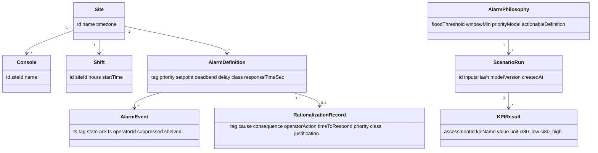

# Pro/Advanced Mode Design for the Article 2 Alarm Rationalization Tool

## Executive summary

I reviewed the **local Article 2 HTML** you provided and reverse-engineered the embedded calculator’s logic and UI behavior (and I used your screenshot to confirm the visual layout). The current tool is a **real-time, single-scenario estimator** designed to let a reader input a handful of summary numbers (alarms/day by severity, operators per shift, response time, shift length, shelving %) and immediately see a compact set of KPIs: alarm rate per operator per 10 minutes, a simplified “cognitive load index,” an alarm flood probability per shift, an ISA-18.2-like compliance score/grade, actionable ratio, a recommended daily alarm target, and “priority reduction targets.” fileciteturn1file0

The calculator’s modeling choices are intentionally lightweight: it assumes **steady-state Poisson arrivals** to estimate 10-minute flood risk, uses a **single average response time** to estimate workload/utilization, and uses a **heuristic compliance score** (four criteria at 25 points each) including a built-in assumption about standing alarms (standing% is guessed from info alarms). fileciteturn1file0 These simplify the user experience, but they also constrain accuracy and actionability—especially for real alarm work, where bursts, mode shifts, standing/chattering behavior, suppression policies, and tag-level “bad actors” matter and must be measured. Standards-oriented KPI sets routinely emphasize metrics like **% of 10-minute periods >10 alarms**, **time in flood**, **chattering/fleeting alarms**, **stale alarms**, **top-10 contributor share**, and **unauthorized suppression / unauthorized attribute changes**. citeturn0search36turn0search1

My Pro/Advanced mode design goal is to turn the tool into a **professional alarm rationalization and alarm performance analytics workspace** that still supports a “quick” path (6–8 inputs → 20–30 derived parameters + charts + PDF conclusions), while also enabling **massive datasets** (millions of alarm events; thousands of tags; multi-site portfolios) and **standards-aligned workflows** (alarm philosophy, master alarm database fields, MOC, audits). The Pro version should be transparent about assumptions (and quantify uncertainty), and it should be deployable in **OT/ICS constraints** (segmented networks, on-prem/edge options). citeturn4search5turn4search6turn10search7

## Current calculator behavior and inventory

### What exists today

The calculator is implemented entirely in the Article 2 page as front-end JavaScript that runs on every input change (“All calculations update in real time”). It exposes a single set of controls and a tiled results panel. fileciteturn1file0

**Current inputs (UI controls and constraints)**

| Input | Control | Default | Constraints / notes |
|---|---|---:|---|
| Total Daily Alarms | `input[type=number]#totalDaily` | 1200 | min 0, max 50,000 |
| Critical Alarms / Day | `#criticalDaily` | 45 | min 0, max 10,000 |
| Warning Alarms / Day | `#warningDaily` | 280 | min 0, max 10,000 |
| Information Alarms / Day | `#infoDaily` | 875 | **disabled**, auto-computed = total − critical − warning |
| Avg Response Time (sec) | `#avgResponse` | 180 | min 1, max 3600 |
| Operators per Shift | `select#operatorsPerShift` | 2 | options 1–5 |
| Shift Duration (hours) | `select#shiftDuration` | 12 | options 8 or 12 |
| Current Shelving % | `input[type=range]#shelvingPct` | 10% | range 0–50% |

This inventory is directly extracted from the HTML section “Interactive Alarm Rationalization Calculator” and the associated script. fileciteturn1file0

**Current outputs (result cards)**

| Output | Element | Notes |
|---|---|---|
| Alarm Rate / Operator / 10 min | `#resRate` | Color-coded vs thresholds (≤1 green, ≤2 amber, else red) |
| Cognitive Load Index | `#resCognitive`, `#resCognitiveSub` | Shows utilization % plus “effective capacity” and “degradation” |
| Alarm Flood Probability / Shift | `#resFlood` | Flood defined as “>10 alarms in any 10-min window” |
| ISA-18.2 Compliance Score | `#resISA` + grade badge | Score out of 100 + letter grade |
| Actionable Ratio | `#resActionable` | Target text “≥85%” |
| Recommended Daily Alarm Target | `#resTarget` | Computed “alarms/day” |
| Priority Reduction Targets | `#resPriority` | Reduction order: Info → Warning → Critical |

fileciteturn1file0

### Current algorithms

I validated the following calculations by inspecting the script and cross-checking them against your screenshot’s example values (e.g., rate 3.75; cognitive utilization 100%; “effective capacity 40.7%”; compliance 50/100 grade D). fileciteturn1file0

**Shelving adjustment**  
The tool applies shelving as a proportional reduction of total daily alarms:  
- `effectiveDaily = totalDaily × (1 − shelvingPct/100)` fileciteturn1file0

**Alarm rate per operator per 10 minutes**  
The function `calcRate(totalDaily, operators, shiftHours)` computes alarms/shift and divides by the number of 10-minute periods in a shift and by operators. Algebraically, this simplifies to:

\[
\text{rate} = \frac{\text{effectiveDaily}}{\text{operators} \times 144}
\]

So this KPI is **independent of shift length** (8 vs 12) once the math is simplified, even though shiftHours appears in the function. fileciteturn1file0

**Cognitive load index (utilization + degradation heuristic)**  
The tool computes alarms per hour per operator during a shift and multiplies by the average response time:

\[
\text{utilization} = \min\left(\frac{\text{alarms/hour/op} \times \text{avgResponseSec}}{3600}, 1\right)
\]

It then applies an exponential “degradation” penalty only beyond 70% utilization:

\[
\text{degradation}=
\begin{cases}
1-e^{-3(\text{utilization}-0.7)} & \text{if utilization} > 0.7\\
0 & \text{otherwise}
\end{cases}
\]

and reports “effective capacity” as \(1-\text{degradation}\). fileciteturn1file0

This is a useful **intuition-building heuristic**, but it is not a validated human-performance model; it is not parameterized using measured distributions of handling time, multitasking, or burst behavior.

**Alarm flood probability per shift (Poisson model)**  
The tool’s `floodProbability(avgDailyRate, threshold=10, windowMin=10, shiftHours)` assumes a Poisson count distribution in a 10‑minute window with:

\[
\lambda = \text{avgDailyRate}\times\frac{10}{1440}
\]

and computes:

\[
P(X\ge 10)=1-\sum_{k=0}^{9}\frac{e^{-\lambda}\lambda^k}{k!}
\]

then escalates to “at least one flood window in a shift” by assuming independent windows:

\[
P(\ge 1\ \text{flood in shift}) = 1-(1-P(X\ge 10))^{\text{windowsPerShift}}
\]

This matches standard Poisson PMF/CDF definitions documented by the entity["organization","National Institute of Standards and Technology","us standards agency"]. citeturn6search0 The **flood definition** via 10 alarms/10 minutes aligns with ISA discussions of “percent time in flood,” defined as time with more than 10 alarms in 10 minutes. citeturn0search1

**ISA-18.2 compliance scoring (heuristic)**  
`isaCompliance(rate, actionableRatio, criticalPct, standingPct)` scores 4 criteria at up to 25 points each:

- Rate: ≤1 → 25; ≤2 → 15; ≤5 → 5; else 0  
- Actionable ratio: ≥0.85 → 25; ≥0.6 → 15; else 5  
- Critical %: ≤5% → 25; ≤10% → 15; ≤20% → 5; else 0  
- Standing %: ≤10% → 25; ≤30% → 15; else 5  

A key detail: **standingPct is not measured**. The tool assumes:

\[
\text{standingPct} = \frac{0.3 \times \text{infoDaily}}{\text{totalDaily}}
\]

i.e., it treats 30% of “information alarms” as standing alarms. fileciteturn1file0

**Actionable ratio definition (simplified)**  
The tool defines actionable ratio as:

\[
\frac{\text{criticalDaily}+\text{warningDaily}}{\text{totalDaily}}
\]

This is a proxy, but it is not the standards definition “alarms requiring operator action” (which is determined by rationalization and alarm philosophy). ISA rationalization guidance explicitly includes documenting operator action, cause, consequence, and justification. citeturn4search6turn4search5

**Recommended daily target**  
The tool enforces the “1 alarm per 10-min per operator” idea by computing:

\[
\text{targetDaily} = \text{operators} \times 144
\]

so 2 operators implies 288 alarms/day. fileciteturn1file0 This benchmark is consistent with EEMUA/ISA-aligned material stating that **<1 alarm per 10 minutes per operator** is very likely acceptable, while higher rates become over-demanding or unacceptable. citeturn14search33turn14search0turn14search30

**Priority reduction targets (greedy heuristic)**  
If totalDaily exceeds targetDaily, the tool “removes” alarms in order: Info first, then Warning, then Critical. fileciteturn1file0

This is understandable for a single input-based calculator, but it is too blunt for real rationalization (where “information” may contain safety-meaningful or state-change alarms, and where the best first actions are often a mix of deadband/delay tuning, chattering fixes, consequential suppression rules, and standing/stale cleanup).

### UX flows and data sources

**UX flow**: single-page input → immediate recalculation → tiles update. There is no save state, scenario library, import/export, or collaboration workflow visible in the provided HTML. fileciteturn1file0

**Data sources**: none external for the calculator itself; everything is computed from user inputs. The page includes analytics tagging and loads an `auth.js` script, but the purpose and behavior of `auth.js` is **unspecified** from the provided artifact. fileciteturn1file0

**Print behavior**: the page’s print CSS explicitly hides the calculator section on print (`.calculator-section { display: none !important; }`). This makes “print-to-PDF” unusable for exporting results in the current version. fileciteturn1file0

### Current limitations

I consider the biggest limitations to be:

- **No tag-level analytics** (no alarm/event log ingestion; no “bad actor” Pareto; no standing/chattering/stale measurement), even though KPI sets commonly emphasize these. citeturn0search36turn12search0  
- **Poisson steady-state assumption**: useful as a baseline, but underestimates/overestimates risk during bursts and transients (where arrivals are non-stationary and clustered). Modern burst-aware point-process models (e.g., Hawkes/self-exciting processes) exist specifically for clustering behavior. citeturn7search0turn7search3  
- **Heuristic standing alarm estimate**: standingPct is assumed, not computed, which strongly affects the compliance score. fileciteturn1file0  
- **Actionability proxy**: actionable ratio is treated as “critical+warning,” but standards-based rationalization defines actionability via documented operator response, time to respond, and consequence. citeturn4search6turn4search5  
- **No uncertainty quantification**: the tool returns point estimates only; Pro should show intervals and sensitivity. citeturn8search4turn8search8  
- **No exports** (and print-to-PDF is disabled by CSS). fileciteturn1file0  
- **No OT/ICS deployment model**: for real data (alarm logs), operators often need on-prem/edge options and strong segmentation controls. citeturn10search7  

## Pro/Advanced mode feature specification

I recommend structuring Pro as two complementary experiences that share one data model and one KPI engine:

- **Pro Quick**: minimal inputs → **20–30 derived outputs + rich charts + PDF** (your “6 inputs → 20–30 parameters” requirement).  
- **Pro Data**: ingest alarm/event logs and master alarm database → **massive analytics**, tag-level drilldown, portfolio benchmarking, and rationalization workflow.

### Pro feature list

**Free vs Pro capability split**

| Capability | Free (current) | Pro Quick | Pro Data |
|---|---|---|---|
| Scenario inputs | Manual summary inputs | Configurable + presets | Summary + imports + connectors |
| Alarm rate KPIs | Average only | Avg + peak estimates + intervals | Avg/peak distributions by window/shift/day |
| Flood metrics | Poisson probability | Poisson + sensitivity + alternatives | Empirical time-in-flood + flood episodes + burst models |
| Standing/chattering/stale | Assumed standing% only | User-configurable assumptions | Measured from logs; tag lists; trends |
| Top contributors | None | Optional estimates | Pareto, concentration, bad actors, area/unit breakdown |
| Suppression/shelving | Single “shelving %” | Policy parameters | Measured suppression + “unauthorized suppression” checks (if available) |
| Compliance scoring | Fixed heuristic | Configurable KPI scorecard | Standards-aligned KPI dashboard; audit-ready evidence |
| Exports | None (and print hides tool) | PDF executive pack + XLSX | PDF + annexes + MADB exports |
| Batch / portfolio | None | Batch what-if across scenarios | Multi-site ingestion + ranking + heatmaps |
| API | None | Results API | Imports API + KPI API + exports API |
| Deployment | Web page only | SaaS (default) | SaaS + on-prem/edge option |

The rationale for Pro Data’s KPI emphasis is supported by published KPI tables and vendor-independent guidance that prioritize flood/time-in-flood, top contributors, chattering/stale alarms, priority distribution, and unauthorized suppression/change controls. citeturn0search36turn4search7turn12search0

### Pro inputs

**Pro Quick (minimal inputs)**
I would keep your current 8 inputs but add **configurable definitions** and **optional higher-fidelity parameters** behind an “Advanced assumptions” drawer:

- Flood definition: window size (default 10 minutes) and threshold (default 10 alarms) — consistent with common time-in-flood definitions. citeturn0search1turn0search36  
- Priority model: allow 3 or 4 priorities; benchmarks often cite priority distribution targets like 80/15/5 (and <1% “highest” if using four). citeturn0search36turn14search33  
- Handling time: accept median/mean and (optional) percentiles or distribution type (lognormal/gamma), to support uncertainty and queueing metrics. citeturn8search4turn8search8  
- Alarm mode mix: % steady-state vs transient, because burst risk is mode-dependent. (Unspecified today; Pro should request it explicitly or infer from logs.)

**Pro Data (log- and configuration-driven inputs)**
Pro Data should ingest at least two datasets:

1) **Alarm & event log** (from historian/DCS/BMS/SCADA export). Minimum schema:

- timestamp, tag/alarm ID, priority, state transition (active/return), acknowledgment time, operator/console (optional), area/unit, suppression/shelving flags (if available). citeturn12search0turn4search0  

2) **Alarm configuration snapshot / master alarm database seed**:

- tag, description, setpoint, deadband/hysteresis, delays, priority, class, cause, consequence, operator action, time-to-respond, safeguards, MOC linkage. This aligns directly with ISA rationalization guidance that documentation includes cause/consequence/operator action and classification per alarm philosophy. citeturn4search6turn4search5  

### Pro outputs

I recommend designing around “outputs as a reportable parameter set,” not just on-screen tiles.

**Pro Quick: 20–30 derived outputs (example set of 28)**
From a small input set, Pro Quick should produce at least:

- Rate and burden: avg alarms/op/10min; avg alarms/op/hr; alarms/op/shift; alarms/hr/site; estimated operator busy time; capacity remaining; utilization band; “overload margin.”
- Flood: per-window exceedance probability (Poisson baseline); expected number of flood windows per shift; probability of ≥1 flood/shift; 95th percentile 10-min count (model-based); time-in-flood estimate; “risk-of-missing-critical” proxy when overloaded (clearly labeled as heuristic).
- Priorities: priority distribution vs benchmark; high-priority proportion vs recommended ceilings; critical fraction vs benchmark.
- Alarm quality proxies: standing% (assumption-driven in Pro Quick but user-editable); stale threshold estimate; suppression exposure estimate.
- Compliance: KPI scorecard + contribution breakdown (“what is driving failure”).
- Scenarios: improvement deltas for staffing change, response-time improvement, shelving policy changes, and priority rebalance.
- Uncertainty: confidence intervals for key risk metrics and sensitivity tornado (see next section). citeturn8search4turn8search8  

**Pro Data: measured (and far richer) output set**
With logs and config, Pro should compute the KPI families widely used in standards-aligned practice:

- Alarm rate distributions (10-min, hourly, daily), not just averages.  
- **Percent of 10-minute periods >10 alarms**, **% hours >30 alarms**, **maximum alarms in 10 minutes**, **time in flood**. citeturn0search36turn0search1  
- Top contributors (Pareto): share of top 10 alarms, top 20 tags, and “bad actor” lists. citeturn0search36turn12search0  
- Chattering/fleeting detection and counts, stale alarms, long-standing alarms. citeturn0search36turn12search0  
- Ack time distribution, time-in-alarm distribution, and operator/shift comparisons (where data allows).  
- Suppression/shelving analytics, including “unauthorized suppression” where policy rules exist. citeturn0search36turn12search0  
- Rationalization workflow outputs: “candidate alarms for removal or redesign,” suggested deadband/delay tuning targets, consequential suppression patterns, and MOC-ready change packages. citeturn4search7turn4search6  

### Chart and visualization types

I recommend a **core dashboard pack** that maps to the KPI families above:

- Time series: alarms/day, alarms/op/hr, standing alarms over time, time-in-flood over time.
- Distributions: histogram + CDF for alarms per 10 minutes and ack times.
- Flood visualization: “flood episode timeline” (episodes where 10-min count > threshold).
- Pareto: top tags / top alarm sources plus cumulative contribution.
- Heatmaps: area × hour-of-day; tag × week; site × KPI percentile (portfolio).
- Sankey: alarm sources → categories (nuisance/stale/chattering/consequential) → recommended fixes (for executive storytelling).
- Scenario tornado: sensitivity of flood risk and overload margin to parameters.

image_group{"layout":"carousel","aspect_ratio":"16:9","query":["alarm management pareto chart top alarms example","time in flood chart alarm management example","alarm rate histogram 10-minute intervals example","operational dashboard heatmap alarms by hour and area"],"num_per_query":1}

### Export, batch processing, and APIs

**Export formats**
- PDF “Executive Pack” (see mockup section), XLSX (KPI tables + scenario deltas), CSV (events and KPIs), JSON (full model + assumptions + version).  
- “Master Alarm Database seed” export (Excel) with ISA rationalization fields (cause, consequence, action, time). citeturn4search6turn4search5  

**Batch processing**
- Batch scenario runner: sweep staffing (1–N operators), response time distributions, shelving policy bounds.
- Portfolio ingestion: multiple sites; compute percentile ranking and “worst 10%” outliers.

**API endpoints (v1 baseline)**
Because large imports and complex queries can be abused, I would design APIs with explicit limits and asynchronous jobs, following entity["organization","OWASP","security community"] guidance on preventing unrestricted resource consumption. citeturn9search1

| Endpoint | Purpose | Performance notes |
|---|---|---|
| `POST /v1/assessments` | Create assessment (Quick or Data) | Returns assessment ID; deterministic versioning |
| `GET /v1/assessments/{id}` | Retrieve KPIs + chart-ready series | Pagination for large lists |
| `POST /v1/imports/alarm-events` | Upload events (CSV/Parquet) | Async job; chunked uploads; schema validation |
| `GET /v1/imports/{jobId}` | Import status + errors | Row reject file export |
| `POST /v1/scenarios/batch` | Parameter sweeps | Async; cached results |
| `POST /v1/exports/pdf` | Generate PDF report | Async; render pipeline cached |
| `GET /v1/benchmarks` | Benchmark presets | Versioned (EEMUA/IEC/ISA-aligned) |
| `GET /v1/auditlog` | Audit events & MOC trail | Enterprise governance |

## Data model and algorithm recommendations

### Data model

I recommend modeling Pro around an “alarm lifecycle workspace” inspired by the lifecycle concepts emphasized in ISA-18 materials (philosophy → rationalization → monitoring → change management). citeturn4search5turn4search7

At a minimum:

- **Organization / Site / Console / Shift**
- **AlarmDefinition** (config snapshot)  
- **AlarmEvent** (historian feed)  
- **AlarmPhilosophy** (definitions, benchmarks, allowed suppression, priority matrix)  
- **RationalizationRecord** (master alarm database fields)  
- **ScenarioRun** (parameter diffs, outputs, uncertainty, provenance)  
- **ChangeRequest / MOC** (approval workflow and versioning)

A simple conceptual diagram:

### Statistical modeling ladder

I recommend an “accuracy ladder” so Pro stays useful even when users only have partial data.

**Level 1: Deterministic KPIs (fast)**
- Exactly compute current-style metrics, but make definitions configurable and transparent. fileciteturn1file0

**Level 2: Poisson baseline + numerically stable tail math**
- Use Poisson PMF/CDF definitions from NIST for 10-minute window calculations. citeturn6search0  
- Replace naive summation when λ is large with stable special-function implementations (or log-sum-exp), chiefly to avoid underflow and improve reproducibility for high-volume sites. (Implementation detail; standard math references apply.)

**Level 3: Overdispersion and mixture models (burst-aware counts)**
Many alarm streams are **overdispersed** (variance > mean) because of process upsets and cascades; a standard remedy is modeling counts with a Negative Binomial distribution, which can be derived as a **Poisson–Gamma mixture**. Cambridge’s excerpt explicitly states the negative binomial’s traditional Poisson–gamma mixture derivation and how it captures extra dispersion. citeturn16search5turn16search46  
- Recommendation: fit Poisson vs Negative Binomial; select using goodness-of-fit and information criteria; expose “dispersion” as a diagnostic.

**Level 4: Self-exciting point processes for cascades**
To model “alarm begets alarm” dynamics, I recommend offering optional Hawkes/self-exciting point process modeling, which was introduced by Hawkes (1971) and developed further in cluster representations (Hawkes & Oakes). citeturn7search0turn7search3  
- In practice: use this when users explicitly want to quantify clustering/cascades from event logs; keep it optional because it increases modeling complexity.

### Queueing and staffing analytics

Your current “cognitive load index” is a utilization heuristic; I recommend adding a queueing layer in Pro because it naturally answers operator questions like: “How many operators do I need to keep probability-of-backlog below X%?”

- **Erlang-C / M/M/c** model: probability an arriving “job” (alarm requiring action) must wait, and expected waiting-time distributions for different staffing levels. The Erlang family traces back to Erlang’s early telephone exchange work; later queueing literature references Erlang’s original 1917–18 paper. citeturn17search0turn17search4  
- **Little’s Law**: relationship between average number in system and average wait time (L = λW) is foundational for interpreting backlog once arrival rate and average time-in-system are known; John Little’s work is widely cited and revisited in later operations research retrospectives. citeturn5search2turn5search46  

In Pro, I would clearly document queueing assumptions (e.g., exponential service times, independence) and provide a “robust approximation” option (e.g., variability-aware approximations) when service time is not exponential. (Specific approximation choice is currently **unspecified**; I would choose it based on the typical log-derived service-time distribution.)

### Monte Carlo uncertainty quantification

I recommend that Pro standardize on Monte Carlo-based uncertainty propagation for key outputs (flood risk, backlog probability, staffing recommendations), because users will rarely know exact parameters (handling-time distribution, mode mix, suppression policy compliance). NIST describes Monte Carlo analysis as probabilistic sensitivity analysis that samples distributions for uncertain inputs and runs many iterations. citeturn8search4turn8search8  

Deliverables in UI and exports:
- Confidence bands (e.g., 80% interval) for flood probability and overload margin.  
- Sensitivity tornado for which inputs drive risk most.

### Validation approach

I recommend a multi-layer validation regime:

1) **KPI definition validation**: match results to published KPI tables and known definitions (10-min exceedance, time-in-flood, priority distribution targets). citeturn0search36turn0search1turn14search33  
2) **Backtesting with logs**: compare Poisson/NB/Hawkes model predictions vs empirical distributions (time-in-flood, peak windows, burst lengths).  
3) **Cross-tool replication**: validate with datasets that can be imported into established platforms (e.g., Yokogawa’s alarm analytics product emphasizes dozens of reports, bad actors, standing alarms, and exports). citeturn12search0turn14search31  
4) **Operational outcome linkage** (optional): correlate alarm KPI shifts with reliability outcomes; I would cite outage research that highlights procedure adherence and operational rigor as major drivers of incidents (as a motivation), while being careful not to overclaim causality. citeturn11search1  

## UX and interaction design

### Free vs Pro interaction model

I recommend keeping Free mode as the article-native educational instrument, and moving Pro into a workspace with progressive disclosure:

Key UX decisions:

- **Presets first**: “Data center / commissioning / steady-state ops” presets that preconfigure benchmarks, priority model (3 vs 4), and reporting windows, while still letting experts override.  
- **Explainability panes**: every KPI should have (a) definition, (b) why it matters, (c) how it is computed, (d) how confident the tool is.  
- **Scenario library**: save named scenarios (“Add 3rd operator,” “Reduce avg ack time 30%,” “Enforce shelving policy change”).  
- **Export-first behavior**: Pro users often want a PDF for management; design the UI so the on-screen dashboard is also the report skeleton.

### Accessibility requirements (WCAG + Chart.js)

If you use entity["organization","Chart.js","open source charting library"] (or any canvas-based charting), you must treat accessibility as a first-class feature. Chart.js explicitly states that charts are rendered on user-provided `<canvas>` elements and that **canvas content is not accessible to screen readers by default**; developers must add ARIA attributes or fallback content. citeturn0search0

I recommend setting WCAG 2.2 as your formal bar. The entity["organization","W3C","web standards body"] confirms WCAG 2.2 is a W3C Recommendation and adds new success criteria beyond WCAG 2.1. citeturn10search5turn10search8

Concrete implementation rules:
- Every chart must have a programmatic name (`role="img"`, `aria-label`) and a “view data as table” control. citeturn0search0  
- Keyboard navigation for all filters and export controls.  
- Do not encode thresholds with color alone; include labels and patterns.  
- PDF export must preserve meaning in grayscale/print.

### Performance considerations

For Pro Data, I recommend:
- Virtualized tables (top 10 → top 10,000 tags).  
- Pre-aggregated 10-minute windows and cached KPI cubes (site × day × KPI) to keep first paint fast.  
- Asynchronous jobs for heavy computations and report generation.

## Scalability, performance, and security

### Two compute planes

To support “massive/batch result sets,” I recommend a split architecture:

- **Interactive plane**: low-latency KPI queries, scenario tweaks, cached aggregates.  
- **Batch plane**: ingestion, windowing over millions of events, model fitting, PDF render pipeline, portfolio rollups.

### Rate limits and abuse controls

Because imports and large queries are expensive, I recommend enforcing OWASP’s guidance on resource limits. OWASP’s API4:2023 describes unrestricted resource consumption and explicitly calls out missing limits on upload size, record-return parameters, and batched operations as common causes of DoS and cost blowups. citeturn9search1turn9search2

Controls I would implement by default:
- Strict max upload size and chunked uploads.  
- Hard caps on “records per page,” “max time range,” and “max number of operations per request.” citeturn9search1  
- Tenant quotas: max active jobs, max parallel scenarios, max export renders/day.  
- Cost controls for any third-party integrations.

### OT/ICS data privacy and deployment options

Alarm/event logs can expose sensitive operational states. I recommend aligning Pro’s security posture with OT security guidance. NIST SP 800-82 Rev. 3 provides an overview of OT security, typical threats/vulnerabilities, and recommended safeguards; it also emphasizes OT system topologies and segmentation realities that must influence architecture decisions. citeturn10search7

Security requirements:
- Encryption in transit and at rest; key management per tenant.  
- Strong tenant isolation (row-level security).  
- Audit trails for uploads, exports, and rationalization changes.  
- Optional **on-prem/edge deployment** for air-gapped or regulated environments (deployment preference is currently **unspecified**; I recommend offering both SaaS and on-prem). citeturn10search7  

### Indonesian context data sources (optional enrichments)

For Indonesian operators, Pro can optionally integrate environmental context:
- entity["organization","BMKG","meteorology agency indonesia"] provides an open weather forecast API with explicit quota (60 requests/min/IP) and an attribution requirement. citeturn10search0turn10search4  
- entity["organization","BNPB","disaster management agency indonesia"]’s InaRISK portal describes national disaster-risk layers and intended use for planning and monitoring risk reduction. citeturn11search0turn11search3  

I would position these as contextual overlays (e.g., correlate “extreme weather advisories” with alarm spikes), not as deterministic predictors.

## Implementation roadmap and QA plan

### Milestone roadmap

I’m assuming no budget constraints, but I still recommend phased delivery to keep correctness high and avoid “big bang” risk.

| Milestone | Scope | Key deliverables | Effort estimate (weeks) |
|---|---|---|---:|
| Product definition | Finalize KPI spec, benchmarks, Pro UX, data schemas | PRD, dataset contracts, model versioning plan | 2–4 |
| Pro Quick engine | 20–30 KPI set + scenario runner + uncertainty | KPI library, Monte Carlo sensitivity, chart-ready API | 4–8 |
| Pro dashboard + exports | Interactive charts + one-click PDF | Accessible dashboard, PDF executive pack v1 | 4–8 |
| Ingestion foundation | Events import, validation, windowing jobs | Async imports, error reporting, aggregates store | 6–10 |
| Tag-level analytics | Bad actors, flood episodes, standing/stale/chatter detectors | Pareto, distributions, drilldown views | 6–12 |
| MADB + rationalization workflow | Documentation fields + change workflow | Rationalization sessions, approvals, exports | 6–12 |
| Portfolio mode | Multi-site ranking and batch scenarios | Site comparison heatmaps, rollups, batch exports | 6–12 |
| Security + OT hardening | Rate limits, audit, pentest fixes, on-prem packaging | OWASP/NIST-aligned controls | 4–8 |

### Timeline sketch

### QA and testing plan

I recommend a test strategy that treats KPI correctness and reproducibility as first-class:

- **Unit tests**: each KPI function with fixed fixtures; boundary cases (0 alarms; negative inputs rejected; missing fields).  
- **Property-based tests**: monotonicity invariants (e.g., increasing alarms should not decrease flood probability; adding operators should not increase backlog probability, all else equal).  
- **Numerical stability tests**: extreme λ for Poisson/NB tail calculations (validated against NIST definitions). citeturn6search0  
- **Load tests**: ingest 10M–100M events and guarantee dashboard p95 latency targets for common queries.  
- **Security tests**: verify strict caps on uploads, pagination, and batch operations (OWASP API4 focus). citeturn9search1  
- **Accessibility tests**: WCAG 2.2 audits + screen reader testing; confirm canvas ARIA/fallback handling per Chart.js guidance. citeturn0search0turn10search5  

## Metrics, KPIs, competitor landscape, and visual mockups

### Metrics and KPIs

I recommend measuring success across three dimensions: model accuracy, operational relevance, and user trust.

**Accuracy / validity**
- KPI reproducibility: % of runs that match golden fixtures across version updates.  
- Calibration: predicted time-in-flood (model-based) vs observed time-in-flood (log-based).  
- Dispersion diagnostics: share of sites where Poisson is rejected in favor of NB/clustered models (helps identify where burst-aware modeling adds value). citeturn16search5turn7search3  

**Relevance / impact**
- “Bad actor resolution rate”: % of top-10 contributing tags addressed within X weeks after report export.  
- Reduction tracking: delta in time-in-flood and peak 10-minute alarms between baseline and follow-up.  
- Rationalization throughput: alarms rationalized per workshop hour (where MADB workflow is used).

**User satisfaction / trust**
- Report usefulness score: post-export survey (“This report is decision-ready”).  
- Explainability score: users agree they understand why the tool flagged specific drivers.  
- Retention: repeat uploads and follow-up assessments per site per quarter.

### Competitor / reference tools comparison

Below are reference platforms and tools that illustrate “what good looks like” for alarm analytics, rationalization, and reporting. Pricing is often quote-based; where public pricing is available, I list it explicitly.

| Tool / reference | Strengths relevant to your Pro design | Notable features | Pricing model (public) |
|---|---|---|---|
| Exaquantum/ARA (alarm analytics product) by entity["company","Yokogawa Electric Corporation","industrial automation company"] | Demonstrates “report richness” expectations (dozens of standard reports), KPI drilldowns, bad actors, and export workflows | Up to 45+ standard reports, drilldown to individual alarms/events, scheduled distribution, OPC A&E interfaces, exports (PDF/Word/Excel) citeturn12search0 | Price not stated in cited sources (likely quote-based) citeturn12search0 |
| PlantState Integrity platform by entity["company","Hexagon AB","industrial software company"] | Shows enterprise scope: alarm management + boundaries + control loops + IPLs and multi-site workflows | Real-time platform, alarm analytics + rationalization workflows, security/SSO enhancements mentioned in release materials citeturn13search9turn13search1 | Price not stated in cited sources (quote-based) citeturn13search9 |
| SILAlarm by entity["company","exida","functional safety company"] | Strong example of MADB-focused rationalization tooling and philosophy enforcement | Rationalization guidance, philosophy-driven rules (priority matrix, response time, alarm classes), Excel import/export citeturn13search2turn13search48 | Price not stated in cited sources (quote-based) citeturn13search2 |
| ACE module by entity["company","TiPS Inc.","alarm management software company"] | Web-based alarm KB + analysis + MOC emphasis similar to your desired workflow | Alarm activity statistical analysis, alarm KB, MOC tracking, configurable reports citeturn13search7 | Price not stated in cited sources (quote-based) citeturn13search7 |
| IEC 62682:2022 (reference standard) by entity["organization","International Electrotechnical Commission","iec standards body"] | Defines scope, alarm system ecosystem (including logs/historians/metrics) | Explicitly covers principles/processes; mentions alarm/event log, alarm historian, performance metrics as part of system citeturn4search0 | CHF 380 for the standard on IEC webstore citeturn4search0 |

In addition, ISA’s TR18.2.2 rationalization technical report (sold via ANSI webstore) is a pragmatic reference for required documentation fields and rationalization steps, and it has a public PDF price listed. citeturn4search6turn4search5

### Suggested visual mockups and PDF report structure

**Executive PDF pack (recommended structure)**
- Page 1: “Alarm System Health Scorecard” (headline KPIs, compliance grade, confidence level).  
- Page 2: Flood exposure (time-in-flood, peak 10-min counts, flood episodes timeline).  
- Page 3: Burden and staffing (Erlang-C backlog probability vs staffing, utilization bands).  
- Page 4: Pareto “bad actors” + recommended fix taxonomy (deadband/delay, chattering fixes, consequential suppression, stale cleanup).  
- Page 5: Scenario tornado and prioritized roadmap (top 5 actions with estimated KPI impact ranges).  
- Appendix: KPI definitions, assumptions, benchmark sources, and (if Pro Data) top-100 tag annex.

**Sample chart bundle (what Pro should ship with on day one)**
- Pareto of top tags (counts + cumulative %)  
- Histogram + CDF of alarms/10-min interval  
- Time-in-flood trend with benchmark band  
- Priority distribution vs target (80/15/5)  
- Erlang-C curves: probability-of-wait vs number of operators  
- Heatmap: hour-of-day × area flood intensity

### Strategic relevance to reliability outcomes

Finally: I would position Pro as an “alarm system performance and operational rigor” tool that reduces risk exposure. This is consistent with broader reliability research: for example, entity["organization","Uptime Institute","digital infra research org"]’s 2025 outage analysis press release highlights that human-error-related outages are often driven by ignored or inadequate procedures and that training/process review remain major opportunities to reduce incidents. While this isn’t an alarm-specific claim, it supports the general thesis that operational systems must be designed to support humans under stress—exactly the problem alarm floods create. citeturn11search1