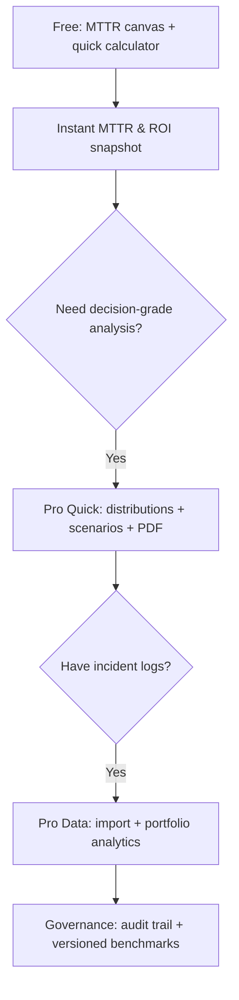
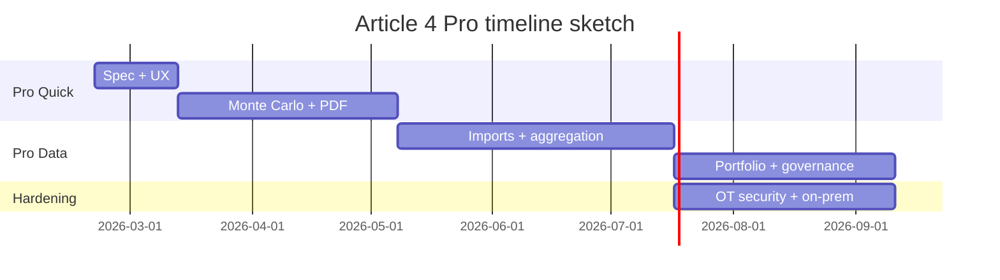

# Pro/Advanced Mode Enhancement Plan for Article 4 Interactive Tools

## Executive summary and goals

I attempted to fetch the live page but it failed with an unexpected status code, so I treated the **local Article 4 HTML** as the authoritative artifact (SHA-256: `719aad8…0c82dd`). (Production parity is **unspecified**.)

Article 4 currently includes two interactive tools:
- An **Interactive MTTR Canvas**: a phase-by-phase bar comparison of *Vendor vs In‑House* MTTR driven by a **single “In‑House Skill Level” slider** (1–5).  
- A **Capability vs MTTR Analyzer**: a calculator that estimates **vendor MTTR vs in-house MTTR**, annual downtime hours, net savings, ROI, and breakeven months based on incident category, vendor SLA hours, skill level, incidents/year, downtime $/hour, vendor callout fee, and training investment.

Conceptually, the tools are consistent with the article’s thesis: **MTTR is where operations leaders can most directly move reliability**, and *mobilization delay* is the structural bottleneck when response depends on external vendors.

My Pro-mode goal is to evolve these tools from a **single-scenario heuristic explainer** into a **decision-grade capability and MTTR analytics workspace** that can:
- Ingest real incident logs and vendor callout records (massive/batch),
- Replace point estimates with **distributions + uncertainty bounds** (Monte Carlo),
- Support staffing/coverage planning using **queueing (Erlang-C)**,
- Model incident arrival variability using **Poisson → Negative Binomial → Hawkes** when appropriate,
- Generate **export-ready executive PDFs** with transparent assumptions, confidence intervals, and scenario comparisons.

This is aligned with:
- Uptime’s research that outages are costly and that better processes/training often prevent incidents. citeturn2search0turn2search2  
- The standard availability relationship \(A \approx \frac{MTBF}{MTBF+MTTR}\) documented in NASA reliability/supportability references. citeturn3search44turn3search45  
- NIST guidance for statistical modeling of counts (Poisson) and reliability estimation uncertainty. citeturn3search0turn3search1  

Unspecified items I would need later to fully lock requirements: target industries (pure data center vs mixed critical facilities), monetization model, whether Pro must be multi-tenant, data retention requirements, and preferred deployment (SaaS vs on‑prem/edge).

## Current tool audit

### Inventory of current inputs, outputs, and formulas

#### Interactive MTTR Canvas

**Inputs (today)**
- In‑House Skill Level slider: integer 1–5 (Novice → Expert).

**Outputs (today)**
- Vendor MTTR (hours), In‑House MTTR (hours), Time Saved (hours), % Reduction (percent).
- Canvas renders per-phase bars for: Detection, Diagnosis, Mobilization, Repair, Verification.

**Algorithm (today, observed in the embedded JS)**
- Vendor phase times (Electrical-only baseline):
  - Detection = 0.25h, Diagnosis = 0.5h, Mobilization = **Vendor SLA fixed at 4h**, Repair = 1.5h, Verification = 0.5h.
- In-house phase times:
  - Detection = 0.25h
  - Diagnosis = 0.5h × skillFactor
  - Mobilization = **0.25h constant**
  - Repair = 1.5h × skillFactor
  - Verification = 0.5h  
- skillFactor mapping: {1:1.5, 2:1.2, 3:1.0, 4:0.75, 5:0.55}.

**Limitations**
- Electrical category only; no vendor SLA variability; mobilization is hard-coded (0.25h in-house; 4h vendor).  
- Deterministic; no uncertainty; no export.  
- Canvas accessibility must be explicitly handled if using Chart.js/canvas patterns; canvas content is not screen-reader accessible by default. citeturn6search0  

#### Capability vs MTTR Analyzer

**Inputs (today)**
- Incident Category: Electrical / Mechanical / Controls / Fire Protection  
- Vendor SLA Hours (numeric)  
- In‑House Skill Level (1–5)  
- Annual Incidents (count)  
- Downtime Cost per Hour ($/hour)  
- Vendor Callout Cost ($ per incident)  
- Training Investment ($)

**Outputs (today)**
- Vendor MTTR (hrs), In‑House MTTR (hrs)  
- Vendor Annual Downtime (hrs), In‑House Annual Downtime (hrs)  
- Net annual savings ($), training ROI (%), breakeven (months)  
- A phase table (per-phase vendor vs in-house hours + savings)

**Algorithm (today)**
- Category baseline phase times (except mobilization) vary by category.
- Vendor MTTR:
  \[
  MTTR_v = Detect + Diagnose + VendorSLA + Repair + Verify
  \]
- In-house MTTR:
  \[
  MTTR_i = Detect + Diagnose \cdot sf + 0.25 + Repair \cdot sf + Verify
  \]
- Annual downtime hours:
  \[
  Down_v = MTTR_v \cdot Incidents,\quad Down_i = MTTR_i \cdot Incidents
  \]
- Downtime savings:
  \[
  (Down_v - Down_i)\cdot CostPerHour
  \]
- Vendor callout costs avoided (modeled as “savings”):
  \[
  Incidents \cdot CalloutFee
  \]
- Net savings:
  \[
  Net = DowntimeSavings + VendorCosts - TrainingInvestment
  \]
- ROI:
  \[
  ROI\% = \frac{Net}{TrainingInvestment}\cdot 100
  \]
- Breakeven (months):
  \[
  TrainingInvestment \big/ \left(\frac{DowntimeSavings + VendorCosts}{12}\right)
  \]

This is consistent with standard ROI representations and is good for fast intuition, but it is not “audit-grade” without explicit attribution/isolation assumptions (see Pro validation section).

**UX flow (today)**
- Single-page, immediate recalculation on input change.
- No saved scenarios, no batch/portfolio, no report export; print CSS hides interactive elements (so “print to PDF” is not usable).

**Data sources (today)**
- No external data calls; all values are user-entered or fixed constants.

### Key limitations to fix in Pro

- **Fixed constants** drive most of the result: vendor mobilization is vendor SLA; in-house mobilization is constant; skill affects only diagnosis and repair.
- **No variability modeling**: real vendor response time has a distribution (weekend/holiday effects, technician quality variance), which can dominate tail risk—exactly the risk the article argues about.
- **No evidence / logs**: cannot validate against actual incidents, vendors, staffing model, spares availability.
- **No staffing realism**: in-house response has resource competition; multiple incidents can queue (especially during systemic events).
- **No uncertainty**: outputs are single numbers; decision-makers need ranges and confidence.
- **No governance**: Pro should be versioned, auditable, and exportable.

## Detailed Pro feature specification

I recommend a two-tier Pro design:

- **Pro Quick**: stays close to the article’s educational framing but produces **20–30 derived parameters + rich charts + executive PDF** from a small input set.  
- **Pro Data**: adds imports/connectors and produces **portfolio-scale, evidence-backed analytics**.

### Pro inputs

#### Pro Quick inputs

1) **Incident profile**  
- Incident frequency: incidents/year (or /month)  
- Incident mix: % Electrical/Mechanical/Controls/Fire/Other  
- Severity class: “critical vs noncritical” (optional)

2) **MTTR decomposition model**  
- Per-phase baselines: Detection/Diagnosis/Repair/Verification (editable, with presets)  
- Vendor mobilization: SLA + “expected actual multiplier” (or distribution)  
- In-house mobilization: on-site coverage and access time distribution  
- Spare parts & tooling readiness: multiplier or discrete mode

3) **Capability parameters**  
- Skill level is expanded into **capability tiers** and domain coverage (electrical/mech/controls/fire).  
- Training plan: cost, duration, ramp curve (how quickly skill improves).

4) **Cost model**  
- Downtime $/hour (and optional nonlinearity: reputational/regulatory multipliers)  
- Vendor callout costs and contract retainer (if applicable; currently unspecified)

#### Pro Data inputs (massive)

- Upload incident tickets (CSV/JSON/Parquet): detection time, diagnosis start/end, mobilization start/end, repair start/end, verification end; vendor vs in-house flag; category; timestamps; shift; notes.  
- Upload vendor callout records: SLA class, dispatch time, arrival time, parts delays.  
- Optional connectors: ITSM/CMMS (e.g., ServiceNow/JSM exports), monitoring/BMS logs, training LMS exports.

### Pro outputs and analysis types

#### Pro Quick: 20–30 derived parameters

A concrete starter set:

- **MTTR distribution summary**: mean/median/p90 for vendor and in-house (per category)  
- **Phase contribution**: stacked contribution chart + “dominant bottleneck” callout  
- **Availability delta**: compute \(A=\frac{MTBF}{MTBF+MTTR}\) (with ranges), using NASA’s standard availability framing. citeturn3search44turn3search45  
- **Annual downtime distribution**: p50/p80/p95 hours/year (Monte Carlo)  
- **Cost distribution**: expected savings ± interval, plus tail risk (p95 loss avoided)  
- **Breakeven distribution** (months) rather than point estimate  
- **Scenario deltas**: skill ramp, vendor SLA changes, on-site coverage changes, spares policy, training investment size  
- **Sensitivity/tornado**: what drives downtime most (mobilization mean? tail? incident frequency?)  
- **Recommended capability roadmap**: prioritize which domain skills reduce downtime most

#### Pro Data: advanced, evidence-backed analytics

- **Empirical phase distributions** (by category, by time-of-day/weekend)  
- **SLA vs actual response** benchmarking and drift monitoring  
- **Tail risk**: “probability MTTR exceeds X hours” by category  
- **What-if staffing coverage**: predict queueing delays during clustered incidents  
- **Portfolio view**: site ranking by mobilization bottleneck, skill gaps, and ROI

### Charts and visualizations

I recommend a “capability analytics dashboard” pack:

- Stacked MTTR phase bars (vendor vs in-house; baseline vs target).
- Violin/box plots of phase durations (Pro Data).
- Empirical CDF of vendor arrival time (p50/p90/p95).
- Tornado sensitivity chart (driver ranking).
- Scenario waterfall: each intervention’s contribution to MTTR reduction.
- Availability delta chart: downtime hours/year reduced.
- Portfolio heatmap: site × bottleneck phase.

image_group{"layout":"carousel","aspect_ratio":"16:9","query":["MTTR decomposition stacked bar chart example","tornado sensitivity analysis chart example","violin plot distribution example reliability phase duration","availability MTBF MTTR chart example"],"num_per_query":1}

### Export options

- **PDF Executive Pack** (auto narrative + charts + appendix definitions)  
- XLSX (KPIs + scenario table + assumptions)  
- JSON export (full model + version + inputs + outputs + confidence intervals)  
- Batch export (portfolio zip of PDFs)

### Batch processing and API endpoints

Because Pro enables massive result sets, all heavy jobs should be async and rate-limited to avoid unrestricted resource consumption. citeturn7search0turn4search1turn8search4turn2search2turn11search4

API baseline:
- `POST /v1/imports/incidents` (async)  
- `POST /v1/assessments/mttr` (quick)  
- `POST /v1/scenarios/batch` (async sweeps)  
- `POST /v1/exports/pdf` (async)  
- `GET /v1/results/{id}` (paginated, bounded)  
- `GET /v1/benchmarks` (versioned benchmarks)

## Data model and algorithm recommendations

### Data model

Core entities:
- **Incident**: category, severity, timestamps, responder type (vendor/in-house), phase start/end times.  
- **PhaseDuration**: detection/diagnosis/mobilization/repair/verification distribution parameters by category and responder type.  
- **CapabilityProfile**: domain coverage, skill levels, coverage schedule, spares readiness.  
- **TrainingProgram**: cost, ramp curve, target capability, date, evaluated outcomes.  
- **CostModel**: downtime cost function, vendor contract/callout structure.  
- **ScenarioRun**: inputs diff, model version, results, confidence intervals, narrative export.

### Statistical modeling ladder

I would implement models in this escalation order:

- **Poisson baseline** for incident arrivals in fixed periods (simple, explainable). NIST documents Poisson distribution definitions (PMF/CDF) useful for transparent implementation. citeturn3search1turn3search0turn8search4turn11search4  
- **Negative Binomial** when observed arrival variance exceeds mean (overdispersion), using the classical Poisson–gamma mixture framing. citeturn11search2turn11search40  
- **Hawkes/self-exciting** model when incidents cluster because “incidents beget incidents” (e.g., systemic dependency, weather events, cascading infrastructure). Hawkes (1971) provides the foundational self-exciting process results. citeturn11search0turn11search3  

### Queueing and Erlang staffing

When moving to in-house capability, response time is not just “skill,” it’s also **resource contention**. I recommend an Erlang-C (M/M/c) layer to estimate probability-of-wait and expected delay when multiple incidents occur close together. INFORMS’ queueing history summarizes Erlang C as the delay/queueing model and ties the classic assumptions to Poisson arrivals. citeturn11search4turn3search1  

### Monte Carlo uncertainty quantification

For decision-grade outputs, I recommend uncertainty propagation with Monte Carlo:
- Sample incident arrival rates (Poisson/NB/Hawkes),
- Sample phase durations from fitted distributions,
- Compute annual downtime and cost, then report p50/p80/p95 and credible intervals.

NIST describes Monte Carlo analysis as probabilistic sensitivity analysis via random sampling and repeated simulation. citeturn0search36turn3search1  

### Validation approaches

- **Model fit**: Poisson vs NB vs Hawkes selection based on goodness-of-fit and predictive accuracy (held-out months). citeturn11search2turn11search0  
- **Reliability uncertainty**: if users infer MTBF from incident counts, use NIST reliability confidence interval guidance (chi-square based intervals) to avoid false precision. citeturn3search0  
- **Outcome validation**: compare predicted downtime reductions vs observed reductions after training/capability interventions. Tie “preventability” claims carefully; Uptime notes methodological uncertainty but repeatedly emphasizes management/process/training as meaningful levers. citeturn2search0turn2search2  

## UX, interaction design, and accessibility

### Free vs Pro and progressive disclosure

Free remains article-native (single slider + small calculator). Pro becomes a workflow:

### Accessibility requirements

If you keep canvas-based charts (or move to Chart.js), you must add ARIA labeling or fallback content because the canvas content is not inherently accessible to screen readers. Chart.js explicitly documents this requirement. citeturn6search0  
I recommend targeting WCAG 2.2 (W3C Recommendation). citeturn5search3turn5search4  

Minimum requirements:
- `role="img"` + `aria-label` for every chart, plus “view data as table.”
- Keyboard-only support for all inputs, charts, and export actions.
- Color is never the only signal for meaning.

### Performance UX

- For Pro Data, use virtualized tables for large incident lists and async report generation.
- Cache scenario results keyed by (inputsHash, modelVersion) to keep “what-if” interaction fast.

## Scalability, performance, and security

### Compute planes

- **Interactive plane**: parameter changes, quick scenario deltas.
- **Batch plane**: imports, distribution fitting, Hawkes fitting, portfolio rollups, PDF rendering.

### Rate limits, caching, and abuse controls

Given Pro’s batch endpoints, I’d enforce budgets and caps consistent with OWASP API resource-consumption guidance: bounded pagination, payload limits, quotas for exports/jobs, and per-tenant throttling. citeturn2search2turn4search1turn11search4  

### OT/ICS privacy and on-prem options

If users upload incident logs tied to critical facilities, treat them as sensitive OT-adjacent data (site layouts, failure patterns, vendor dependencies). NIST SP 800-82 Rev. 3 provides authoritative guidance tailored to OT systems’ unique reliability and safety constraints and is a good baseline for your security architecture and deployment patterns. citeturn7search0turn7search3  

I recommend offering:
- SaaS (default), plus
- **On‑prem/edge** (for regulated/air-gapped customers), with offline licensing and local PDF generation.

### Indonesian context overlays (optional but valuable)

Vendor mobilization tail risk is often weather/transport sensitive. If you want localized scenario overlays:
- BMKG provides open weather forecast APIs with explicit access limits and attribution requirements. citeturn5search1turn5search9  
- InaRISK provides official hazard-risk mapping context for Indonesia. citeturn5search8  
These should be framed as **contextual risk modifiers**, not deterministic predictors.

## Implementation roadmap and QA plan

### Roadmap milestones

| Milestone | Deliverables | Effort (weeks) |
|---|---|---:|
| Pro Quick MVP | Unified parameters, distributions, Monte Carlo intervals, PDF export v1 | 6–10 |
| Advanced modeling | NB + Hawkes optional, sensitivity tornado, scenario sweeps | 6–12 |
| Pro Data ingestion | Incident import + schema validation + aggregation store | 8–14 |
| Portfolio & governance | Multi-site dashboards, audit trails, benchmark versioning | 6–12 |
| OT deployment option | On-prem packaging, offline mode, security hardening | 6–12 |

Timeline sketch:

### QA/testing plan

- **Unit tests**: formula correctness (MTTR sums, ROI math, availability equation use cases). citeturn3search45  
- **Property-based tests**: monotonicity invariants (e.g., higher vendor SLA → higher vendor MTTR; higher skill → lower in-house diagnosis/repair).  
- **Statistical tests**: model selection tests for Poisson vs NB; stability tests for Hawkes fitting. citeturn11search2turn11search0  
- **Load tests**: millions of incidents; ensure bounded query times and export SLAs.  
- **Security tests**: rate limit enforcement and payload boundaries. citeturn7search0turn11search4  
- **Accessibility tests**: WCAG 2.2 audits; verify Chart.js ARIA/fallback compliance. citeturn6search0turn5search3  

## Metrics, competitor landscape, and prioritized sources

### Metrics/KPIs

Accuracy and reliability:
- Calibration: predicted annual downtime distribution vs observed (post‑implementation).
- Model adequacy flags: % of sites where NB/Hawkes is required (overdispersion/clustering). citeturn11search2turn11search0  
- Confidence interval coverage: how often observed outcomes fall within predicted intervals.

Relevance and impact:
- MTTR phase improvement: reduction in mobilization p90/p95.
- Availability impact: estimated downtime hours avoided (with NASA-style availability framing). citeturn3search44turn3search45  
- ROI realization tracking: projected vs realized savings.

User satisfaction:
- Report “decision readiness” score (survey after export).
- Time-to-insight (time to produce board-ready PDF).
- Retention: repeat scenario runs and uploads.

### Competitor/reference tools comparison

| Reference tool | What it’s best at | Strengths relevant to your Pro design | Pricing model |
|---|---|---|---|
| **entity["organization","Uptime Institute","digital infrastructure authority"]** M&O Stamp of Approval | Operational resiliency assessment program | Holistic operations/staffing focus; emphasis on continuous improvement and skill assessment concepts (CCAM) and risk profiling. citeturn12search0 | Quote-based (public pricing not listed) |
| **entity["organization","Uptime Institute","digital infrastructure authority"]** Tier Certification of Operational Sustainability | Operational behaviors/risks audit | Points-based assessment (Bronze/Silver/Gold) emphasizing human/process elements. citeturn12search5 | Quote-based |
| **entity["company","PagerDuty","incident management vendor"]** | Incident response + on-call | Public pricing, workflows, post-incident reviews; good “runbook + on-call” reference. citeturn4search1 | Public tiers ($0 to $41/user/mo; enterprise custom) citeturn4search1 |
| **entity["company","Atlassian","software company"]** Jira Service Management | ITSM + incident workflows | Public pricing; audit logs/data residency; a reference for batch reporting and governance. citeturn4search2 | Public tiers ($0–$51.42/agent/mo; enterprise contact sales) citeturn4search2 |
| **entity["company","SolarWinds","it management company"]** Service Desk | ITSM + change/incident | Transparent plan pricing; scheduled reports and API access are good Pro references. citeturn4search0 | $39/$79/$99 per technician/mo (annual billing) citeturn4search0 |

### Prioritized source set I recommend anchoring Pro’s methodology on

- **entity["organization","NASA","us space agency"]** reliability/supportability references for availability and MTBF/MTTR framing. citeturn3search44turn3search45  
- **entity["organization","National Institute of Standards and Technology","us standards agency"]** for Poisson definitions, reliability uncertainty, and statistical methods. citeturn3search0turn3search1  
- **entity["organization","INFORMS","operations research society"]** for Erlang/queueing conceptual grounding and assumptions. citeturn11search4  
- **entity["organization","Uptime Institute","digital infrastructure authority"]** for outage cost context and human/process factors framing. citeturn2search0turn2search2  
- **entity["organization","Chart.js","javascript charting project"]** documentation for canvas accessibility constraints and ARIA/fallback patterns. citeturn6search0  
- Indonesian official context sources: **entity["organization","BMKG","Indonesia weather agency"]** API terms/limits and **entity["organization","InaRISK","Indonesia disaster risk portal"]** hazard portal description. citeturn5search1turn5search8  
- Indonesian-language resilience guidance example: **entity["company","Amazon Web Services","cloud provider"]** whitepaper section on reducing MTTR (useful for bilingual/local framing). citeturn0search12