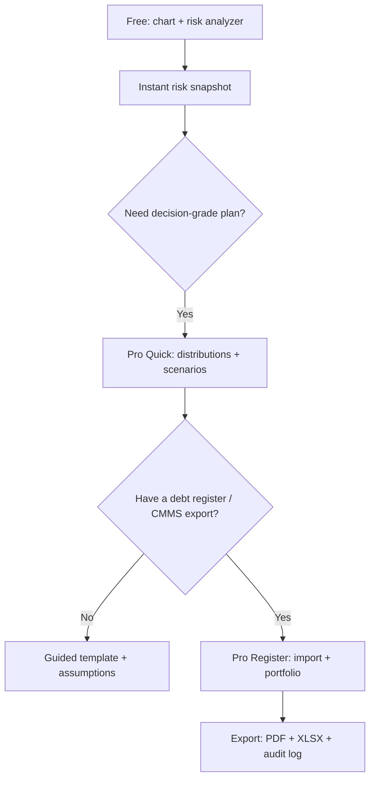
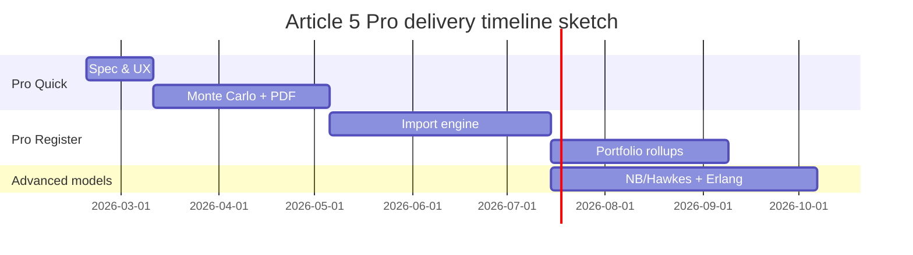

# Pro/Advanced Mode Design for Article 5 Technical Debt Interactive Tools

## Executive summary

I treated the **local `article-5.html`** as authoritative because the live URL fetch failed (status is **unspecified**; could be bot protection, CDN policy, or transient outage). From the local HTML, Article 5 contains two interactive tools tightly tied to the article’s thesis (“technical debt compounds into operational risk”): an **interactive Technical Debt Accumulation chart** (canvas-based, with two sliders) and a **Technical Debt Risk Analyzer** (a Weibull-hazard-based calculator with a risk gauge, multi-year projections, and cost escalation outputs). The current tooling is excellent for narrative clarity, but it is **not decision-grade** because it relies on fixed Weibull parameters, single “average age” inputs, heuristic scaling constants, and deterministic forecasts without uncertainty bounds.

My Pro/Advanced goal is to turn Article 5’s tools into a **Technical Debt Risk Analytics workspace** that can: (a) ingest a real “debt register” from CMMS/EAM/DCIM sources, (b) compute risk and cost exposure with **uncertainty quantification (Monte Carlo)**, (c) model incident/failure arrivals using **Poisson → Negative Binomial → Hawkes** (as data warrants), (d) plan remediation capacity using **queueing/Erlang** and resource constraints, and (e) produce an export-ready executive PDF with transparent assumptions and versioning.

This approach aligns with internationally recognized asset/risk management intent—balancing performance, risk, and expenditure across asset lifecycles for decision-making. citeturn0search0turn10search1

Unspecified details I cannot infer from Article 5 alone: target customer segment (enterprise DC vs colo vs mixed), whether Pro is paid and multi-tenant, retention requirements, preferred deployment model (SaaS vs on‑prem/edge), and which EAM/CMMS systems you expect to integrate.

## Current tool inventory and limitations

### Interactive tool inventory

**Debt accumulation chart (Section “Interactive: Technical Debt Accumulation”)**

- **Inputs**
  - Facility age slider: `ageSlider` (1–25 years, default 8)
  - Debt accumulation rate slider: `debtSlider` (0–100%, default 40)

- **Outputs**
  - Current risk level: `finalRisk` (last simulated year’s risk value)
  - Risk trajectory label: `trajectory` (Critical / Rising / Climbing / Stable)
  - Debt status label: `debtStatus` (Managed / Moderate / Critical based on debt rate thresholds)
  - Years to critical: `yearsToCritical` (first year where risk ≥ 60; else `>maxYears`)
  - Visual output: canvas line chart with at least: “Operational Risk Level,” “Managed Debt Baseline,” and “Critical Threshold.”

- **Algorithm (as implemented in the embedded JS)**
  - A Weibull hazard function is used inside the simulator (conceptually consistent with reliability engineering hazard modeling; NIST documents Weibull parameterization and terminology). citeturn6search2
  - Risk simulation path (debt accumulation scenario):
    - For each year \(y\): convert to months \(t=12y\)
    - Debt factor: \(1 + (\text{rate}/100)\cdot y \cdot 0.3\) (linear growth with age and slider rate)
    - Hazard: Weibull hazard with fixed \(\beta=2.0\), \(\eta=180\) months (values are hard-coded)
    - Base risk: \(5 + \text{hazard}\cdot \text{debtFactor} \cdot 800\); capped to 100
  - Managed baseline:
    - Hazard uses fixed \(\beta=1.5\), \(\eta=240\)
    - Base risk: \(5 + \text{hazard}\cdot 200\); capped to 100
  - Critical threshold is a fixed line at risk = 60; “years to critical” is the first simulated year at or above 60.

**Technical Debt Risk Analyzer (Section “Technical Debt Risk Analyzer”)**

- **Inputs**
  - Deferred items count: `calcItems` (1–500)
  - Average age of deferred items: `calcAge` (months, 1–120)
  - Facility age: `calcFacilityAge` (years, 1–30)
  - Average remediation cost per item: `calcCost` ($, 100–500,000)
  - Annual revenue: `calcRevenue` ($, 1,000,000–1,000,000,000)
  - Criticality distribution sliders:
    - `% Critical`: `calcCritical` (0–100)
    - `% Major`: `calcMajor` (0–100)
    - `% Minor`: `calcMinor` is auto-calculated as remainder and disabled

- **Outputs**
  - Current risk score gauge: `riskScoreDisplay` with a needle `riskNeedle` (0–100)
  - Projected risk: 1 year, 3 years, 5 years (`resultRisk1yr`, `resultRisk3yr`, `resultRisk5yr`)
  - Original remediation cost, escalated current cost, escalation percent
  - Annual revenue at risk (a derived exposure proxy)
  - Recommended annual budget (3-year remediation target)
  - Priority breakdown counts: critical/major/minor items

- **Algorithm (as implemented)**
  - Weibull hazard of average age \(t\) (months) with fixed parameters: \(\beta=2.5\), \(\eta=60\). (Weibull hazard behavior and parameter meaning are consistent with NIST’s Weibull notes about shape/scale synonyms and hazard growth regimes). citeturn6search2
  - Risk base:
    - Item counts = items × criticality %
    - Criticality weights: critical=10, major=5, minor=1
    - Base risk = weighted item count × hazard
  - Facility multiplier = \(1 + \text{facilityAge}/20\)
  - Current risk score = min(100, baseRisk × facilityMultiplier)
  - Risk projections use a deterministic compounding factor \(1.15^t\) (15% annual “risk interest”) at t = 1, 3, 5
  - Cost escalation factor = \(1 + (\text{avgAge}/24)\cdot 0.5\)
  - Revenue at risk = annualRevenue × (risk/100) × 0.1 (10% factor)
  - Budget = escalatedCost / 3

### UX flows, data sources, and limitations

- **UX**: single-page, immediate updates on input events. No scenario saving, no history, no batch uploads, no multi-site comparison, and no export button.
- **Data sources**: none external. All baselines and coefficients are hard-coded; therefore, there is no provenance for the chosen β/η values, scaling constants, or critical threshold other than being a pedagogical approximation.
- **Print/export**: the page’s print CSS hides the chart and calculator, so “print to PDF” yields no interactive results—blocking the dominant workflow you want (exportable conclusions).
- **Accessibility risk**: the interactive chart is a `<canvas>`. Chart.js explicitly notes that canvas content is not accessible to screen readers and requires ARIA or fallback content. citeturn8search0
- **Decision-grade limitations**
  - “Average age” collapses the age distribution; but Weibull hazards are nonlinear, so the tail can dominate risk.
  - Fixed β/η assumes one asset family; in reality, UPS batteries, switchgear, controls, and mechanical systems have very different wear-out regimes.
  - A single deterministic compounding rate and linear debt factor can exaggerate or understate real growth depending on maintenance capacity (which is not modeled here).
  - No uncertainty bounds; decision makers need ranges and confidence.

## Pro/Advanced feature blueprint

I recommend a two-tier Pro architecture: **Pro Quick (fast, low data requirements)** and **Pro Register (data-driven, massive/batch)**. Both should share the same KPI engine, model versioning, and export pipeline.

### Pro feature list

**Inputs**

- **Pro Quick**
  - Asset profile preset: (UPS battery / switchgear / cooling / controls / fire / mixed) with editable β/η defaults and design-life references.
  - Debt register summary: item count by class + age distribution (p50/p90) instead of a single average.
  - Compounding model: choose drivers (age-only, age+debt-rate, age+capacity constraints).
  - Exposure: downtime cost model (linear or piecewise), revenue at risk, and SLA penalty modifiers.
  - Governance: documentation quality, spares availability, change-control maturity (as multipliers).

- **Pro Register**
  - Upload debt register (CSV/JSON/Parquet): each deferred item gets an ID, asset/system, category, age, last PM date, criticality, estimated cost, required window, dependency notes.
  - Optional connectors: CMMS/EAM work orders, asset inventory, spares stock levels, incident tickets.
  - Geography context (optional): link site to BMKG forecast and InaRISK hazard layers (Indonesia). BMKG states 60 requests/min/IP and requires attribution. citeturn8search4turn9search0

**Outputs (examples)**

- **Pro Quick: 25–35 reportable outputs**
  - Current risk score distribution (p50/p80/p95), not a single value.
  - Projected risk curve (1/3/5/10 years) + confidence band.
  - Expected annual incident rate increase (arrival model choice: Poisson/NB/Hawkes; see methods section).
  - Cost-of-deferral curve (NPV-style and “escalation-only”).
  - Recommended annual remediation budget to meet a target risk threshold by year N.
  - Sensitivity/tornado: top 10 drivers (β/η uncertainty, age tail, capacity limits, criticality mix).

- **Pro Register: massive result sets**
  - Pareto of top risk contributors (items and systems).
  - Heatmap: system × risk bucket; site × risk bucket (portfolio).
  - “Debt concentration index”: share of risk in top 10% items.
  - Budget optimization: which subset of items yields the biggest risk reduction per dollar.
  - “Readiness blockers”: items that cannot be executed due to window/tooling/spares constraints.

**Analysis types**

- Weibull fitting from failure/service data (MLE + confidence intervals).
- Scenario simulator (“Fix the top 20 items,” “Add spares,” “Increase maintenance capacity,” “Reduce documentation debt”).
- Portfolio benchmarking: compare sites by normalized risk and by risk reduction efficiency.

**Chart types**

- Weibull hazard and survival curves (with annotated β, η).
- Risk trajectory with confidence band.
- Pareto bar + cumulative distribution.
- Bubble plot: cost vs risk vs criticality.
- Budget vs risk frontier curve.
- Sankey: debt sources → risk mechanisms → remediation levers.

**Export options**

- PDF Executive Pack (5–15 pages): one-click, with narrative conclusions and assumptions table.
- XLSX/CSV exports: register + computed fields (risk score, hazard, priority, recommended window).
- JSON export: complete scenario definition for reproducibility.

**Batch processing**

- Batch import multiple sites; compute portfolio rollups.
- Batch scenario sweeps (e.g., 10 budgets × 5 compounding rates).

**APIs**

- `POST /v1/debt-registers/import` (async)
- `POST /v1/scenarios/run` (async for Monte Carlo)
- `GET /v1/results/{id}` (paginated)
- `POST /v1/exports/pdf` (async)
- `GET /v1/benchmarks` (versioned presets + provenance)

image_group{"layout":"carousel","aspect_ratio":"16:9","query":["weibull hazard curve beta eta example chart","risk heatmap dashboard example","pareto chart risk contributors example","budget vs risk frontier curve example"],"num_per_query":1}

## Data model and algorithm recommendations

### Data model

I recommend a versioned, audit-friendly model aligned with asset/risk management principles (balancing performance/risk/expenditure). citeturn0search0turn10search1

Core entities:
- **Site** (location, criticality, environment modifiers, hazard overlays)
- **Asset/System** (UPS, switchgear, cooling plant, controls, fire)
- **DebtItem** (ID, type, age, last service, criticality, cost, constraints, dependencies)
- **RiskModelVersion** (β/η presets, compounding rules, thresholds)
- **ScenarioRun** (inputs hash, Monte Carlo settings, outputs, timestamps)
- **Evidence** (attachments, work orders, inspection results)

### Statistical methods

**Weibull survival/hazard**
- Use Weibull to model time-to-failure and hazard growth; NIST provides Weibull reliability handbook definitions and parameter naming conventions (shape vs scale terms). citeturn6search2
- Pro should support:
  - 2-parameter Weibull (β, η)
  - optional 3-parameter Weibull with shift when physics indicate a minimum life (document assumptions)

**Incident arrival modeling (Poisson → Negative Binomial → Hawkes)**
- **Poisson** for baseline event counts in intervals; NIST provides PMF/CDF formulas used widely for transparent implementation. citeturn15search4
- **Negative Binomial** when data are overdispersed; Cambridge’s excerpt explains the classical Poisson–gamma mixture derivation and why it generalizes Poisson for real-world variance. citeturn15search1
- **Hawkes/self-exciting** when failures cluster (e.g., systemic stress events, cascading issues); Hawkes (1971) is a foundational reference. citeturn15search0

**Maintenance capacity and remediation backlog (queueing/Erlang)**
- Model remediation as a service system: arrivals = remediation tasks; service = crew capacity and window constraints.
- Use Erlang-C style “probability of delay” and expected waiting time for staffing/budget feasibility; INFORMS’ queueing overview ties Erlang models to delay systems and Poisson arrivals assumptions. citeturn15search6

### Monte Carlo uncertainty quantification

I recommend Monte Carlo as the default for decision-grade outputs:
- Sample uncertainty in β/η, age distribution, compounding rate, cost escalation, and event arrivals.
- Produce p50/p80/p95 for risk, downtime, and budget.
- NIST publications provide authoritative examples of Monte Carlo methods for uncertainty when analytic propagation is hard. citeturn9search6

### Validation approach

- **Internal validity**
  - Unit tests: hazard monotonicity for β>1; projection logic; budget optimizer constraints.
  - Property tests: “more deferred items never reduces risk,” “older distribution shifts increase hazard,” etc.
- **External validity**
  - Backtest: compare predicted incident counts and realized “near misses/outages” after debt reduction.
  - Compare decision rankings against expert workshop outcomes (does the tool’s top 10 match engineering judgment?).
- **Governance validity**
  - Model versioning + changelog so results are reproducible and auditable, consistent with risk-management expectations that practices should be benchmarkable and transparent. citeturn10search1

### Narrative algorithm text for PDF exports

I would include a “How this score is computed” section written for executives:

> **Risk score construction.** I estimate each deferred item’s risk contribution as a function of its **criticality** and its **age-dependent failure hazard**. Hazard is modeled using a Weibull form, where the shape parameter controls whether hazard increases with age (wear-out behavior). I aggregate item contributions to compute a site-level score and cap it to a 0–100 scale for interpretability. Weibull terminology and parameterization follow NIST references. citeturn6search2  
> **Uncertainty.** Because β/η, ages, and costs are uncertain, I run Monte Carlo simulations by sampling plausible parameter ranges and recomputing the risk and cost exposure thousands of times. I report percentile bands (p50/p80/p95) rather than a single number. citeturn9search6  
> **Clustering and compounding.** If failure/incident records show clustering or overdispersion, I replace simple Poisson assumptions with negative binomial or self-exciting models, documenting the selected model and diagnostics. citeturn15search4turn15search1turn15search0

## UX and interaction design

### Free vs Pro progressive disclosure

Free should remain educational: two sliders + a simple calculator. Pro should become a workflow:

### Accessibility

If you keep canvas-based charts (or move to Chart.js), canvas content must be made accessible via ARIA labels or fallback content (Chart.js explicitly states this). citeturn8search0  
I recommend targeting WCAG 2.2 for Pro. (Exact target conformance level AA/AAA is **unspecified**; I would choose AA unless you target regulated procurement.)

Concrete requirements:
- Every chart: `role="img"` + `aria-label` + “View data as table.”
- Keyboard-first interactions for sliders, filters, scenario selection, and exports.
- Color is never the only indicator (threshold labels and patterns).

### Performance considerations

- “Fast path” for Pro Quick: client-side computation + cached Monte Carlo (lightweight).
- Heavy path for Pro Register: async jobs, incremental aggregation, and cached portfolio rollups.

## Scalability, performance, and security

### Compute planes

- **Interactive plane**: quick scenario updates, low latency.
- **Batch plane**: Monte Carlo, Weibull fitting, Hawkes fitting, portfolio rollups, PDF rendering.

### Caching and rate limits

Pro APIs must bound resource consumption. OWASP’s API4:2023 lists missing limits (pagination, upload size, timeouts, operations per request) as a widespread cause of DoS and cost blowups. citeturn11search3  
Controls:
- Hard caps on upload size and time range.
- Strict pagination limits (`limit` max).
- Per-tenant quotas for batch jobs and PDF exports.
- Spend alerts for third-party data overlays (BMKG calls) and caching of hazard layers.

### OT/ICS data privacy and on‑prem options

A debt register can expose vulnerabilities (aging UPS, bypasses, missing inspections). If Pro ingests operational records, treat it as OT-adjacent. Offer:
- Encryption in transit and at rest.
- Tenant isolation + audit logs.
- Optional on‑prem/edge deployment (preferred deployment model is **unspecified**, but on‑prem is high-value in critical facilities).
If Pro includes authentication and roles, follow modern digital identity guidance (NIST SP 800-63 Rev. 4). citeturn11search2

## Implementation roadmap and QA strategy

### Roadmap milestones

| Milestone | Deliverables | Effort estimate |
|---|---|---:|
| Pro Quick MVP | Configurable Weibull presets, Monte Carlo bands, scenario runner, PDF export v1 | 6–10 weeks |
| Register ingestion | Import templates, validation, computed fields, portfolio rollups | 8–14 weeks |
| Advanced modeling | NB + Hawkes optional, Erlang capacity planner, budget optimizer | 8–16 weeks |
| Governance hardening | Versioning, audit logs, RBAC, retention controls | 6–12 weeks |
| Enterprise deployment | On‑prem package, offline mode, security review | 6–12 weeks |

### Testing plan

- **Unit tests**: Weibull hazard computation; Poisson/NB likelihood components; Monte Carlo reproducibility (seeded); budget optimizer constraints. citeturn6search2turn15search4turn15search1turn9search6
- **Property tests**: monotonicity and invariants (“risk increases with age under β>1”).
- **Load tests**: 100k–10M debt items across portfolios; p95 query latency targets.
- **Security tests**: validate OWASP API4 controls (pagination, timeouts, quotas). citeturn11search3
- **Accessibility tests**: screen readers + keyboard-only; enforced fallback content for canvas. citeturn8search0

## Metrics, competitor landscape, and prioritized sources

### Metrics and KPIs

Accuracy and relevance:
- Calibration: predicted vs observed incident volume and “near miss” rates after remediation.
- Interval coverage: share of realized outcomes within predicted p80/p95 bands.
- Model selection rate: % of sites that need NB/Hawkes vs Poisson (diagnostic maturity).

Operational usefulness:
- Risk reduction per dollar (portfolio frontier improvement).
- “Decision latency”: time from upload to board-ready PDF.
- Remediation throughput feasibility score (capacity planner outputs vs executed work).

User satisfaction:
- Export CSAT (“report is decision-ready”).
- Repeat usage: % of users running ≥3 scenarios per quarter.
- Trust score: % of users who understand the top drivers (measured via survey).

### Competitor/reference tool comparison

| Tool | Strengths relative to your Pro goals | Evidence | Pricing model |
|---|---|---|---|
| entity["company","IBM Maximo Application Suite","enterprise asset mgmt"] | Enterprise EAM/APM, condition monitoring, health/risk scoring, predictive maintenance | IBM describes APM health/criticality/risk scoring and predictive monitoring capabilities. citeturn12search2turn12search3 | Quote-based (public list price typically not shown) |
| entity["company","ServiceNow Hardware Asset Management","it asset mgmt module"] | Lifecycle workflows, executive dashboards, TCO and automation (good reference for governance + unified platform) | ServiceNow lists lifecycle automation, executive dashboards, and asset TCO features. citeturn13search0turn13search60 | Quote-based (pricing not listed on product page) |
| entity["company","SAP Enterprise Asset Management","eam software"] | Lifecycle-wide EAM framing: performance, maintenance, risk management and compliance | SAP explains EAM as lifecycle management including risk and compliance. citeturn12search6 | Quote-based |
| entity["organization","HBM ReliaSoft","reliability software"] | Deep Weibull/reliability analytics tooling (RBDs, failure modes modeling); strong reference for statistical rigor | ReliaSoft help docs describe Weibull++ diagrams and RBD analysis. citeturn12search7turn12search8 | Quote-based |
| entity["organization","Uptime Institute","data center authority"] | Operational resiliency framing and audit-style assessment practices; strong benchmark reference for process maturity and human-factor risk | Uptime press releases emphasize procedure adherence and operational training as risk levers. citeturn11search0turn6search0 | Quote-based |

### Prioritized sources I anchored on

- entity["organization","National Institute of Standards and Technology","US standards agency"] for Poisson and Weibull statistical definitions. citeturn15search4turn6search2  
- entity["organization","International Organization for Standardization","standards body"] for risk/asset management framing (ISO 31000 and ISO 55001). citeturn10search1turn0search0  
- entity["organization","Badan Meteorologi, Klimatologi, dan Geofisika","Indonesia weather agency"] for Indonesia-ready risk overlays and explicit API limits. citeturn8search4  
- entity["organization","Badan Nasional Penanggulangan Bencana","Indonesia disaster agency"] for hazard-risk mapping context via InaRISK. citeturn9search0  
- OWASP API Security Top 10 for rate limits and resource bounds. citeturn11search3