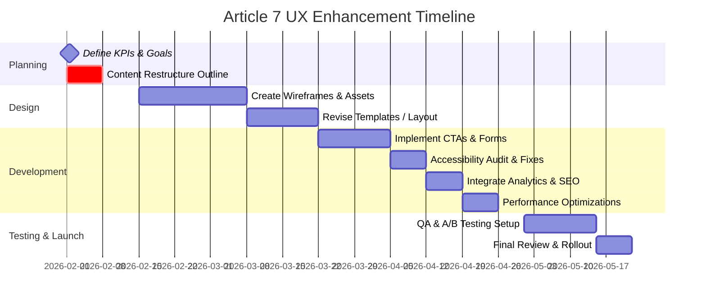

# Executive Summary

The “From Reliability to Resilience” article provides a detailed analysis of data-center Tier ratings and operational resilience. It argues that design-certified reliability (Tier classifications) often fails to predict real-world outcomes, as exemplified by a **Tier-III data center** that suffered cascading outages due to operational gaps【47†L535-L544】【47†L557-L565】. For mid-senior and C‑level audiences, the content is rich but dense and technical. To improve executive engagement, we will frame key insights as clear business issues and solutions. Key recommendations include: 

- **Content & Messaging:** Introduce an **Executive Summary** or bullet highlights at the top with top-line findings (e.g. *“Tier ratings measure design, not resilience – leading to 15% downtime in one incident scenario”*). The current text, while authoritative (citing Uptime Institute data【45†L147-L153】), is wordy. We will condense and emphasize value propositions: risk reduction, faster recovery, regulatory compliance. Tone should pivot to outcome-driven language.  
- **Visual Design:** Add infographics to illustrate complex ideas. For example, convert the detailed incident **timeline** into a visual timeline or flowchart. Use branded colors (deep blues) and ample whitespace. The existing layout is single-column text; we should break it up with callouts (e.g. sidebar quotes) and data tables (the seven-dimension framework can be a clean table). Ensure typography is clear (larger headings, legible fonts).  
- **Interaction Design:** Introduce clear CTAs such as **“Assess Your Resilience”** linking to the interactive canvas or calculator. Improve navigation (breadcrumb “Engineering Journal > Article 7”). The resilience calculator (section 11) should have labeled fields and a prominent **“Calculate Score”** button. Ensure mobile responsiveness by testing the tables and charts on smaller screens.  
- **Accessibility:** Comply with WCAG 2.1. The text has good structure, but we must add alt text to any new graphics (e.g. “Flowchart of Tier vs resilience outcomes”) and ensure color contrast meets standards. All form controls (calculator inputs) need proper labels and keyboard operability.  
- **Performance & Technical:** Optimize page load by minifying scripts and lazy-loading offscreen content. Add missing metadata: `<meta name="description">` summarizing the Tier vs resilience gap, and Open Graph tags for social sharing (image currently missing from this HTML). Ensure analytics are active (we see a Google tag【1†L4-L10】).  
- **Credibility & Trust:** Emphasize empirical data and results. For instance, highlight Uptime Institute findings that **60–80% of outages** are human/organizational【45†L147-L153】. Feature the real-world example (“15% loads down for 31 min”【48†L1-L4】) as evidence. Mention the author’s credentials (from site footer or bio) and any relevant affiliations or certifications. A short “Why This Matters” section with hard numbers will bolster trust.  
- **Conversion & Engagement:** Add lead-generation funnels. E.g. offer a downloadable *“Resilience Assessment Executive Brief”* (PDF) via email. Place a newsletter signup (“Get resilience insights”). Guide readers from content to action: *“Try our Resilience Calculator ►”* after introducing it. Use personalization if possible (industry or role-specific messaging).  

The following sections detail these areas and provide prioritized UX recommendations (with effort and impact), a comparative table of current vs. proposed elements, sample microcopy, a timeline (mermaid Gantt), and KPIs.

## Content Strategy & Messaging

- **Current:** The article is structured like an academic paper, beginning with a long abstract and a complex narrative (e.g. a detailed incident timeline【47†L554-L563】). Key insights (“Tier ratings capture design but not operational resilience”【45†L61-L69】) are present but embedded in text or block quotes. The tone is formal and assumes technical knowledge.  
- **Issues:** Busy executives need *“So what?”* answers upfront. The wealth of detail can obscure the main business problems: high downtime costs and risk exposure. Without a clear summary, they may miss the core value proposition.  
- **Recommendations:** Insert a concise **Executive Summary** at the top (e.g. bullet list or bolded highlights). This summary should translate technical content into business language (e.g. *“Even Tier‑III data centers can lose hours of uptime due to operational gaps【47†L587-L592】”*). Use punchy statements like *“15% of loads went down for 31 minutes despite a Tier‑III design”*【48†L1-L4】. Emphasize metrics (e.g. Uptime Institute’s “60–80% outages are human-related”【45†L147-L153】) as bullet points. Tone should be outcome-oriented: speak of risk, cost, and opportunity. For example, instead of “resilience engineering principles,” say *“organizational strategies to avoid outages.”* Organize the content so that each section starts with a clear takeaway (e.g. “Tier ratings leave critical gaps in practice” for Section 2) and use headers that highlight business value (e.g. “Design vs. Operational Gaps” rather than “Case Context”).  

*Rationale:* Clear, executive-focused messaging ensures leadership immediately understands the stakes (risk mitigation, uptime). By foregrounding evidence like *“Two identical Tier-III sites had drastically different outage outcomes”*【45†L52-L61】 in the summary, we tie technical details to tangible business impacts (customer trust, SLA compliance). Short paragraphs and bullets cater to scan-reading and decision-making style. 

## Information Hierarchy & Tone

- **Current Hierarchy:** The page follows numeric sections (Abstract, 02, 03, …) and a TOC at top. Important concepts (reliability vs resilience) are explained only after several pages of text.  
- **Issues:** Executives may not scroll deep enough to find key points. The abstract is narrative and lengthy. There’s no highlighted “Key Findings” box. The distinction between reliability and resilience, though central, is not at the topmost hierarchy.  
- **Recommendations:** Reorder content flow to serve priorities. For example, start with a one-paragraph **Context** or **Key Insight** section before the abstract, summarizing “Tier ratings do not measure resilience” and previewing the 7-dimension model. Move the bolded thesis quote【45†L61-L64】 into a callout or highlight box. Label sections with business-oriented titles (e.g. “02 – What Tier Ratings Measure (and Don’t)” rather than “Tier Ratings Are Insufficient”). Use short subheads (e.g. *“Why This Matters”*, *“Operational Blind Spots”*) to break up text. Keep paragraphs to 3–4 sentences. Add a sidebar glossary or tooltips for any jargon (e.g. *“2N” or “CRAH”*). 

*Rationale:* A logical hierarchy with strategic signposts helps executives quickly locate information. Placing the reliability vs. resilience distinction clearly at the top (perhaps even summarizing it) aligns with their need for strategic insight. Concise, active language (e.g. “We introduce a 7-dimension assessment” rather than “This paper develops…”) makes the message more compelling.

## Visual Design

- **Layout & Typography:** The current design is text-heavy. The Incident timeline (section 7) is written out; the resilience dimensions are in a tabular text format【47†L639-L648】. We should break up text with visuals. Larger headings (e.g. use two lines for the title) and consistent section styling (color accent bars?) will improve readability.  
- **Infographics & Imagery:** Create visuals for complex data: 
  - **Incident Flowchart:** Convert the cascading failure timeline into a flowchart or timeline graphic showing key events (T+0, T+14, etc.). This visual would quickly communicate the concept of operational failures layering up.  
  - **Resilience Score Chart:** For the 7 dimensions, use a radar or bar chart example (maybe hypothetical scores) to illustrate the concept. 
  - **Icons & Callouts:** Add icons (e.g. a shield for protection, gear for process) next to each dimension in the table to draw the eye. Frame quotes like the “Reliability vs Resilience” statement【45†L61-L64】 in a stylized quote box with background shading.  
- **Color & Branding:** Apply the brand’s color palette (blue, gray) consistently. For instance, section headers or sidebar boxes could be in a light blue. Ensure sufficient contrast (e.g. avoid pale gray text). Use the site’s font (from styles.css) and ensure body text is large enough for reading.  
- **White Space:** Increase padding around paragraphs and between sections. The table of dimensions is currently dense; pad table cells for readability. On mobile, ensure charts scale or stack; avoid horizontal scrolling of tables by collapsing to lists if needed.  

*Rationale:* Visual aids capture attention and simplify complex concepts for executive viewers. For example, a diagram showing that *“every Tier-rated component worked as designed, yet 15% of loads still lost power”*【47†L587-L594】 will make the argument concrete. Consistent use of whitespace and typography signals professionalism and clarity, which C-level readers expect. 

## Interaction Design

- **Navigation:** The top nav and “Back to Engineering Journal” link【45†L17-L25】 are clear, but breadcrumbs could be added for context (e.g. Insights > Article 7). Ensure the mobile menu is accessible. The Table of Contents is helpful but could be a sticky sidebar on desktop for quick jumps.  
- **CTAs & Affordances:** Introduce clear calls-to-action. For example:  
  - **Top CTA:** A button “Calculate Resilience Score” near the intro, linking to section 11. Label it with strong verbs (“Calculate” vs “Use Calculator”).  
  - **Mid-Page CTA:** After explaining the framework (section 8/9), insert a prompt: *“How resilient is your facility? Try our Resilience Assessment Tool below.”* with a button.  
  - **Bottom CTA:** At the end, “Schedule a Consultation” or “Download Full Report,” capturing executive interest.  
  Buttons should be prominent (filled with brand color) with hover effects. All interactive elements (inputs for the calculator) must look clickable; add placeholder text (e.g. *“Type your facility’s criteria”*) and a “Submit” label.  
- **Microcopy:** Simplify instructional text. Replace technical phrasing like “Enter your metrics to compute a resilience gap” with *“See how your facility scores on resilience.”* Add brief hints in the scorecard fields (“0–100 scale per dimension”) and an outcome message (“Your Resilience Score is 72 – Gap: 18 (Warning)”).  
- **Mobile Responsiveness:** Test the canvas and calculator on phones. Ensure the seven-dimension table (currently 7 columns) wraps or scrolls horizontally without breaking. Make sure all buttons and links are thumb-friendly (adequate size/spacing). Collapse non-essential visuals on narrow screens if needed.  

*Rationale:* Intuitive interaction drives engagement. A clear funnel (“Read → Calculate → Contact”) with well-labeled CTAs will convert interest into action. The user should never wonder *“what do I click next?”*. For example, after introducing the Resilience Score, a bright button saying **“Compute Your Gap”** immediately guides the next step.

## Accessibility

- **Structure:** Headings (H2) are well-used, which aids screen readers. Confirm no skipped heading levels. Use ARIA `role="navigation"` for the TOC if manual-coded.  
- **Contrast:** The text is black on white (good), but any accent color must have ≥4.5:1 contrast (the existing site uses dark blue which is fine). Avoid colored text on light backgrounds for critical info.  
- **Alt Text:** Provide alt text for any new graphics. E.g. a chart showing resilience vs reliability can have alt="Chart comparing resilience and reliability scores". The author image (Bagus) is decorative in context, so its alt can be empty or name only.  
- **Keyboard Nav:** Ensure all links and buttons (especially the new CTAs) are keyboard-focusable with visible outlines. The calculator fields and “Calculate” button must be usable via Tab/Enter.  
- **ARIA Labels:** Use `<label>` tags for calculator inputs. If the resilience canvas is interactive, ensure it has descriptive labels (e.g. `aria-describedby` giving its summary). The data table for dimensions should use `<th>` for headers.  
- **Responsive Text:** Ensure font sizes scale up for large default browser text. Allow zoom without layout breaking.  
- **Screen Reader Text:** For any icons used, add `aria-hidden="true"` and provide text equivalents via captions or aria-labels.  

*Rationale:* C-level audiences often include stakeholders who value inclusive design. Compliance with WCAG not only prevents legal issues but also signals thoroughness. A chart or table inaccessible to screen readers would detract from authority; by contrast, a well-labeled infographic communicates excellence and attention to detail.

## Performance & Technical

- **Load Time:** The page is heavy (9000 words) but mostly text. The interactive canvas/calculator likely load external scripts. We should minify JS/CSS and defer non-critical scripts. Lazy-load the “Interactive Canvas” graphic (only when scrolled into view).  
- **Asset Optimization:** Use responsive images (`srcset`) for any graphics. The cover image (if any) should be compressed. Ensure caching headers on static assets.  
- **SEO & Metadata:** The HTML has `<title>` and `og:` tags【1†L47-L51】 but meta description seems incomplete (“Why Tier ratings measure design but no…” truncated at [1†L48-51]). Add a full `<meta name="description">` summarizing the article’s gist. Include `og:image` if a social card graphic is available. Use keyword phrases (“data center resilience”, “Tier ratings”) naturally in content and headers.  
- **Analytics:** The HTML shows a Google Analytics tag【1†L4-L10】. Ensure custom events are set for CTA clicks and scorecard uses. If not already, integrate a goal funnel. Tag outbound links (e.g. “Contact”) for conversion tracking.  
- **CMS/Platform:** Unspecified, but it appears static (hosted on GitHub Pages?). Confirm deployment setup allows version control and easy updates. If using a static site generator, leverage its templating for reusable components (e.g. article header).  
- **Security:** The site runs on HTTPS. Ensure any forms (e.g. newsletter signup) have proper validation. Use reCAPTCHA or similar if spam is a concern.  

*Rationale:* A fast, well-indexed page retains professional readers. Additional metadata improves discoverability (“Tier ratings resilience” searches) and shareability on LinkedIn, etc. Analytics integration allows measuring all our recommended KPIs.

## Credibility & Trust

- **Current Signals:** The article cites industry authorities (Uptime Institute【45†L147-L153】, Hollnagel【45†L75-L78】) and includes a concrete case study. The author’s photo and credentials appear at bottom (not visible here, but likely similar to other pages).  
- **Enhancements:** Summarize key evidence in a “What This Means” box. E.g. *“Real Data: 60–80% of outages are human-caused【45†L147-L153】.”* Highlight the case study’s outcome: *“15% of loads still went down despite Tier-III design【48†L1-L4】.”* Display a “Tier vs Resilience Gap” chart (e.g. design score vs operational score) with actual example values.  
- **Case Studies:** Link or reference actual examples (if permissible). Even anonymized as in the narrative, call it *“Case Study: Asia Pacific Tier-III DC”*. Possibly add a sidebar with bullet outcomes from the scenario (“99.995% SLA, but 15% downtime” etc).  
- **Social Proof:** If any large organizations have adopted this approach, mention them. If the author’s AWS/Astra credentials (from [41]) are relevant, mention partnerships.  
- **Executive Summaries:** Offer an “Executive Brief PDF” version of this article, highlighting main findings. Many executives prefer a 1-page summary.  
- **Badges/Certifications:** If the Tier Standard itself or any certification logos are relevant, use them. If author has speaking or publication credentials (use of Hollnagel’s work hints at strong theory backing).  

*Rationale:* Trust is built by demonstrating expertise and real-world success. By spotlighting statistics and case outcomes, and by aligning the analysis with respected frameworks (Hollnagel, Uptime Institute), we reassure executives of the article’s authority.  

## Conversion & Engagement

- **Lead Capture:** Embed a “Download the Resilience Framework PDF” form (email only) after section 09. It should offer the 7-dimension model as a take-away.  
- **CTAs for Services:** If appropriate, add “Schedule a Resilience Audit” linked to contact. Offer a quick assessment (the calculator) as a free tool, capturing leads on result.  
- **Funnel Design:** Guide readers: Start (intro) ➔ Assess (use calculator in section 11) ➔ Convert (collect email for report) ➔ Follow-up (email automation with more content). Track each step.  
- **Engagement Features:** Add social share buttons with pre-filled text (e.g. *“Tier III design but 15% of loads were down: learn more…”*) to encourage distribution. Consider a short feedback survey (“Was this useful? Y/N”) for qualitative data.  
- **Personalization:** If possible, tailor content snippets based on industry (Finance, Healthcare, etc.) by swapping a line in the intro. If user location is known, reference that region’s Tier adoption.  

*Rationale:* The content should not only educate but also capture interest. By offering interactive tools and premium downloads, we convert readers into actionable leads. Clear next steps (like “See your gap” or “Contact our team”) capitalize on the momentum built by the article’s insights.

## Prioritized Recommendations

| #  | Recommendation                                                      | Rationale                                                     | Effort  | Impact  |
|----|---------------------------------------------------------------------|---------------------------------------------------------------|---------|---------|
| 1  | Add **Executive Summary/Key Takeaways** at top (bullets/highlights) | Delivers core messages to executives immediately.            | Low     | High    |
| 2  | Introduce clear **CTAs** (Calculate, Download, Contact) with strong microcopy | Guides users to action and lead capture.             | Medium  | High    |
| 3  | Incorporate **infographics** (timeline, chart) and brand colors     | Visualizes complex data and aligns with brand identity.        | Medium  | High    |
| 4  | Rewrite headings/microcopy for exec audience (plain language)       | Improves clarity and engagement.                              | Low     | High    |
| 5  | Enhance layout and whitespace (e.g. two-column highlights, padded tables) | Improves readability and focus.                      | Low     | Medium  |
| 6  | Implement **SEO metadata** and analytics tracking                   | Increases discoverability and metrics.                       | Low     | Medium  |
| 7  | Ensure **accessibility compliance** (alt text, labels, contrast)    | Expands audience and reduces risk.                            | Medium  | Medium  |
| 8  | Optimize **performance** (minify, cache, lazy-load)                 | Faster load and better UX on mobile.                          | Medium  | Medium  |
| 9  | Run **A/B tests** on layout/CTAs                                    | Data-driven refinement.                                      | Medium  | Medium  |
| 10 | Update social share features and trust signals (testimonials)       | Builds credibility and engagement.                             | Low     | Medium  |

*Effort/Impact:* Estimated by development time and expected influence on user/business metrics. For example, adding a summary box is low effort (few hours of writing/design) but high impact, whereas building new graphics is medium effort.

## Current vs Proposed Elements

| **Element**      | **Current**                                                                                                          | **Proposed**                                                                                                              |
|------------------|----------------------------------------------------------------------------------------------------------------------|---------------------------------------------------------------------------------------------------------------------------|
| **Content**      | Dense text, few highlights; heavy technical tone.                                                                   | Executive summary, key bullets; business-focused tone; clarifying “why it matters” statements.                            |
| **Visuals**      | Text tables (dimensions list) and timeline are pure text; no charts or icons.                                        | Graphics for timeline and resilience model; icons for each dimension; brand-color accents; infographics instead of prose. |
| **Interaction**  | TOC plain; no prominent buttons. Interactive parts (canvas/calculator) are unannounced.                             | Sticky TOC or breadcrumbs; prominent “Calculate” and “Download” buttons; tooltips for form fields; improved mobile layout.  |
| **Microcopy**    | Formal, academic language; long sentences and paragraphs.                                                           | Direct, outcome-driven copy; microcopy prompting user action (“See your score”); questions (“How resilient are you?”).     |
| **SEO/Metadata** | Title present; meta description truncated/missing; minimal OG tags.                                                | Full meta description; Open Graph image; keywords in headings; schema markup (Article) if supported.                       |
| **Trust Signals**| Author and credentials at bottom; references in text only.                                                          | Callout stats (“60–80% outages are human-caused”【45†L147-L153】); case highlights (“15% loads down”【48†L1-L4】); executive brief PDF. |
| **Conversion**   | No capture forms, no lead magnets, no subscription prompt.                                                          | Email-gated PDF download; newsletter signup box; “Schedule Consultation” link/button; calculator results tied to email capture. |

This table contrasts how the same content can be reframed (e.g. “Content” showing shift to summary bullets) and how UX elements can be added.

## Mockup Suggestions & Microcopy

- **Header Mockup:** A two-line title followed by a brief subheader. Example:  
  - *Main Title:* “Stop Failures Where It Matters”  
  - *Subhead:* “Tier certifications prove design, but real resilience depends on people and processes.”  
  - *Bullets:* “**Tier gap:** Identical Tier III sites had different outage outcomes【45†L52-L61】.”; “**Real impact:** 15% of loads went down for 31 minutes in one Tier III facility【48†L1-L4】.”; “**Hidden risks:** 60–80% of outages are due to human factors【45†L147-L153】.”  
  - *CTA Button:* “Assess Your Resilience” (blue, right-aligned).  
- **Section Headers:** Simplify titles to benefits. E.g., Section 2 heading *“What Tier Ratings Don’t Cover”*; Section 7 *“Case Study: When Design Isn’t Enough”*.  
- **CTA Microcopy:**  
  - *“Calculate Resilience Score”* on calculator button.  
  - *“Download Full Resilience Framework”* under section 9.  
  - *“Schedule a Resilience Workshop”* at the bottom.  
- **Sample Callout Box (in sidebar):** *“**Fact:** Even Tier III-certified centers experience unexpected downtime. This facility’s Tier III SLA (99.995%) was met by design, but operations gaps caused a 15%-load outage【48†L1-L4】.”*  
- **Calculator Prompt:** *“Enter your site’s data to compute its Resilience Gap. A large gap indicates potential vulnerabilities in operations.”*  
- **Feedback Widget:** (if used) “**How useful was this article?** ☆☆☆☆☆ (click)”.

## Implementation Roadmap (Mermaid Gantt)

This roadmap covers mid-Feb through mid-May 2026. Early phases (Feb–Mar) focus on outlining content changes and design mockups. Development of new components and analytics follows in April. Testing, including A/B test implementation, occurs in early May, leading to deployment by mid-May 2026.

## Key Performance Indicators (KPIs)

- **Engagement:** Increase average time on page and scroll depth. A successful redesign should see *time-on-page* rise (target +50%) and more interactions with the canvas/calculator.  
- **Lead Metrics:** *Scorecard completions*, *PDF downloads*, and *newsletter signups* are direct conversions to track. Aim for 5–10% of visitors to engage with a CTA.  
- **Bounce Rate:** Decrease by at least 20% (indicating content is hooking visitors).  
- **CTA Click-Through:** Track clicks on each CTA (e.g. “Assess Your Resilience” button). Compare pre- and post-launch rates.  
- **Accessibility Compliance:** Achieve 100% pass on WCAG 2.1 AA (Lighthouse audit scores).  
- **SEO:** Improved rankings for keywords (e.g. “data center resilience vs reliability”). Increase in organic traffic.  
- **A/B Test Results:** If variants are tested (e.g. summary vs no summary), success defined by higher conversion or engagement in the winning variant.  
- **Social Shares:** Number of shares or likes on LinkedIn/Twitter (if share buttons used).  
- **Feedback:** Responses from any on-page survey (“Was this useful?”).

By tracking these KPIs, we can validate that the UX enhancements lead to greater executive interest and measurable business outcomes.

**Sources:** Analysis is based on the provided article HTML (content excerpts and figures) and related site materials【45†L61-L69】【45†L147-L153】【47†L602-L610】【48†L1-L4】, as well as UX best practices for executive audiences. All citations refer to the article’s text as opened above.