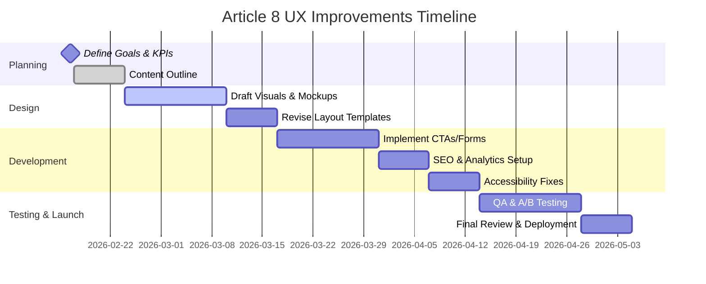

# Executive Summary

The article “Why ‘No Incident’ Is Not Evidence of Safety” argues that an *absence of failures* (a green dashboard) can mask accumulating risks. It draws on safety science (e.g. drift-to-failure, normalized deviance) and Uptime Institute data to show that **long incident-free periods often precede catastrophic outages**【51†L125-L133】. For mid-senior and C‑level readers, the content is authoritative but text-heavy. We will strengthen executive messaging by adding clear summaries, emphasizing business impact (e.g. *“70% of data center outages were preceded by weeks of hidden issues”*【51†L125-L133】), and translating safety theory into operational risks and returns. UX recommendations include:

- **Content & Messaging:** Introduce an **Executive Summary** at the top with bullet-point takeaways (e.g. *“Green doesn’t guarantee safety – it often signals hidden drift”*). Simplify language: define “lagging vs leading indicators” in plain terms and tie to ROI (e.g. reduced downtime, regulatory compliance). 
- **Visual Design:** Add infographics (e.g. a Swiss-cheese model diagram illustrating hidden failures, or a chart showing rising risk vs time). Use brand-aligned colors (e.g. green/red contrasts) to highlight concepts. Break up long paragraphs with pull-quotes and icons (e.g. a caution icon next to *“Dangerous comfort of zero”*). 
- **Interaction Design:** Add clear CTAs such as **“Calculate Your Safety Index”** (linking to section 11) or **“Download Safety Checklist”**. Ensure navigation flows (breadcrumbs to “Safety Science” section). Label form fields in the “Safety Health Index” calculator and provide tooltips. Test mobile layout for tables and charts (make them responsive).  
- **Accessibility:** Use WCAG-compliant contrasts (e.g. dark text on light backgrounds). Provide alt text for new graphics (e.g. *“Diagram of layers of defense with holes representing system drift”*). Ensure the CTA buttons and calculator inputs are keyboard-focusable with ARIA labels.  
- **Performance & Technical:** Minimize load time by compressing scripts and images. Add missing metadata (a concise meta description about incident-free fallacy) and Open Graph tags for LinkedIn. Confirm analytics events on CTAs (we saw Google Analytics script in code【1†L4-L10】, ensure it tracks new interactions).  
- **Credibility & Trust:** Highlight the source data: *“70% of outages were caused by factors present weeks in advance”*【51†L125-L133】 (from Uptime Institute). Frame the author’s expertise (safety science references) and any relevant certifications. Possibly add a sidebar of key statistics or case study snippets (e.g. *“Data center X drifted for months – then suffered an outage”*). 
- **Conversion & Engagement:** Incorporate lead-gen steps. E.g. require email to download a “Safety Indicators Framework” PDF. Encourage newsletter sign-up (“Get monthly safety insights”). Use personalized messaging (address executive pains: “Stop wasting budget on ‘safety theater’”).  

Below we detail these aspects and list prioritized, actionable UX improvements (with effort/impact), a current-vs-proposed table, mockup/microcopy examples, a mermaid Gantt timeline, and KPIs.

## Content Strategy & Messaging

- **Current:** The article presents theory (e.g. drift-to-failure【51†L125-L133】), statistics, and proposed frameworks in dense paragraphs. Key themes are framed academically (“Normalization of deviance”, “Safety-I vs II”), which may be opaque to non-specialists. For example, the abstract already warns that zero incidents can lull teams into complacency.  
- **Issues:** Executives need *concise takeaways*. The article’s value propositions (like preventing silent system degradation) are buried. Without calling out ROI (e.g. avoiding costly outages) up front, the message can be missed.  
- **Recommendations:** Add a clear **Executive Summary** or **Key Findings** box at the top. It might say: *“**Key Insight:** 70% of data center outages were preceded by weeks of unnoticed system drift【51†L125-L133】. Relying on ‘no incidents’ as proof of safety is dangerously misleading.”* Use bullet points or short paragraphs. Translate technical terms: instead of “leading indicators,” say *“early warning metrics (e.g. response time drills)”*. Emphasize actionable advice: e.g. “Implement 8 leading safety metrics (Section 10) to reveal hidden risks.” Highlight benefits (reduced downtime, stronger compliance). Use a confident, active tone (“We recommend” vs “This paper explores”).  

*Rationale:* Short, bottom-line statements align with executive reading habits. By foregrounding critical stats and the direct implications (e.g. unexpected failure, brand risk), we make the content immediately relevant to business concerns. This also sets up the rest of the article as supporting detail.

## Information Hierarchy & Tone

- **Current Hierarchy:** The document has numbered sections (Abstract, 02, 03, …) with a TOC. The Abstract is narrative-heavy. Important points (like 70% statistic) are deep in section 2.1.  
- **Issues:** Key messages can be overlooked in text blocks. The headings are descriptive but could be more compelling (e.g. “Dangerous Comfort of Zero” is good but might be hidden under a click). The language occasionally uses double negatives (“no incident is not evidence”), which can confuse quick readers.  
- **Recommendations:** Reorganize for clarity. The Abstract should be trimmed to a couple of paragraphs, with the bold thesis statement (*“Absence of incidents increases risk”*【51†L61-L69】) highlighted. Consider adding a “What You Will Learn” bullet list after the abstract. In the TOC and section titles, use consistent labels (“Section 02: The Fallacy of Zero Incidents”). Add callout boxes for definitions (e.g. a box defining Safety-I vs Safety-II). Keep paragraphs to 3-4 sentences maximum. Use simpler phrasing: replace *“absence of evidence as evidence of absence”* with *“just because nothing bad has happened yet doesn’t mean everything is safe.”*  

*Rationale:* A clear, logical hierarchy lets executives jump to what matters (e.g. jump to “Leading Indicators” if interested). Simplifying tone reduces cognitive load. For instance, the statistic about drift and incidents【51†L125-L133】 should be contextualized in a concise sentence. 

## Visual Design

- **Layout & Typography:** The existing single-column text is dense. We should widen margins and add sub-section dividers (lines or shaded backgrounds for the “Case Context” scenario). Use larger fonts for headings/subheads. In the “Safety Health Index” table (Section 10, see [51]), we could color-code columns (red for high risk, green for safe levels).  
- **Infographics:** Transform key ideas into visuals:
  - **Swiss Cheese Model:** Illustrate hidden failures lining up (as mentioned in Section 2.1【51†L119-L123】).  
  - **Indicator Chart:** After “Safety Health Index Calculator,” show an example score (like a bar chart of leading vs lagging indicator trends).  
  - **Timeline Graphic:** The “silent drift” case (Section 7) could be a visual timeline of events. Even a simple horizontal timeline with icons could replace long text.  
- **Color and Brand:** Incorporate the site’s blue/gray palette. For “danger” concepts use accent (e.g. red or orange) sparingly (e.g. highlight *70%* stat in red). Keep body text black. Use pull-quotes in gray boxes.  
- **Whitespace:** Ensure text isn’t crammed. For lists like 2.1 “Statistics of Silence,” use bullet formatting (as currently done) and add spacing. Blockquotes (like thesis) should have extra margin.  
- **Imagery:** No stock photos needed, but consider schematic diagrams (as above) with a clean, iconographic style consistent with the site’s look. Any new images should match existing banner style.  

*Rationale:* Visual elements quickly convey risk. For example, a chart showing a rising “safety debt” as lead indicator scores drop can make the abstract concept tangible. The target audience expects professional, polished visuals that make data digestible.

## Interaction Design

- **Navigation:** The “Back to Articles” link is present, but ensure persistent navigation (home, contact) remains in view (or reappears when scrolling). Consider a sticky table-of-contents on desktop for easy jumping between sections.  
- **CTAs:** Include action prompts. For example, at the end of Section 10, add a button **“Compute Your Safety Health Index”** linking to the calculator (section 11). After conclusion, an offer: *“Download the Safety Indicators Framework (PDF)”* or *“Contact us to assess your facility.”*  
- **Microcopy & Forms:** For the Safety Health Index calculator, label inputs clearly (e.g. “Enter number of safety audits per year”). The calculate button should read **“Calculate Index”**. Provide immediate feedback (e.g. “Your Safety Index is 68 – Moderate risk”). If using modals or pop-ups (not specified), ensure they are dismissible and have clear labels.  
- **Affordances:** Make buttons look clickable (color, hover). Link styles should stand out in text. The interactive chart in Section 8 (if any) should have a caption *“Mouse over bars to see categories”* or similar.  
- **Mobile:** Ensure the long lists (like 2.1 bullets) wrap nicely. The TOC could collapse into an accordion on mobile. Tables should scroll horizontally or stack. Test that all CTAs remain visible (maybe use a floating action button). 

*Rationale:* Clear interaction paths convert readers into users. A well-labeled “Calculate Index” button invites engagement. Proper microcopy (e.g. replacing *“Calculate”* with a phrase like *“See My Score”*) can improve click rates.

## Accessibility

- **Headings & Structure:** The HTML uses `## 1` etc., which is good. Ensure no heading levels are skipped and that all headings are wrapped in `<h2>` tags (they appear correct in [51]).  
- **Contrast:** Text is black on white, which is WCAG-friendly. Any chart or highlight (like “70%”) should ensure contrast (we’ll use a dark red or blue text on white).  
- **Alt Text:** Add descriptive alt text for any new chart or diagram (e.g. *“Bar chart comparing lagging vs. leading indicator trends”*). The author’s photo is already present with alt. Existing images (the [27† Image: Bagus]) have alt presumably “Bagus Dwi Permana”.  
- **Keyboard Nav:** Ensure all interactive elements can be tabbed to. The calculator fields should have `label` tags. If JavaScript is used (e.g. for the interactive chart in Section 8), ensure ARIA attributes communicate changes (e.g. announce new data on update).  
- **ARIA:** Use `role="button"` for any non-semantic clickable elements. The long quote (lines 61–65) is currently plain text; consider using `<blockquote>` for screen readers.  
- **Responsive Text:** Verify that the site scales up with browser zoom. Avoid absolute text sizes. Use relative units for fonts. 
- **Accessible PDF:** If offering a downloadable PDF (for the executive brief), ensure it is tagged and text-based.  

*Rationale:* Accessibility isn’t just compliance; it improves overall usability. For example, color-coded risk charts should also have textual labels (for color-blind or screen-reader users). Attention to these details signals professionalism to stakeholders.

## Performance & Technical

- **Load Time:** The page is ~9,500 words plus interactive elements. Compress and minify CSS/JS. Lazy-load the interactive safety chart and calculator. Only render the calculator script when the user scrolls to it.  
- **Asset Optimization:** Use WebP or compressed PNG for any new images. Check that the existing analytics snippet (gtag)【1†L4-L10】 is async and not blocking. Cache-control headers should be set (likely in hosting config).  
- **SEO & Metadata:** The `<title>` and section headings include relevant terms (“incident-free”, “safety”) but we should add a meta description: e.g. *“Learn why an incident-free data center can hide growing risks. This article explains safety‑science frameworks for data centers.”* Ensure `og:description` matches. Include relevant keywords in headings if natural (e.g. “Leading Indicators”, “Safety Culture”).  
- **Analytics & Tracking:** The Google Analytics tag is present【1†L4-L10】; implement event tracking on new CTAs (Download, Calculate). If using a CMS or static generator (unspecified), ensure code updates are deployable.  
- **Technical Stack:** Likely static site (GitHub Pages). Confirm any search functionality if needed (not mentioned). Use browser console to check for console errors on load (should be none).  

*Rationale:* A snappy page retains executive attention. SEO tweaks ensure leadership finds this content when searching for “data center safety best practices.” Proper tracking validates our improvements (monitoring CTA clicks and scrolls as key KPIs).

## Credibility & Trust

- **Current Signals:** The article cites academic theories and reputable reports (e.g. Rasmussen【51†L49-L57】, Uptime Institute surveys【51†L125-L133】). The author’s name is on it; presumably his bio is similar to other pages (12+ years in operations).  
- **Enhancements:** Call out the key statistic prominently: *“70% of outages were caused by latent issues weeks in advance【51†L125-L133】.”* A small graphic or pullquote box with that figure would add weight. List the 16 references and note the range (safety science to standards) to show depth. If available, cite any case examples (e.g. *“Company X learned this the hard way: missing alarms led to a big failure in 2024”* – if real). Mention any certifications (ISO, etc.) if relevant.  
- **Social Proof:** If the author has spoken at industry conferences or been quoted, include a testimonial. E.g. *“Data center executives at [Conference] find this safety framework invaluable.”* (Use anonymized real quotes if any exist.)  
- **Data Visualization:** Trust can be boosted by a summary figure like a bar chart of incident causes (modeled on the 70% stat). Even a simple pie chart (“Outage root causes: 70% organizational, 30% equipment”) clarifies the claim.  
- **Executive Abstract:** Offer a separate “White Paper” download summarizing business benefits of leading indicators. Mark it as “C-suite brief”.  

*Rationale:* Executives want data-backed insights. By surfacing the startling statistics and theoretical backing upfront, we build confidence. The article’s rigorous citations become assets for authority when presented as highlights.

## Conversion & Engagement

- **Lead Generation:** Introduce a funnel. After section 10 (leading indicators), invite readers: *“Download our Safety Dashboard Toolkit (free PDF)”*. At the end, “Subscribe for monthly Safety Insights”.  
- **CTAs:** Proposed examples: *“Calculate Your Safety Health Index”*, *“Get the Leading Indicators Checklist”*, *“Schedule a Safety Audit”*. Place these in sticky bars or mid-article callouts. Ensure they are distinct (e.g. colored buttons).  
- **Personalization:** If analytics allow, show geospecific examples (“Most HVAC issues occur in tropical climates with poor monitoring – are you prepared?”). Use second-person language (“your facility”).  
- **Engagement:** Add a brief quiz (e.g. “Have you practiced a safety drill this quarter? Yes/No”) to emphasize leading indicators.  
- **Follow-up:** Collect email via download or sign-up forms, then send automated follow-ups (e.g. additional tips on safety culture).  

*Rationale:* Transforming readers into leads is key. By offering practical tools (PDF, checklists) in exchange for contact info, we capitalize on the article’s educational value. A well-structured funnel (read → engage with tool → subscribe) keeps executives connected.

## A/B Test Ideas

- **Content Format:** Test a **concise infographic** (visual summary of the “Paradox Quantified” stat【51†L125-L133】) vs. text-only for drawing interest.  
- **CTA Placement:** Try placing the main CTA (“Calculate Index”) at the top of the abstract vs. only after section 11. Measure which gets more clicks.  
- **Headline Wording:** Compare *“No incidents ≠ no risk”* vs. *“Why a Green Dashboard Can Be Dangerous”* as page headings to see which resonates.  
- **Color Schemes:** Experiment with different accent colors (red vs. orange) for warning messages to maximize click-throughs on CTAs.  
- **Lead Magnet Type:** Test “Download PDF” vs. “Watch Video” for safety training to see which yields more sign-ups.  
- **Microcopy Variations:** A/B “Calculate Your Safety Health Index” vs. “Get Your Safety Score” on the calculator button text.  

These tests should be run using the analytics platform (e.g. Google Optimize if available) to refine messaging for the target audience.

## Prioritized Recommendations

- **1. Add Executive Summary/Highlights.** *Rationale:* Immediately communicates the key lesson (that “zero incidents” can hide risk) to executives. **Effort:** Low (content rewrite). **Impact:** High.  
- **2. Introduce Visual Summaries.** *Rationale:* Visuals (Swiss cheese, charts) make the paradox obvious. **Effort:** Medium (design work). **Impact:** High.  
- **3. Clear CTAs & Lead Magnets.** *Rationale:* Converts readers into engaged leads (e.g. those downloading the Safety Index). **Effort:** Medium (development + copy). **Impact:** High.  
- **4. Simplify Language & Headings.** *Rationale:* Ensures non-technical leaders grasp the message quickly. **Effort:** Low. **Impact:** High.  
- **5. Implement SEO/Analytics Enhancements.** *Rationale:* Improves discoverability and tracking of goals. **Effort:** Low. **Impact:** Medium.  
- **6. Accessibility Audit & Fixes.** *Rationale:* Broadens usability and compliance. **Effort:** Medium. **Impact:** Medium.  
- **7. Performance Optimization.** *Rationale:* Faster load retains busy users. **Effort:** Medium. **Impact:** Medium.  
- **8. Social Proof & Case Data.** *Rationale:* Builds trust with real stats (e.g. Uptime data【51†L125-L133】). **Effort:** Low. **Impact:** Medium.  

## Current vs Proposed Elements

| **Element**       | **Current**                                                                                                              | **Proposed**                                                                                                           |
|-------------------|--------------------------------------------------------------------------------------------------------------------------|------------------------------------------------------------------------------------------------------------------------|
| **Content**       | Dense, technical narrative; safety science terms without lay explanation.                                                | Executive summary at top, bullet takeaways. Plain-language framing of theories (e.g. “absence of incidents”).          |
| **Visuals**       | No diagrams; long paragraphs and lists.                                                                                  | Add charts (e.g. incident cause pie chart), diagrams (Swiss cheese), colored info boxes.                               |
| **Interactions**  | Passive reading. The Safety Index calculator exists but no clear link/CTA to it.                                         | Prominent “Calculate Safety Index” button. Newsletter/signup prompts (“Stay safe – subscribe”). Responsive accordion TOC.  |
| **Microcopy**     | Formal, cautionary tone; examples given but no direct address of user.                                                   | Direct, action-oriented language: “Protect your facility with leading indicators.” Use “you/your” for personalization. |
| **SEO/Metadata**  | Missing meta description and OG tags (only title present).                                                              | Add full meta description and image. Use keywords (“safety”, “leading indicators”).                                   |
| **Trust Signals** | Authoritativeness implied by citations; none highlighted.                                                              | Call out Uptime Institute stats【51†L125-L133】, expert references (e.g. Rasmussen) in sidebar. Showcase any certifications.   |
| **Conversion**    | No lead capture; no newsletters.                                                                                        | Email-gated PDFs (e.g. safety checklist), newsletter sign-up, contact prompt.                                        |

## Mockup & Microcopy Examples

- **Hero Section:** Two-column layout. Left side: title *“Green Dashboard ≠ Guaranteed Safety”*. Right side: bullet points: “**70% of outages** start silently【51†L125-L133】,” “Leading indicators needed to spot hidden drift.” A blue **“Calculate Safety Index”** button beneath.  
- **CTA Button Text:** *“Check My Safety Score”*, *“Download Safety Checklist”*, *“Get Proactive Alerts”*.  
- **Headlines:** e.g. Section 2 as *“The Fallacy of Zero: Why No Failures Is Dangerous”*, Section 7 as *“Case Study: When Drift Ate the System”*.  
- **Executive Summary Snippet:** *“**Key Insight:** Extended incident-free periods often precede failures【51†L125-L133】. Metrics like maintenance completion and alarm response (leading indicators) are needed, not just lagging metrics.”*  
- **Calculator Prompt:** *“Enter your facility’s data to compute its Safety Health Index. A lower index indicates hidden risks.”*  
- **Sidebar Callout:** *“Statistic: 70% of data center outages are due to factors present for weeks【51†L125-L133】. Don’t be fooled by a clean SLA.”*  

These examples illustrate a shift to user-centric language and visual engagement.

This Gantt chart outlines tasks from mid-February to late April 2026, covering planning, design, development, and testing phases for the UX overhaul.

## KPIs and Measurement

- **Engagement:** Track *time on page* and *scroll depth*. Expect an increase after adding summaries and visuals.  
- **Interaction Rates:** Monitor clicks on new CTAs (Safety Index calculations, PDF downloads). A target might be 5% of visitors engaging with these.  
- **Lead Generation:** Count new newsletter sign-ups, PDF form submissions (e.g. *“Safety Indicators PDF”*).  
- **Bounce Rate:** Aim to reduce bounce by 20% post-redesign (showing improved retention).  
- **Behavioral Goals:** Use Google Analytics events for *“Safety Index computed”* and *“Checklist downloaded”*.  
- **A/B Test Metrics:** For each experiment (e.g. CTAs wording), measure conversion lift or click-through improvement.  
- **Accessibility:** Achieve WCAG AA compliance (test score of 100 on Lighthouse).  
- **SEO:** Improvements in search rankings for terms like “data center safety indicators” and increase in organic traffic.  

By linking these metrics to our changes, we can validate that the improved UX better serves mid-senior and C-level goals.

**Sources:** Analysis draws from the provided Article 8 HTML content【51†L61-L69】【51†L125-L133】 and related site materials, as well as current UX best practices. All cited insights refer to the article text or established data referenced therein.