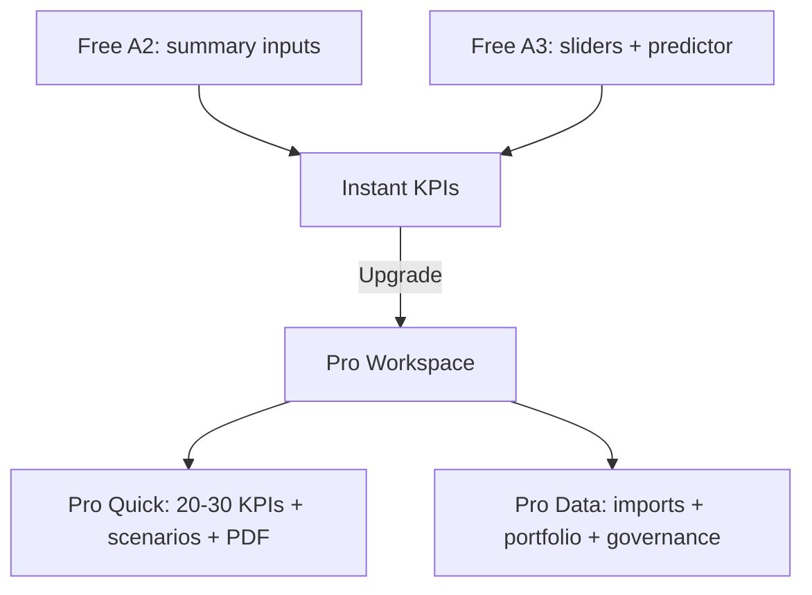

# Pro/Advanced Mode Design for ResistanceZero Article 2 and Article 3 Interactive Tools

## Executive summary

I analyzed the **local HTML artifacts** for Article 2 and Article 3 as the authoritative source of current behavior (web fetch may differ; that is **unspecified**). Article 2 is a compact **alarm-burden and flood-risk estimator** that takes summary alarm counts, staffing, response time, shift length, and shelving percentage, then computes a small KPI set including an ISA-style score and **Poisson-based flood probability**. The tool is valuable for quick intuition, but it is not decision-grade because it assumes steady-state arrivals, estimates standing alarms heuristically, and cannot ingest or analyze raw alarm logs (which are essential under the alarm lifecycle emphasized by the entity["book_series","ISA-18 series","alarm management lifecycle"]). citeturn0search2turn7search0

Article 3 contains two interactive elements: (a) a canvas-based “simulation” chart driven by **workflow friction** and **evidence clarity** sliders, and (b) a “Maintenance Compliance Predictor” that estimates compliance capacity vs demand from PM workload, staffing, CMMS maturity, workflow friction, and evidence quality. This is a useful narrative model, but it is also heuristic and does not support portfolio/batch analysis or export-ready governance.

My Pro/Advanced mode design goal is to evolve these into a coherent **Operations Analytics Pro Suite** that still supports “quick what-if” analysis, but can also handle **massive datasets** (alarm/event logs, CMMS work orders, multi-site portfolios), produce **20–30+ derived parameters from a small input set**, quantify uncertainty via Monte Carlo, and generate an executive-ready PDF report with transparent assumptions and versioned benchmarks. citeturn3search0turn0search2turn5search0

## Current tool behavior and limitations

### Article 3 interactive maintenance compliance tools

**Interactive simulation chart (canvas):** Two sliders (workflow friction %, evidence clarity %) drive a simulated 12-week series and callouts (before average, after average, improvement in percentage points, variance reduction). This uses a deterministic “base + structured noise” model with a before/after phase to visualize how friction reduction and evidence clarity improve stability (local HTML).

**Maintenance Compliance Predictor calculator:**  
Inputs: PM tasks/month; available technicians; backlog tasks; average task duration (hours); hours/tech/month; CMMS maturity level (1–5); workflow friction (High/Medium/Low); evidence clarity (Unclear/Adequate/Excellent).  
Outputs: effective capacity (hrs) vs demand; predicted compliance (%); backlog burn rate (tasks/month) or deficit; risk score (0–100); recommended techs to hit 95% target; months to reach target.  
The model uses fixed multipliers (friction factor, CMMS modifier, evidence modifier), backlog demand weighting, and heuristic risk scoring.

**Limitations:** It is not calibrated to real CMMS distributions without imports, it provides point estimates without uncertainty, and it cannot produce portfolio/batch comparisons. Canvas rendering also requires explicit accessibility work.

## Pro/Advanced mode feature design

I recommend one Pro platform with two “modules” that share identity, ingestion, versioning, and export pipelines: **Alarm Pro (Article 2)** and **Maintenance Pro (Article 3)**.

### Pro inputs

**Alarm Pro (configurable + data-driven):**  
- Definitions: flood threshold N and window size W (default 10-in-10), priority schemes (3 or 4), definitions for standing/stale/chattering (configurable to match philosophy). citeturn7search41turn0search2  
- Workload: handling time distribution (median + p90/p95) rather than one mean; operator concurrency (consoles, shared operators).  
- Policy: suppression/shelving rules, authorized vs unauthorized suppression (governance KPI category). citeturn7search41  
- Imports (massive): alarm & event logs (timestamp, tag, priority, state transitions, ack times, suppression/shelving flags); alarm configuration snapshots; optional MADB seed files (cause, consequence, operator action, time-to-respond). The lifecycle emphasis and rationalization documentation expectations are core to ISA-18 framing. citeturn0search2turn8search1  

**Maintenance Pro:**  
- Inputs: keep quick inputs but make modifiers user-configurable and add distributions (task duration variability, wrench time %, travel %, admin time).  
- Imports: CMMS work orders/PM schedules (CSV/JSON), workforce rosters, shift calendars.  
- Evidence: attach SOPs, PM compliance reports, audit logs (for governance).

### Pro outputs and analysis types

**Pro Quick requirement: 6–10 inputs → 20–30 outputs.**  
I would ship a “Quick Pro Report” for each module that generates at least:

**Alarm Pro Quick (example 28 outputs):** average alarms/op/10-min; average alarms/op/hour; peak estimate (p95) alarms/10-min; expected flood windows/shift; time-in-flood estimate; probability of ≥1 flood/shift; severity-weighted burden; actionable ratio (configurable definition); priority distribution vs benchmark; critical % ceiling check; standing/stale/chattering assumed ranges (explicitly labeled); overload margin; predicted operator wait probability under staffing; recommended operators for SLA; reduction required to hit benchmark; top drivers (score contributions); Monte Carlo intervals for flood risk and backlog probability; scenario deltas for staffing, handling time improvement, suppression policy shifts. Flood and KPI targets can align to published benchmark tables such as “% 10-min periods >10 alarms <1%”, and three-priority distributions (80/15/5). citeturn7search41turn7search0turn8search0  

**Maintenance Pro Quick (example 24 outputs):** effective capacity vs demand; utilization; predicted compliance with interval; backlog change rate; time-to-clear backlog; staffing required for 95% compliance with interval; sensitivity by friction/CMMS/evidence; triage score (risk); SLA risk (missed PM probability proxy); scenario deltas for adding techs, reducing task duration, improving CMMS maturity / workflow friction.

**Pro Data (massive analytics):**  
- Alarm: empirical time-in-flood; flood episode timelines; Pareto of top contributors; long-standing alarms; chattering/fleeting detection; ack time distribution; operator/shift comparisons; MOC drift detection (unauthorized attribute changes). citeturn7search41turn8search0  
- Maintenance: compliance trends by system/area; “age of backlog” distributions; failure-mode linked PM effectiveness; workforce capacity vs seasonality; multi-site benchmarking.

### Visualization suite

I recommend a consistent chart pack across modules: KPI tiles + sparklines, distributions (histogram/CDF), Pareto with cumulative %, heatmaps (hour×area, tag×week, site×KPI), scenario tornado charts, and “before vs after” control charts.

image_group{"layout":"carousel","aspect_ratio":"16:9","query":["alarm management time in flood chart example","pareto chart for top alarm contributors example","histogram of alarms per 10 minute interval example","maintenance backlog heatmap dashboard example"],"num_per_query":1}

### Export and batch processing

**Exports:** PDF executive pack (summary + charts + narrative conclusions + appendix definitions), XLSX/CSV for KPI tables, JSON for full model provenance and reproducibility. Article 2 currently cannot print-export because the calculator section is hidden in print CSS; Pro should replace this with a server-rendered PDF pipeline.

**Batch:** portfolio upload (multi-site), batch scenarios, scheduled monthly reporting.

### API endpoints

Because imports and large queries are expensive, I would enforce OWASP guidance on pagination, payload caps, and rate limiting to prevent unrestricted resource consumption. citeturn0search3

Minimal API set:
- `POST /v1/imports/alarm-events` (async, chunked, schema validated)  
- `POST /v1/imports/cmms-workorders`  
- `POST /v1/assessments/alarm` and `/maintenance`  
- `POST /v1/scenarios/batch`  
- `POST /v1/exports/pdf` (async render)  
- `GET /v1/benchmarks` (versioned benchmark presets)  
- `GET /v1/auditlog` (governance)

## Data model and algorithm recommendations

### Data model

I recommend a shared core schema plus module extensions:

- Tenancy: org → site → asset/area → console/work center.  
- Time series: alarm events, CMMS events, shifts.  
- “Master records”: alarm definition snapshots + MADB rationalization fields; maintenance task definitions + SOP evidence; model versions and benchmark versions.

### Statistical and probabilistic modeling ladder

**Poisson baseline (counts per window):** Use NIST’s Poisson PMF/CDF for transparency and to support reproducible definitions. citeturn5search0

**Overdispersion handling (Negative Binomial):** Alarm windows are often bursty; the negative binomial is commonly derived as a Poisson–gamma mixture and is standard for overdispersed count data, as described in Cambridge’s excerpt. citeturn4search0

**Self-exciting / cascade modeling (Hawkes):** For “alarm begets alarm” clustering (upsets), use Hawkes/self-exciting point processes (Hawkes 1971) as an optional advanced mode for log-driven analysis. citeturn3search1

### Queueing and staffing (Erlang-C)

For “operators fall behind” and “tech staffing to meet SLA,” I recommend queue-based estimation using Erlang approaches: Erlang’s queueing (delay) model remains widely used; INFORMS’ historical note describes Erlang C as the delay/queueing formula and ties inbound calls to Poisson arrivals in classical traffic models. citeturn6search7  
I would treat alarm-handling as arrivals and operator response as service, and compute probability-of-wait and expected delay under staffing levels (clearly stating assumptions and limits).

### Monte Carlo uncertainty quantification

I recommend Monte Carlo-based uncertainty propagation for both modules: define distributions for uncertain inputs (handling time, burstiness, wrench time, friction factor), run many iterations, and report credible intervals and sensitivity. NIST describes Monte Carlo as probabilistic sensitivity analysis via random sampling from input distributions. citeturn3search0turn3search5

### Validation approach

- **Definition validation:** KPI definitions match benchmark tables (10-min thresholds, priority distributions). citeturn7search41turn7search0  
- **Backtesting:** compare model-predicted distributions to empirical logs (Poisson vs NB vs Hawkes selection based on fit). citeturn4search0turn3search1  
- **Cross-tool replication:** validate against results from established alarm analytics platforms (e.g., ARA’s time-in-flood, standing alarms, suppression views). citeturn8search0  
- **Operational relevance:** track whether improvements reduce overload and improve compliance; avoid causal overclaims.

### Narrative algorithm text for PDF exports

Below is the style I would include in Pro PDFs (transparent, not code):

**Alarm flood probability (baseline):**  
“I estimate alarm flood exposure by dividing the time series into fixed windows (default 10 minutes). For each window I model the expected number of alarms, λ. Under a Poisson assumption, the probability of observing k alarms in a window is \(e^{-\lambda}\lambda^k/k!\). I then compute the probability of meeting or exceeding the flood threshold (default ≥10 alarms/10 minutes) by summing the tail of the distribution. Where high variability is observed, I replace the Poisson model with an overdispersed Negative Binomial model (Poisson–gamma mixture) and report both the chosen model and goodness-of-fit diagnostics.” citeturn5search0turn4search0turn7search0

**Operator backlog risk (queueing view):**  
“I treat alarms requiring action as arrivals into a queue and operator handling as service. Using a queueing model (Erlang-C style), I estimate the probability an arriving alarm will wait because all operators are busy, and I compute the staffing required to keep delay risk below a target. Assumptions (Poisson arrivals, service-time distribution choice) are stated and I quantify uncertainty via Monte Carlo sampling.” citeturn6search7turn3search0

## UX, accessibility, performance, and security

### Free vs Pro interaction design

I recommend progressive disclosure: keep the article-native Free calculator for education, and place Pro behind a “Pro workspace” with saved scenarios, imports, and exports.

### Accessibility (WCAG + canvas)

Because Article 3 uses canvas, Pro must address that canvas content is not screen-reader accessible unless ARIA or fallback content is added. The Chart.js docs explicitly state this: developers must add ARIA attributes or fallback content to make canvas graphs accessible. citeturn1search0  
I recommend targeting WCAG 2.2, which is a W3C Recommendation, and providing a table view for every chart plus keyboard-only navigation. citeturn1search1turn1search2

### Scalability and OT/ICS security

I recommend two compute planes (interactive + batch), heavy caching of rollups (10‑minute windows, daily KPI cubes), and strict rate limits and payload ceilings following OWASP’s guidance on preventing unrestricted resource consumption. citeturn0search3  
For OT/ICS, I recommend encryption at rest/in transit, tenant isolation, full audit logs, and an on‑prem/edge deployment option. NIST SP 800-82 Rev. 3 is an authoritative basis for OT security posture and safeguards. citeturn2search3turn2search4

For Indonesia-specific optional context overlays, BMKG’s open forecast API provides global-ready JSON plus explicit access limits and attribution obligations, and InaRISK provides official disaster-risk mapping context. citeturn2search1turn2search0

## Roadmap, QA plan, metrics, and competitor references

### Implementation roadmap and effort

| Milestone | Deliverables | Effort (weeks) |
|---|---|---:|
| Pro Quick MVP | KPI library, scenario runner, accessibility baseline, PDF export v1 | 6–10 |
| Imports foundation | alarm+CMMS ingest, schema validation, windowing jobs | 8–14 |
| Advanced modeling | NB + Hawkes optional, Erlang staffing curves, Monte Carlo UQ | 6–12 |
| Governance workflows | MADB + rationalization workflow, MOC/audit log | 8–14 |
| Portfolio + scheduling | multi-site ranking, scheduled exports, API hardening | 6–12 |

### QA/testing plan

I recommend unit tests for every KPI, property-based tests for invariants (e.g., alarms↑ → flood risk↑; staffing↑ → delay risk↓), numerical stability tests for Poisson/NB tails using NIST definitions as reference, load tests on 10M+ events, OWASP-aligned abuse tests (pagination/rate limits), and WCAG audits for keyboard/screen reader/canvas ARIA. citeturn5search0turn0search3turn1search0turn1search1

### Metrics and KPIs

- **Accuracy:** calibration of predicted vs empirical time-in-flood; model selection rate (Poisson vs NB vs Hawkes) with fit diagnostics. citeturn4search0turn3search1  
- **Relevance:** reduction in time-in-flood and top-10 contributor share after interventions. citeturn7search41  
- **User satisfaction:** PDF export usefulness ratings, explainability rating, retention, time-to-insight.

### Competitor and reference tools

| Tool | Strengths vs your Pro goals | Evidence from primary pages | Pricing model |
|---|---|---|---|
| ARA by entity["company","Yokogawa Electric Corporation","industrial automation"] | KPI-rich analytics: time-in-flood, standings/long-standing, suppression views; exports PDF/Word/Excel; OPC A&E | Exaquantum/ARA capability and export descriptions. citeturn8search0 | Quote-based (public price not listed) |
| PAS PlantState Integrity by entity["company","Hexagon AB","industrial software"] | Platform approach: alarm mgmt + rationalization workflow + multi-site; ISA/IEC alignment | Product/press materials describe alarm mgmt + rationalization enhancements. citeturn8search4turn8search6 | Quote-based |
| SILAlarm by entity["company","exida","functional safety"] | MADB-first rationalization tool; philosophy-driven rules; Excel import/export | SILAlarm pages describe ISA/EEMUA alignment and MADB workflow. citeturn8search1turn8search3 | Quote-based |
| ACE by entity["company","TiPS Inc.","alarm management software"] | Alarm KB + analysis + integrated MOC tracking | ACE page states alarm KB, statistical analysis, MOC tracking. citeturn8search9 | Quote-based |
| IEC 62682:2022 by entity["organization","International Electrotechnical Commission","standards body"] | Authoritative alarm management standard reference | Standard listing describes alarm/event log, historian, metrics concepts. citeturn0search1 | Paid standard; prices vary by reseller (e.g., VDE listing shows 406.60€). citeturn0search1 |

### prioritized sources I used and recommend anchoring your Pro methodology on

- entity["book_series","ISA-18 series","alarm management lifecycle"] official overview page. citeturn0search2  
- entity["organization","International Electrotechnical Commission","standards body"] IEC 62682:2022 product abstract (alarm logs, historians, metrics). citeturn0search1  
- entity["organization","National Institute of Standards and Technology","us research agency"] / NIST/SEMATECH Poisson reference. citeturn5search0turn5search2  
- Monte Carlo uncertainty guidance from entity["organization","National Institute of Standards and Technology","us research agency"]. citeturn3search0  
- entity["organization","OWASP","application security nonprofit"] API4:2023 resource consumption controls. citeturn0search3  
- entity["organization","National Institute of Standards and Technology","us research agency"] SP 800-82 Rev. 3 OT security. citeturn2search3  
- entity["organization","BMKG","indonesia meteorology agency"] open forecast API + limits for Indonesia context overlays. citeturn2search1  

## Unspecified details I would need to finalize in implementation

The following are currently **unspecified** from the artifacts and request: whether production HTML matches the local copies; whether there is any existing backend, auth, or paid tier infrastructure; the exact target industries (process plants vs data centers vs mixed); preferred ingestion formats and connectors; data retention rules; on‑prem vs SaaS preference; and pricing/packaging strategy for Pro.