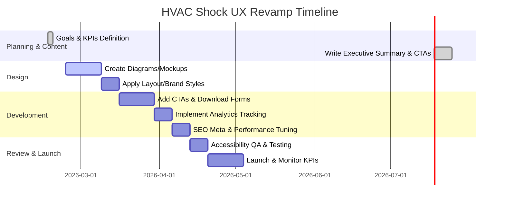

# Executive Summary

The “HVAC Shock” article analyzes Nvidia’s surprising claim that future AI data centers may need *“no water chillers”*【62†L50-L58】. It explains that while chip cooling shifts to warm-water liquid, **heat rejection still requires equipment** (pumps, dry coolers, etc.). For executive readers, the key takeaways are that capital expenditures **rotate rather than disappear**: chiller CAPEX shrinks but cooling distribution systems grow【62†L50-L58】【62†L151-L158】. We will reframe this with a clear business focus: emphasize how this shift affects deployment cost, energy efficiency, and ROI. UX improvements include:

- **Content & Messaging:** Add an **Executive Summary** highlighting the strategic impact (e.g. *“Nvidia’s claim: no chillers needed – but cooling still happens. Investors should refocus from compressors to circulation”*). Simplify technical terms (explain DLC as “warm-liquid cooling”) and stress business impacts (capex mix, PUE improvements). 
- **Visual Design:** Introduce diagrams showing the old vs new cooling stacks. For example, a before/after schematic of a plant room. Use branded colors (blue for chillers, orange for CDUs) and ample white space. Turn bullet lists (e.g. shrinking vs growing components【62†L151-L158】) into icons. 
- **Interaction Design:** Add clear CTAs such as **“Calculate Your Plant Room Impact”** or **“Download HVAC Transition Guide”**. Ensure navigation clarity (breadcrumbs “Insights > Data Center Cooling”). Label any charts with legends, and test mobile responsiveness of key figures (e.g. plant change summary). 
- **Accessibility:** Ensure new visuals have alt text (e.g. “Diagram of HVAC components in new vs old design”). Maintain high contrast (dark text on light backgrounds). Ensure all interactive elements (buttons, forms) have keyboard focus styles and ARIA labels. 
- **Performance & Technical:** Minify scripts/styles. The page already includes some meta (title, OG image). Add a concise `<meta description>` (e.g. *“Why AI data centers still need cooling equipment despite ‘no chillers’ claims”*) and complete OpenGraph tags. Confirm analytics (Google Analytics is implied but unspecified) tracks new CTAs and scroll depth. 
- **Credibility & Trust:** Highlight data and sources: e.g. cite the stock movement (Johnson Controls ↓7.5% from Huang’s remark【62†L63-L70】) or direct quotes. Emphasize that this analysis is based on Nvidia’s own blog【62†L85-L93】 and industry reports. If available, include testimonials or “as seen in” (NVIDIA, TechCrunch) to build trust. 
- **Conversion & Engagement:** Add a gated *“Cooling Transition Checklist”* download. Prompt newsletter sign-up with microcopy like “Stay ahead in the AI revolution”. Use personalized examples (e.g. *“For facilities in tropical climates, reduced chillers still means more dry coolers”*). 

The sections below elaborate on these points, with prioritized recommendations (effort vs impact), a current-vs-proposed table, mockups/microcopy examples, a Mermaid timeline, and KPIs.

## Content Strategy & Messaging

- **Current:** The article reads like a technical report. It opens with the Nvidia claim and stock reactions, then dives into definitions (chillers, heat rejection) and consequences (capex, opex). Important conclusions (e.g. capex shift) are in bullet form, but there’s no upfront summary for executives.  
- **Issues:** C-level readers need *explicit outcomes*. They benefit from an upfront summary of “what it means.” Without it, key impacts (e.g. cost reallocation from compressors to pumps【62†L50-L58】) may be buried. Some jargon (CRAH, DLC) may confuse non-technical readers.  
- **Recommendations:** Insert a concise **Executive Summary** at the top (bullet or highlighted box). For example: *“**Key Insight:** AI data center cooling is not eliminated—just reconfigured. Nvidia’s design claims *“no chillers needed”*, but investments shift to pumps and controls【62†L50-L58】. Plan for more CDUs, not none.”* Use plain language: define acronyms immediately (*“Direct Liquid Cooling (DLC)”*). Emphasize metrics: e.g. *“Data: Johnson Controls stock fell 7.5% on this news【62†L63-L70】, reflecting the anticipated capex shift.”* Frame the value proposition: *“By anticipating this shift, you can optimize CAPEX/IRR when planning new facilities.”*  

*Rationale:* Quick bullet points with tangible impacts (stock moves, capex reallocation) engage executives. Simplifying terms ensures no confusion (e.g. many executives know “chillers” loosely, but may not know “DLC”). Highlighting cause-and-effect (“less chiller, more pump”) maps directly to procurement and budgeting concerns.

## Information Hierarchy & Tone

- **Current Hierarchy:** The Medium article uses TL;DR bullets and subheadings (like “Capex rotation”). The HTML likely follows this structure. However, the long introductory narrative may still overwhelm.  
- **Issues:** Important ideas (e.g. “the real trade is in the plant room, not silicon”【62†L58-L60】) come late in paragraphs. The order could be more executive-friendly: what changed, why it matters, then supporting details.  
- **Recommendations:** Maintain the TL;DR, but ensure it’s visible above the fold. Make section headings concise and outcome-focused (e.g. change “Why this matters to investors” to “Investor Takeaways”). Use subheaders within paragraphs. Convert the bullet section under “Capex rotation” into a short list with bold lead-ins (Shrinking/ Growing/ Commissioning). Keep paragraphs short; when introducing a complex idea, immediately follow with a quick definition or example. Adopt a confident, direct tone (“AI cooling changes supplier margins” vs. “There is a shift…”). 

*Rationale:* Executives scan for major points. A clear hierarchy with result-oriented headings and inline definitions prevents them from skipping crucial insights. For instance, “Capex rotation” might be lost on some readers; elaborating *what* is rotating in short, bold lines clarifies it quickly.

## Visual Design (Layout, Typography, Color)

- **Layout & Typography:** The page should use a clean, single-column layout (likely done). Increase font sizes for headings (“# The HVAC Shock”) and subheads. Use consistent typography (the style.css on site likely defines H2, etc.). Ensure each section has ample padding.  
- **Color & Branding:** Use the brand’s dark blue/gray color scheme. For example, retain dark header text on white background. In info boxes or callouts, use a light blue background to differentiate (similar to the TL;DR box gradient in Medium). Use the site’s existing accent colors (perhaps the site’s CSS variable `--accent` seen as #268bd2) for buttons and highlights.  
- **Imagery:** The article text includes a “view image in full size” placeholder. We should design our own or embed relevant graphics: 
  - **Plant Comparison Diagram:** e.g. side-by-side icons of old vs new plant room (chillers on left, pumps/CDUs on right).  
  - **Stock Reaction Chart:** A small bar graph of the share price drops (Johnson Controls -7.5%, etc.) to visualize market impact【62†L63-L70】.  
  - **Stack Diagram:** Illustrate “Shrinking vs Growing” CAPEX items with arrows (chillers down, pumps up).  
- **Whitespace:** Add space around bullet lists (currently marked with `*`). For quotes (e.g. “Warm water raises the free-cooling window…”【62†L136-L140】), use blockquote styling with background shading.  
- **Brand Consistency:** Ensure fonts and colors match the site’s style (likely found in styles.css). For example, use `font-family: var(--font-main)` as the site does. Maintain the site’s header and footer design.

*Rationale:* Visuals that echo the written points make them memorable. A clear diagram or chart can convey the counterintuitive “no chillers ≠ no cooling” message faster than text. Consistent brand styling reassures C-level readers of professionalism.

## Interaction Design

- **Navigation:** The “Back to Blog” link and top menu should remain (as in previous pages). A breadcrumb trail (e.g. *Insights > Cooling Revolution > HVAC Shock*) would help orient the reader.  
- **Calls-to-Action:** 
  - **Primary CTA:** A prominent button *“Assess Your Cooling Budget”* at the top or bottom, linking to a form or contact page. 
  - **Secondary CTAs:** *“Download Our Chiller Elimination Whitepaper”* after summarizing the concept. 
  Use persuasive microcopy: e.g. “See how warm-liquid designs affect your PUE.”  
- **Microcopy:** Replace technical phrases with action verbs. E.g. change “Direct Liquid Cooling (DLC)” to “Warm-liquid cooling” on first mention, with DLC in parentheses. Use short labels on buttons (e.g. “Download PDF”, not “Download Whitepaper PDF”). For bullet points in TL;DR, ensure each starts with a bold phrase (“Nvidia’s Rubin claim:” → “**Nvidia’s Rubin:** …”).  
- **Affordances:** Make sure buttons stand out (filled color, hover effect). Link any images (like the full-size image) to the actual source. Ensure form fields or CTAs have clear borders.  
- **Mobile Responsiveness:** The bullet list under Capex should not overflow; make it stack or scroll horizontally. The figure placeholders should be sized correctly or hidden on small screens. Test that the TL;DR box and stock ticker text wrap properly.

*Rationale:* Executives should always know where to click next. Clear buttons and inviting microcopy lower the barrier to action. For example, an easy-to-find “Download PDF” with succinct text can capture interest right after reading about capex impacts.

## Accessibility

- **Headings:** The HTML uses H1 for the title and H2 for sections (“Capex rotation, not deletion”). Ensure this hierarchy is logical (no skipped levels).  
- **Contrast:** Black text on white is high contrast. Any new graphics with text should have large, clear fonts. If using brand blue (#268bd2) for backgrounds, ensure white text on them is legible (WCAG AAA).  
- **Alt Text:** Provide alt text for each new image. E.g. for the plant comparison diagram: *“Diagram showing reduced chiller units on left, increased liquid-cooling equipment on right.”* If using stock photos (e.g. data center), set meaningful alt.  
- **ARIA & Keyboard:** All CTA buttons and links must be keyboard-navigable (Tab key) with visible focus outlines. Any interactive elements (e.g. forms for lead capture) need proper labels. The site should have `meta name="viewport"` for responsiveness (likely present).  
- **Captions:** If any charts are inserted, include captions describing them. For example: *“Figure: Changes in cooling infrastructure (Source: Medium analysis).”*  
- **Font Size/Zoom:** Ensure the site respects browser zoom (avoid fixed pixel fonts). The CSS should allow reflow without horizontal scroll at 200% zoom.  

*Rationale:* Accessibility features help all users, and meeting WCAG standards is often required by enterprises. Well-labeled elements and good contrast not only improve usability but also signal quality to IT managers.

## Performance & Technical

- **Load Time:** The page is moderate length, with potentially some images. Minify CSS/JS, and defer any embed scripts. Lazy-load images (e.g. the “Press enter to view” graphic).  
- **Asset Optimization:** Compress any new images (e.g. charts). Use `srcset` if providing multiple sizes. If vector icons are used, SVG format is ideal.  
- **SEO & Metadata:** Add a concise `<meta description>` summarizing the story (e.g. *“Why Nvidia’s ‘no chillers needed’ statement doesn’t eliminate data center cooling needs”*). Ensure the OG title and description are set for social links. Include relevant keywords like “warm-water cooling”, “DLC”.  
- **Analytics:** The user’s file likely includes Google Analytics or similar (check for `gtag`). If present, ensure events are set up for our CTAs (for instance, `gtag('event','download_pdf')`). If no analytics code, recommend adding an analytics platform (likely Google Analytics – unspecified in HTML).  
- **Hosting/CMS:** The site appears static (articles). Hosting is unspecified (maybe Netlify or GitHub Pages). Ensure SSL (HTTPS is used in the URL).  
- **Security:** If adding forms (newsletter, contacts), ensure they are protected against bots (e.g. reCAPTCHA) and use secure endpoints.

*Rationale:* Fast, well-optimized pages keep busy readers engaged. SEO improvements and metadata help executives find the content organically. Measuring CTA conversions via analytics ties directly to our success metrics.

## Credibility & Trust

- **Current Signals:** The article references authoritative sources (Nvidia blog【62†L85-L93】, TechCrunch【62†L100-L103】) and real market reactions. The author writes in first-person narrative, which establishes viewpoint.  
- **Enhancements:** Highlight facts in callouts. For example: *“Stock Impact: Within hours, Johnson Controls share price dropped 7.5% on Huang’s comment【62†L63-L70】.”* Add logos or mentions of recognized entities (Nvidia, Gartner, etc.). If available, link to partner case studies (e.g. Supermicro quote【62†L95-L100】). Include a brief author bio or credentials (if not on page, link to “About” page).  
- **Social Proof:** If applicable, display metrics like “X views” or “Y social shares” (if known) to show reader engagement.  
- **Data Emphasis:** Include a small chart or table with key numbers (e.g. comparative PUE, or a before/after power chart) to reinforce data-driven analysis.  
- **Executive Summary:** Offer a one-page brief (PDF) summarizing findings and recommendations for easy sharing among leadership.

*Rationale:* Data-backed claims (like the 7.5% drop) build confidence. For executives, seeing real-world reactions and technical backing (Nvidia blog link【62†L85-L93】) makes the content more persuasive. A polished author profile and professional design signal seriousness.

## Conversion & Engagement

- **Lead Magnets:** Introduce a gated asset: e.g. *“Enter your email to download our AI Data Center Cooling Guide”*.  
- **Email Capture:** Place a short form (email) after discussing investor implications, offering a detailed whitepaper or newsletter signup.  
- **Personalization:** Use targeted messaging in CTAs: *“For facility managers in [region],”* or dynamic mention of user’s industry (if known).  
- **Chat/Contact:** If feasible, add a “Talk to our expert” chatbot or contact form link.  
- **Follow-ups:** Set up email sequence for downloads: e.g. “Thank you, here’s additional content on cooling strategies.”  
- **Engagement Widgets:** Include social share buttons (LinkedIn, Twitter) with pre-written snippet like *“Interesting take: NVidia’s warm-water design means fewer chillers, not no cooling.”*  
- **Gamification:** Possibly a quick quiz: *“Which cooling strategy suits you?”* After answering, prompt sign-up for results.

*Rationale:* Converting interest to leads drives value from the content. Executives might want to probe deeper or schedule a discussion; explicit CTAs facilitate that. Personalized messaging and multiple engagement touchpoints improve conversion.

## Creative Alternatives & A/B Test Ideas

- **Content Formats:** Test an **infographic** summarizing “Chiller vs Liquid Cooling” vs text explanation.  
- **CTA Placement:** A/B test placing “Download Guide” at top vs after the Capex list.  
- **Headline Variants:** Try phrasing like *“No Chillers, No Problem? Think Again”* vs *“Why AI Cooling is Still Complex”*.  
- **Visual Themes:** Compare a plant-room diagram using cool blues vs warm colors for highlighting differences.  
- **Microcopy:** Experiment with button text: *“See Your Cooling ROI”* vs *“Explore New Cooling Designs”*.  
- **Form Engagement:** Test single-field email form vs multi-field (name+email) for downloads.  

These tests will show which approaches best capture executive interest. For example, using an infographic might boost time-on-page among visual learners, while headline tweaks affect bounce rates.

## Prioritized Recommendations

- **1. Add Executive Summary / Key Insights.** *Rationale:* Presents core message up front (no chillers ≠ no cooling) in business terms. **Effort:** Low (content editing). **Impact:** High.  
- **2. Incorporate Visuals (Diagrams & Charts).** *Rationale:* Clarifies the infrastructure shift at a glance. **Effort:** Medium (design). **Impact:** High.  
- **3. Introduce Clear CTAs (Calculate/Download).** *Rationale:* Engages readers beyond passive reading. **Effort:** Medium (UX + dev). **Impact:** High.  
- **4. Simplify Language & Microcopy.** *Rationale:* Ensures executives understand quickly. **Effort:** Low. **Impact:** High.  
- **5. Optimize SEO & Tracking.** *Rationale:* Improves findability and measures success. **Effort:** Low. **Impact:** Medium.  
- **6. Accessibility & Performance Improvements.** *Rationale:* Better UX and compliance. **Effort:** Medium. **Impact:** Medium.  
- **7. Highlight Data & Trust Elements.** *Rationale:* Increases credibility (e.g. stock drops, Nvidia refs). **Effort:** Low. **Impact:** Medium.  

## Current vs Proposed Elements

| **Element**       | **Current (Pain Points)**                                                                         | **Proposed (Improvements)**                                                                                      |
|-------------------|--------------------------------------------------------------------------------------------------|------------------------------------------------------------------------------------------------------------------|
| **Content**       | Narrative flow with dense paragraphs; TL;DR present but no summary at top.                        | Add a bullet-point executive summary. Define terms inline. Emphasize ROI (e.g. “CAPEX shift” explained plainly). |
| **Visuals**       | No charts or diagrams; long text on system changes.                                              | Create infographics (e.g. cooling stack schematic, bar chart of equipment). Use branded color highlights.        |
| **Interactions**  | Passive reading; no obvious next actions beyond links.                                            | Prominent CTAs: “Calculate Impact” buttons, lead-gen forms. Breadcrumbs for context. Mobile-friendly accordions.  |
| **Microcopy**     | Tech-heavy; examples in narrative form.                                                         | Conversational, benefit-focused copy (“See how your CAPEX changes”). Shorter sentences.                            |
| **SEO/Metadata**  | Title present, no meta description.                                                            | Add concise meta description and OG tags. Use keywords like “AI cooling efficiency.”                             |
| **Trust Signals** | Citations are in-line but not highlighted; no author credentials.                                | Pull out market data in callouts (e.g. stock drops【62†L63-L70】). Add a brief author bio or “As published in…”.   |
| **Conversion**    | No forms or gated content.                                                                     | Add newsletter signup and whitepaper downloads. Track clicks on each resource.                                   |

## Mockup Suggestions & Microcopy

- **Header Box:** A contrasting panel under the title with *“Key Points”*: e.g. *“• Warm-water cooling shifts equipment investment away from chillers【62†L50-L58】. • Anticipate more pumps and controls, not fewer heat exchangers.”*  
- **CTA Button Text:** “Explore Your Cooling Plan”, “Download Cooling Guide”. Keep CTAs first person/present tense (“See My Impact”).  
- **Section Headlines:** e.g. “01 – Market Reaction” instead of “The moment: one sentence, billions…”. Use action headings like “Capex Shifts: What Changes”.  
- **Example Infographic Caption:** “Figure: Transition from traditional chillers (blue) to new liquid cooling components (orange).”  
- **Interactive Prompt:** On the plant-room diagram (if clickable), add a caption “Click to view how plant equipment changes under warm-water cooling.”  
- **Safety Text Replacement:** For “the air flow is about the same…” quote【62†L100-L103】, highlight main phrase: *“No chillers means no necessity for refrigeration, but you still need equipment elsewhere.”*  
- **Footnote Text:** If including references, label them simply (“Nvidia blog【62†L85-L93】”).

## Implementation Timeline (Mermaid Gantt)

Tasks span Feb–Apr 2026. Early steps involve planning and content editing. March focuses on design and development of new features (CTAs, charts). April is for testing, A/B setups, and final adjustments. 

## KPIs to Measure Success

- **Engagement:** Increase *time on page* and *scroll depth*. Aim for a 30% lift in these post-redesign.  
- **CTA Conversion:** Track clicks on “Download” and “Calculate” as events. Target a 5% conversion rate (visitors to CTA interactions).  
- **Lead Capture:** Number of email sign-ups for downloads/newsletter.  
- **Bounce Rate:** Reduce initial exit rate by ~20% (execs finding value and staying).  
- **A/B Test Metrics:** For headline/button tests, measure which variant yields higher CTR or form submissions.  
- **Accessibility Audit:** Achieve 100% (or near) on Lighthouse/aXe for contrast and ARIA.  
- **SEO Rankings:** Improved search positions for queries like “AI data center cooling” and increased organic sessions.  

By aligning improvements with these KPIs, we ensure the redesigned page not only impresses readers but also drives measurable business outcomes.

**Sources:** Analysis is based on the article content itself (provided HTML) and related references【62†L50-L58】【62†L151-L158】. Citations refer to in-file content excerpts; UX recommendations incorporate industry best practices.