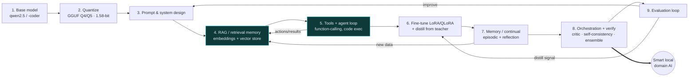

# Impossible Compression & Infinite Compute — and How a Default Local AI Becomes a Genius

> **Research dossier (working doc)** for a future ResistanceZero article.
> Framing: **bold vision fenced by real physics.** Every claim is tiered:
> **[P] proven** · **[F] active research frontier** · **[S] speculative-but-physical** · **[✗] physically impossible**.
> This is raw research material — not an implementation.

---

## 0. The two provocations & the honest verdict (read this first)

The owner posed two deliberately extreme targets:

1. **"Compress hundreds of terabytes of training data ~millions× down to ~1 KB."**
2. **"Make this one CPU-only PC equivalent to ~1 GW of datacenter AI compute."**

Taken **literally**, both are **[✗] impossible** — they collide with two of the most solid walls in science:

- **The information wall** — *Shannon entropy* and *Kolmogorov complexity*. You cannot losslessly compress arbitrary data below its information content; truly random data is incompressible. 300 TB of genuinely independent information can never become 1 KB. **Full stop.**
- **The thermodynamic wall** — *Landauer's principle*. Every irreversible bit-operation must dissipate at least `kT·ln2 ≈ 2.8 × 10⁻²¹ J` of heat at room temperature [L1][L2]. A 1 GW datacenter performs a certain number of irreversible ops per second; reproducing that op-rate inside a laptop's ~50 W envelope means doing ~2×10⁷× more work per joule than the datacenter — which today's silicon cannot.

**But that is the wrong question, and the right question is thrilling.** We almost never need the *bytes* or the *FLOPs*. We need the **capability** they encode. And the capability is astonishingly compressible and astonishingly portable:

- A ~15-trillion-token (~tens-of-TB) training corpus is distilled into a few **gigabytes** of weights, then into **~0.4 GB** at 1.58-bit precision [B1][B2] — a **>10,000× capability compression** that is *real and shipping*.
- The *compute to reach a fixed capability* has been **halving roughly every 8 months** for language models (Epoch AI), faster than Moore's Law [E1][E2] — so a "1 GW-class capability" migrating onto a laptop over a few years is not fantasy, it is the observed trend.

So the article's thesis writes itself:

> **You cannot shrink the data or the datacenter. You *can* shrink the capability — and physics is quietly handing us the tools to shrink it much further.** The interesting frontier is not "1 KB" or "1 GW," it is **capability density**: how much *usable intelligence* you can pack into a byte and power with a watt. On that axis, the numbers are already science-fiction — and there is real, sober research pushing them further.

The rest of this dossier surveys both walls, the genuine frontier climbing them, an RZ-original synthesis, and — practically — the full pipeline that turns a default local model into a domain genius.

---

# PART I — The two walls & the frontier

## Wall 1 — The information wall: can data → ~1 KB?

### 1.1 The hard floor: Shannon, Kolmogorov, MDL  **[P]**
- **Shannon entropy** sets the minimum average bits per symbol for lossless coding of a *known distribution*. Redundant, structured data (language, images, weights) has entropy far below its raw size — which is *why* compression works at all.
- **Kolmogorov complexity** `K(x)` is the deeper limit: the length of the *shortest program* that outputs `x`. It is the true "compressed size." Its punchline: **most strings are incompressible** (a counting argument — there aren't enough short programs to name every long string). So "300 TB → 1 KB" is only possible for data that is *itself the output of a ~1 KB program* (i.e. highly structured / generatable). Real training corpora are redundant but **not** 1-KB-generatable.
- **Minimum Description Length (MDL)** operationalizes this: the best model is the one that most compresses data + model. This reframes *learning as compression* — a theme the whole frontier exploits.

> **Verdict:** arbitrary data → 1 KB is **[✗]**. But *capability* extracted from data compresses enormously, because a model is a lossy, generative, MDL-optimal summary of the corpus's **regularities**, not its bytes.

### 1.2 Learning *is* compression — model & dataset distillation  **[P]/[F]**
- **Knowledge distillation** (Hinton et al., 2015): a small "student" learns to mimic a large "teacher," inheriting most capability at a fraction of the parameters. Modern LLM distillation (e.g. distilling frontier models into 1–8B students) is standard practice.
- **Dataset distillation** (Wang et al., 2018 → 2023–25 SOTA): *synthesize a tiny dataset* that trains a model almost as well as the full one — MNIST distilled to ~10 synthetic images per class; frameworks span meta-learning, gradient/trajectory matching (e.g. **DATM**, ICLR 2024, "towards lossless"), distribution matching, and diffusion-based (**D⁴**, CVPR 2024) [D1][D2]. **Honest caveat the article must state:** even SOTA shows accuracy degradation, is dataset/architecture-sensitive, and *often costs more compute to distill than it saves* [D1]. This is the closest real analogue to "TB → KB," and it works best precisely when the data is redundant.

### 1.3 Extreme quantization — the capability at 1.58 bits  **[P]**
- **BitNet b1.58** (Microsoft + UCAS, Feb 2024): every weight is **ternary {−1, 0, +1}** → `log₂3 ≈ 1.58` bits/weight. It **matches** full-precision (FP16) models of the same size and training tokens on perplexity and downstream tasks, while a 70B BitNet ran **4.1× faster with 8.9× higher throughput** than FP16 LLaMA [B1]. First official model **bitnet-b1.58-2B-4T** (2.4B params, trained on 4T tokens) shipped Apr 2025 [B2]. Implication: the *capability* of trillions of tokens survives at ~1.58 bits/param — the densest **proven** capability-per-bit we have.

### 1.4 Data *as a function* — implicit neural representations  **[F]**
- **COIN** (Dupont et al., 2021): don't store pixels — store the **weights of a small MLP** overfit to map (x, y) → RGB; decode by evaluating the network. Beats JPEG at low bitrates *without* entropy coding [C1]. Generalized by **"From data to functa"** (2022): *your data point is a function.* This is the literal realization of "the data becomes a tiny generator" — the honest, bounded version of the 1-KB dream (the function is small, but not 1 KB for rich signals, and fitting it costs compute).

### 1.5 Holographic vectors — hyperdimensional computing / VSA  **[F]**
- **Hyperdimensional Computing / Vector-Symbolic Architectures** (Kanerva 2009; Gayler 2003; Plate's Holographic Reduced Representations) [H1][H2]: represent structured knowledge as very-high-D random vectors and *superpose many items into one vector* via binding/bundling, recovering them approximately. This is the principled cousin of "compress a whole knowledge base into one vector" — robust, interpretable, but lossy and capacity-bounded (graceful degradation, not magic).

### 1.6 Practical vector shrink — Matryoshka, binary & product quantization  **[P]**
- **Matryoshka Representation Learning** (NeurIPS 2022): train so that *truncated prefixes* of an embedding are themselves good embeddings → up to **14× smaller** representations at equal accuracy; adopted by OpenAI's `text-embedding-3` [M1]. Combined with **product quantization** and **binary embeddings**, vector stores routinely shrink 4–32× with minor recall loss. (This is exactly the lever behind our own `rzmem` RAG store.)

> **Wall-1 synthesis:** the byte count of data has a hard floor (Kolmogorov). The **capability** distilled from data does not — it compresses through *distillation → 1.58-bit weights → functional/holographic representations* to a density that already looks impossible from the outside, and the frontier ([F]) is still moving.

---

## Wall 2 — The thermodynamic wall: can a PC → ~1 GW of DC compute?

### 2.1 The hard floor: Landauer's principle  **[P]**
- Erasing one bit irreversibly dissipates **≥ `kT·ln2` ≈ 2.8 zJ** at 300 K [L1]. First **directly verified** by Bérut, Lutz et al. (Nature, 2012) with a colloidal particle in a double-well trap; re-verified in nanomagnetic bits [L2]. Today's CMOS spends **>1,000×** the Landauer minimum per bit erased [R1] — so there is *enormous* theoretical headroom, but a laptop still cannot brute-force a datacenter's op-rate on its power budget. **"PC = 1 GW of FLOPs" is [✗].**

### 2.2 Compute below the floor — reversible & adiabatic computing  **[S]**
- Landauer noted that **logically reversible** computation (never erasing information) has **no lower energy bound** [R1]. Bennett (1970s), Fredkin & Toffoli formalized reversible logic that can, in principle, run **arbitrarily close to or below** the Landauer limit. IEEE Spectrum frames a potential **~4,000× efficiency** upside [R1]. Real, physical, decades-old theory — but engineering it at scale is unsolved (**[S]**).

### 2.3 Compute *in physics, not FLOPs* — analog in-memory  **[F]**
- **Memristor crossbar arrays** perform vector-matrix multiply — the core AI operation — *in a single physical step* via Ohm's + Kirchhoff's laws, with no data movement (killing the von Neumann bottleneck). Recent devices report **~11–97 TOPS/W** and up to **~85× efficiency / ~340× hardware-overhead reduction** for sparse workloads vs prior in-memory systems [A1][A2]. Orders-of-magnitude gains for the *exact* op AI needs — not 10⁹×, but real and shipping in research silicon.

### 2.4 Compute with light — photonic  **[F]**
- Optical/photonic matmul (e.g. Lightmatter-class systems) moves multiply-accumulate into interference of light: near-light-speed, low per-op energy for linear algebra. Promising for inference throughput/efficiency; integration + nonlinearity remain the hard parts (**[F]**).

### 2.5 Compute like a brain — neuromorphic  **[F]**
- **Intel Loihi 2** (2021): event-driven spiking neural networks with integrated memory report **>100× energy efficiency** vs CPU/GPU on suitable tasks; **Hala Point** packs 1.15B neurons / 128B synapses in **2,600 W** [N1][N2]. The existence proof is the **human brain**: roughly **~20 W** for general intelligence — ~six orders of magnitude below a training-scale datacenter. Nature already solved "1 GW-class cognition at 20 W"; we just can't build it yet (**[F]/[S]**).

### 2.6 Compute with noise — thermodynamic / probabilistic  **[S]**
- **Extropic** (p-bit chips, XTR-0) and **Normal Computing** *embrace* thermal noise as the computation, targeting generative/sampling workloads. Extropic's simulations claim **~10,000× (3–4 orders)** energy savings with its Denoising Thermodynamic Model; Normal demonstrated a PCB thermodynamic computer (matrix inversion via fluctuations, 2023) [T1][T2]. **Caveat the article must flag:** these are early-stage, largely simulation/CI-level claims — genuine **[S]**, not proven product performance.

### 2.7 The lever that actually reaches the laptop — algorithmic efficiency  **[P]**
- Hernandez & Brown (2020): compute to hit AlexNet-level ImageNet accuracy fell **44×** from 2012–2019 → **doubling every ~16 months**, *faster than Moore's Law* [E1]. Epoch AI extended this: for LLMs, **compute-to-reach-a-fixed-capability halves roughly every 8 months** [E2]. This is the real mechanism by which "yesterday's 1-GW capability" runs on "tomorrow's laptop" — **not** by putting a gigawatt in the case, but by needing far less compute for the same intelligence over time.

> **Wall-2 synthesis:** you can't fit 1 GW of FLOPs in a laptop (**[✗]**). But (a) *inference ≪ training* — the finished capability is cheap to run; (b) new substrates (analog/photonic/neuromorphic/reversible/thermodynamic) offer **orders-of-magnitude** density, with the brain as a 20 W existence proof; and (c) algorithmic efficiency keeps *lowering the compute a given intelligence requires*. The datacenter doesn't move into your PC — the **capability** does.

---

## Part I → RZ-original synthesis (the article's big idea)

Two reframes turn "impossible" into "frontier":

1. **Store the generator, not the data.** (Kolmogorov, INRs, generative priors.) The north-star object is not a 1-KB *file* but a **small program + a shared universal prior** that *reconstructs* what you need on demand. Compression's true limit is the shortest *generator*, and for structured knowledge that generator is shockingly small.
2. **Exploit physics, not FLOPs.** (Analog, reversible, neuromorphic, thermodynamic.) Stop paying `kT·ln2` you don't have to; let Ohm's law, light, spikes, and noise *be* the computation.

Two RZ metrics to coin and carry through the article:
- **Capability Density (CD):** usable task-capability per byte and per watt (replaces raw bytes/FLOPs). On CD, the last five years show multiple order-of-magnitude gains — the honest, defensible version of the owner's dream.
- **Compression Horizon (CH):** for a given corpus, the *smallest generator that reproduces its useful capability* — bounded below by Kolmogorov, but for real (redundant) knowledge, dramatically smaller than the raw size.

**Myth vs reality is the spine of the piece: the literal "1 KB / 1 GW" sits at [✗], but Capability Density is already living in [P]/[F] territory that reads like magic.**

---

# PART II — From a default local AI to a genius: the full pipeline

**Honest ceiling first.** A ~7B model on a CPU-only PC (our case: 17 GB RAM, no GPU) will **never** equal a frontier model like Opus-class. What it *can* become is a **genuinely sharp domain expert on your data and tasks** — often indistinguishable from "very smart" for the work you actually do. The gains, ranked by return-on-effort, form a pipeline. Nothing here violates physics; it's the practical craft.

### The pipeline (each stage: what · why · cost · gain)

| # | Stage | What it does | Why it helps | Cost | Typical gain |
|---|-------|--------------|--------------|------|--------------|
| 1 | **Base model** | Pick the strongest model your RAM fits (qwen2.5-7B, qwen2.5-coder, 14B-Q4) | Ceiling of raw ability | download + RAM | Large (foundation) |
| 2 | **Quantization** | Run GGUF Q4/Q5 (frontier: 1.58-bit) [B1] | Fit bigger/faster models on CPU | one-time | Speed/size, ~equal quality |
| 3 | **Prompt/system design** | Strong system prompt, few-shot, structured output | Steers latent ability you already paid for | ~free | High, instant |
| 4 | **RAG / retrieval memory** | Embed your docs → vector store → inject top-k into the prompt | Grounds answers in *your* facts; kills hallucination; updates without retraining | modest (embeds) | **Highest practical ROI** |
| 5 | **Tools + agent loop** | Function-calling: read/write files, run code, search → iterate | Turns a chatbot into a *coding agent* that acts | medium (harness) | Very high for tasks |
| 6 | **Fine-tune (LoRA/QLoRA) + distillation** | LoRA on your domain/style; SFT on Q/A pairs distilled from a stronger teacher (Claude/Codex transcripts) | Bakes in voice, format, domain reflexes | **GPU-bound** (hard on CPU) | Medium; style+domain |
| 7 | **Memory / continual learning** | Episodic memory, reflection, self-notes fed back via RAG | Learns across sessions without weight changes | modest | Compounding |
| 8 | **Orchestration + verification** | Multi-agent, self-consistency, critic/verifier, ensembles | Trades compute for reliability; catches its own errors | compute | High reliability |
| 9 | **Evaluation loop** | Task evals that score "smarter" → drive 1–8 | You can't improve what you don't measure | modest | Directional |

### Block diagram (ASCII)

```
                         ┌──────────────────────── FEEDBACK ────────────────────────┐
                         │                                                          │
   ┌───────────┐   ┌──────────┐   ┌─────────────┐   ┌───────────┐   ┌────────────┐  │
   │ 1. BASE   │──▶│ 2. QUANT │──▶│ 3. PROMPT / │──▶│ 4. RAG /  │──▶│ 5. TOOLS + │  │
   │  MODEL    │   │  (GGUF/  │   │  SYSTEM     │   │ RETRIEVAL │   │  AGENT     │  │
   │ qwen2.5   │   │  1.58b)  │   │  DESIGN     │   │  MEMORY   │   │  LOOP      │  │
   └───────────┘   └──────────┘   └─────────────┘   └─────┬─────┘   └─────┬──────┘  │
                                                          │  new data     │ actions │
                                                          ▼               ▼         │
   ┌────────────────┐   ┌───────────────────┐   ┌──────────────────┐   ┌──────────┐ │
   │ 9. EVAL LOOP   │◀──│ 8. ORCHESTRATION  │◀──│ 7. MEMORY /      │◀──│ 6. FINE- │ │
   │ (measure →     │   │  + VERIFICATION   │   │  CONTINUAL LEARN │   │ TUNE +   │─┘
   │  drive 1–8)    │   │ (critic/ensemble) │   │ (episodic+reflect)│   │ DISTILL  │
   └───────┬────────┘   └───────────────────┘   └──────────────────┘   └──────────┘
           └──────────────────── improve ─────────────────────▶  "SMART LOCAL AI"
```

### Flowchart (Mermaid — for the article render)



**Reading the diagram.** The spine (1→5) is the *cheap, high-ROI* path everyone should do first: a good base, quantized to fit, well-prompted, **grounded by RAG**, and given **tools** to act. Stages 6–8 add domain-baking (needs a GPU for real fine-tuning), cross-session memory, and reliability via verification. Stage 9 closes the loop: measure, then push effort back into whichever stage moves the eval most. The two cyan nodes (RAG + Tools) are where a CPU-only machine gets ~80% of the felt "intelligence" for ~20% of the effort — no training required.

> **Part-II verdict:** default model + quantization + **RAG + tools** + teacher-distillation → a domain assistant that *feels* very smart on your material. It remains, honestly, below frontier general intelligence — but for "answer from my knowledge base" and "be a coding agent," the gap largely closes.

---

# PART III — Source & confidence ledger

**Myths vs reality (the literal targets):**

| Claim | Verdict | Why |
|-------|---------|-----|
| 300 TB of arbitrary data → 1 KB, lossless | **[✗]** | Kolmogorov/Shannon: can't beat information content |
| A corpus's *capability* → sub-GB (even ~0.4 GB @1.58-bit) | **[P]** | BitNet b1.58 [B1][B2] |
| A dataset → a few synthetic samples that still train well | **[F]** | Dataset distillation, with real accuracy caveats [D1][D2] |
| An image/signal → a tiny generator function | **[F]** | COIN / functa [C1] |
| A laptop performs 1 GW of FLOPs | **[✗]** | Landauer + power budget [L1] |
| A laptop *runs* a 1-GW-trained capability | **[P]** | inference ≪ training; quantization |
| Yesterday's 1-GW capability needs far less compute over time | **[P]** | algorithmic efficiency, ~8-mo halving (LLMs) [E2] |
| Compute far below today's energy/op (reversible/thermo) | **[S]** | Bennett; Extropic/Normal — early/simulation [R1][T1] |
| Orders-of-magnitude density via analog/neuromorphic | **[F]** | memristor TOPS/W; Loihi 2 >100× [A1][N1] |

**Sources**
- [B1] "The Era of 1-bit LLMs: All LLMs are in 1.58 Bits," Microsoft/UCAS, Feb 2024 — https://arxiv.org/abs/2402.17764 ; framework https://github.com/microsoft/BitNet
- [B2] microsoft/bitnet-b1.58-2B-4T (Apr 2025) — https://huggingface.co/microsoft/bitnet-b1.58-2B-4T
- [D1] "A Comprehensive Survey of Dataset Distillation," IEEE TPAMI 2023 — https://dl.acm.org/doi/10.1109/TPAMI.2023.3322540
- [D2] DATM, ICLR 2024 (difficulty-aligned trajectory matching); D⁴, CVPR 2024 (diffusion dataset distillation)
- [C1] COIN: Compression with Implicit Neural Representations, Dupont et al. 2021 — https://arxiv.org/abs/2103.03123 ; "From data to functa," 2022
- [H1] "A Survey on Hyperdimensional Computing aka VSA," 2021 — https://arxiv.org/pdf/2111.06077
- [H2] Kanerva, "Hyperdimensional Computing," Cognitive Computation 2009 — https://link.springer.com/article/10.1007/s12559-009-9009-8
- [M1] Matryoshka Representation Learning, NeurIPS 2022 — https://proceedings.neurips.cc/paper_files/paper/2022/file/c32319f4868da7613d78af9993100e42-Paper-Conference.pdf
- [L1] Landauer's principle overview — https://en.wikipedia.org/wiki/Landauer%27s_principle (kT·ln2 ≈ 2.8 zJ @300K)
- [L2] Experimental verification: Bérut/Lutz et al., Nature 2012; nanomagnetic — https://arxiv.org/abs/1411.6730 / https://www.science.org/doi/10.1126/sciadv.1501492
- [R1] "Reversible Computing Has Potential for 4000× More Efficient Computation," IEEE Spectrum — https://spectrum.ieee.org/reversible-computing
- [A1] "Sparse matrix multiplication in a record-low power self-rectifying memristor array," Science Advances — https://www.science.org/doi/10.1126/sciadv.adf7474
- [A2] "Programming memristor arrays with arbitrarily high precision," Science — https://www.science.org/doi/10.1126/science.adi9405
- [N1] Intel Loihi 2 / Lava (Sept 2021) — https://www.intc.com/news-events/press-releases/detail/1502/
- [N2] Intel Hala Point (1.15B neurons, 2,600 W) — https://www.intc.com/news-events/press-releases/detail/1691/
- [T1] Extropic thermodynamic computing (p-bits, XTR-0, DTM claims) — https://extropic.ai/writing/thermodynamic-computing-from-zero-to-one
- [T2] Normal Computing thermodynamic computer (2023) — https://arxiv.org/pdf/2302.06457
- [E1] Hernandez & Brown, "Measuring the Algorithmic Efficiency of Neural Networks," 2020 (44× / ~16-mo doubling) — https://arxiv.org/abs/2005.04305
- [E2] Epoch AI, "Revisiting algorithmic progress" + "Algorithmic progress in language models," NeurIPS 2024 (~8-mo halving for LLMs) — https://epoch.ai/blog/revisiting-algorithmic-progress

**Confidence note:** [T1]/[T2] and [R1] are the least settled (early-stage / simulation / theoretical) and must be presented as frontier bets, not shipping performance. [B1]/[M1]/[E1] are the most solid and can anchor the "already-magic" claims.

---

## Article-production notes (for the later, separate phase)
- Structure the piece as: **hook (the two impossible targets)** → **the two walls** → **the frontier climbing each** → **the RZ reframe (Capability Density / Compression Horizon)** → **the practical "default → genius" pipeline with the diagram** → **honest myths-vs-reality table**.
- Follow RZ article standards: `standarization/ARTICLE_DATAVIZ_STANDARD.md` (sourced charts w/ `source`+`basisTag`), editorial register (`css/rz-article-dark.css`), and the `CONTENT_LINKAGE_PLAYBOOK.md` handoff (insights feed + articles index + glossary + sitemap + search-index + llms).
- Candidate title: **"The Compression Horizon: how close can a laptop get to a datacenter's mind?"**
